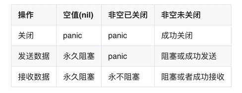

go协程中操作channel之前没有判断是否关闭的函数。在多个协程之间通信也都是依靠于channel，所以友好通知各个协程比较重要。



## 通道关闭原则

- 情形一：M个接收者和一个发送者，发送者通过关闭用来传输数据的通道来传递发送结束信号。
- 情形二：一个接收者和N个发送者，此唯一接收者通过关闭一个额外的信号通道来通知发送者不要再发送数据了。
- 情形三：M个接收者和N个发送者，它们中的任何协程都可以让一个中间调解协程帮忙发出停止数据传送的信号。

:::danger
关于通道和协程的垃圾回收

注意，一个通道被其发送数据协程队列和接收数据协程队列中的所有协程引用着。因此，如果一个通道的这两个队列只要有一个不为空，则此通道肯定不会被垃圾回收。另一方面，如果一个协程处于一个通道的某个协程队列之中，则此协程也肯定不会被垃圾回收，即使此通道仅被此协程所引用。事实上，一个协程只有在退出后才能被垃圾回收。

总结：不能关闭一个有其他协程写入的channel。可以让channel都没有任何协程引用，自动被垃圾回收掉。
:::

## 场景示例

下面三个示例分别展示上面三个情形

### M个接收者和一个发送者

```go

func TestOneWriteMoreReceive(t *testing.T) {
	fmt.Println(runtime.NumGoroutine())
	onceWrite()
	fmt.Println(runtime.NumGoroutine())
}

// 单协程发送数据，然后关闭通道
func onceWrite() {
	ch := make(chan int, 100)
	wg := &sync.WaitGroup{}
	go func() {
		for i := 1; i < 100; i++ {
			ch <- i
		}
		close(ch)
	}()

	for j := 1; j < 10; j++ {
		wg.Add(1)
		go receive(ch, wg)
	}

	wg.Wait()
}

func receive(ch chan int, wg *sync.WaitGroup) {
	defer wg.Done()
	for {
		num, ok := <-ch
		if !ok {
			break
		}
		fmt.Println("开始读取到数据了，开始处理", num)
		time.Sleep(time.Second * 2)
		fmt.Println("处理完数据了", num)
	}
	fmt.Println("协程关闭了,退出协程")
}
```

## 一个接受者N个发送者

注意：这里是接住一个channel来通知协程关闭，而不是直接close(dataCh),我们让数据协程通过垃圾回收，主动关闭，写入协程可能会报错。因为select会尝试写入，判断是否阻塞。所以不能关闭

```go

func TestMoreWriteOneReceive(t *testing.T) {
	fmt.Println(runtime.NumGoroutine())
	ch := make(chan int, 2)
	cancel := make(chan bool)
	for i := 1; i < 5; i++ {
		go moreWrite(ch, cancel, i)
	}
	for i := range ch {
		fmt.Println(i)
		if i == 10 {
			close(cancel)
			break
		}
	}
	fmt.Println("结束了")
	time.Sleep(time.Second)
	fmt.Println("协程数量", runtime.NumGoroutine())
}

func moreWrite(ch chan int, cancel chan bool, num int) {
	i := 0
	for {
		i++
		select {
		case ch <- i:
		case <-cancel:
			fmt.Println("工作协程接收到了信号退出了", num)
			return
		}
	}
}
```

## M个接受者N个发送者

这里稍微复杂点就是任意协程通过自己的逻辑都可以主动通知其他协程关闭。所以这里就涉及到了并发关闭协程的问题，这里用了sync.Once单例

```go

// 定义个clsoeChan的类型
type CloseChan struct {
	ch   chan struct{}
	once sync.Once
}

// 定义个clsoeChan关闭方法，这样不会重复关闭导致异常
func (c *CloseChan) Close() {
	c.once.Do(func() {
		close(c.ch)
	})
}

func NewCloseCh() *CloseChan {
	return &CloseChan{
		ch: make(chan struct{}),
	}
}

func moreReceive(dataCh chan int, closeCh *CloseChan, gNum int) {
	for {
		select {
		case <-closeCh.ch:
			fmt.Println("有协程通知关闭了", gNum)
			return
		case data := <-dataCh:
			if data == 10 {
				closeCh.Close()
				fmt.Println("在接受中主动关闭")
			}
			fmt.Printf("协程%d收到数据%d\n", gNum, data)
		}
	}
}

func moreProduct(dataCh chan int, closeCh *CloseChan, gNum int) {
	i := 0
	for {
		i++
		time.Sleep(time.Millisecond * 100)
		select {
		case <-closeCh.ch:
			fmt.Printf("写入协程%d收到关闭通知\n", gNum)
			return
		case dataCh <- i:
			fmt.Printf("写入协程%d发送数据数据%d\n", gNum, i)
		}
	}
}

func TestMoreReceiveMoreWrite(t *testing.T) {
	dataCh := make(chan int, 10)
	closeCh := NewCloseCh()
	for i := 1; i < 6; i++ {
		go moreReceive(dataCh, closeCh, i)
	}
	for j := 1; j < 10; j++ {
		go moreProduct(dataCh, closeCh, j)
	}
	time.Sleep(time.Second * 3)
	// 可以多关闭的了，借助第三方进行关闭操作，任意协程都可以主动关闭
	closeCh.Close()
	closeCh.Close()
	closeCh.Close()
	time.Sleep(time.Second * 5)

	fmt.Println("剩余协程数量", runtime.NumGoroutine())
}

```