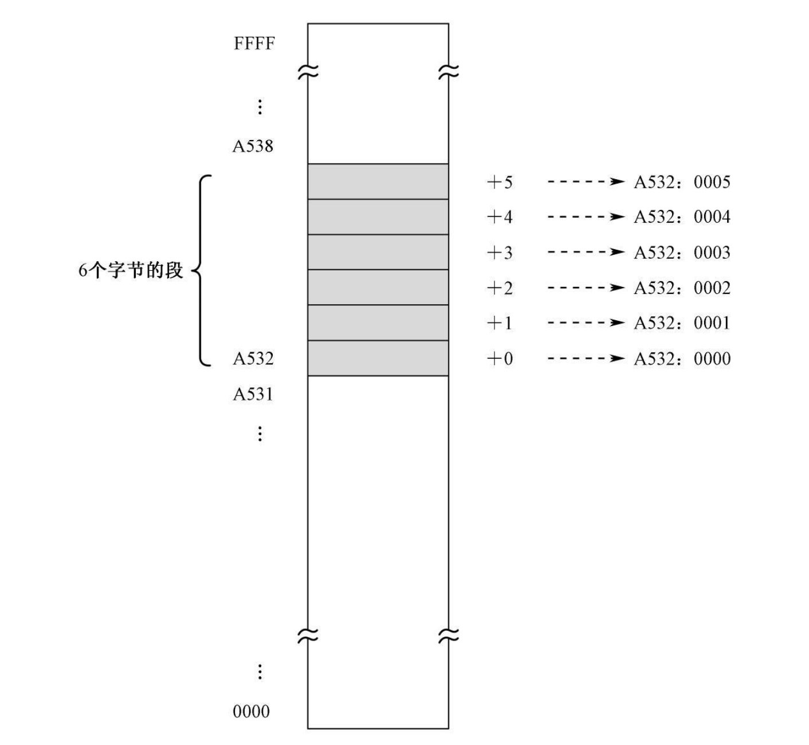

## CPU

- cpu外部总线接口，逻辑算数单元部件（包含寄存器），控制接口组成。
- cpu在出厂的时候就设置了很多指令，这些指令组合在一起构成了指令集。
- N位CPU表示CPU里面的寄存器能存储数据的位数，64位则是寄存器能存64位的数据
- CPU取内存中的指令是通过读取指令指针寄存器中的地址，然后读取到CPU中，然后执行，最后根据读取完的指令大小加上当前指令指针寄存器中的地址，然后存放到指针指令寄存器，也就是下次CPU要执行的指令地址。

## 总线

- 总线主要是和CPU和外部设备打交道的。
- 地址总线是CPU传递数据用的，每一根线能表示1或者0，地址总线是在内存中寻址的，告诉CPU想操作内存哪个单元的数据。所以地址总线的长度决定最大使用内存的大小，每一个内存单元存储1字节。地址总线能寻址的是内存单元
- 数据总线是用来传递数据的，地址总线的根数称为宽度，也就是每新增一个线则多传递1位
- 控制总线控制CPU是读取数据还是写入数据

## 寄存器

- 寄存器是在CPU中临时存放数据的。
- 不同类型的寄存器作用也是不一样的。

## x8086实模式下访问内存



- 地址总线是20根，最大访问内存就是2^20Byte=1024K=1M。所以内存最大是1M
- 数据总线是16根  最大的传输数据是16位=2字节
- 寄存器是16位的，最大能存储2字节
- 内存使用了分段模式
- 访问内存采用了数据段方式，逻辑地址表示方式
- `CS`存储的是代码段起始位置的逻辑地址
- `DS`存储的是数据段起始位置的逻辑地址
- `IP`存储的是指令指针相对于`CS`的偏移地址
- 内存的逻辑访问方式：`逻辑起始位置 偏移地址`
- `CS`代码段寄存器，里面存储的是代码段的起始位置，因为最大存储的是FFFF，16位，但是地址总线是20位，所以访问不了整个内存。
- 针对于16位寄存器，20位地址总线，所以将内存分段，内存地址最后4位是0的都可以当做是代码段CS,或者数据段DS的起始位置，用逻辑表示，里面存储的是将真实地址右移动4位，然后取地址的时候就是传送到地址线就左移动4位然后加上偏移地址

## 访问显存

- CPU在访问内存的时候，其中`0xB800:0x0000~0xB8000:0xFFFF`这段32kb是访问显存的范围
- 显示器上显示1个字符需要占用两个连续的字节

## 除法

- 如果指令中指定的是8位寄存器或者8位操作数的内存地址，则意味着被除数在寄存器AX中 ，相除后，商在AL中，余数在AH中
- 如果指令中指定的是16位寄存器或者16位操作数的内存地址，则意味着被除数是32位的，低16位在寄存器AX中，高16位在寄存器DX中，商在AX中，余数在DX中
- (80386)如果指令中指定的是32位寄存器或者32位操作数的内存地址，则意味着被除数是64位的，低32位在寄存器EAX中，高32位在寄存器EDX中，相除后，商在寄存器EAX，余数在EDX
- (64位处理器)如果指令中指定的是64位寄存器或者64位操作数的内存地址，则意味着被除数是128位的，低64位在寄存器RAX中，高64位在寄存器RDX中，相除后，商在寄存器RAX，余数在RDX


除法相关的寄存器`AX`,`DX`

## 逻辑运算

```
# 异或xor
xor r/m, r/m/imm
相同为0，否则位1  0xor0=1 0xor1=1
用途，可以将寄存器设置为0，这样就不用mov ax,0 直接 xor ax,ax


```

```
div BH  # BH 是一个8位寄存器
div byte [0x2002]   #  

---
div bx
div word [0x2002]

---
div ebx
div dword [0x2002]

---
div rbx
div qword [0x2002]
```

# x8086CPU特点

- 寄存器大小为16位
- 地址总线20位
- 可以采用分段模式访问内存(逻辑地址)`[段地址：便宜地址]`
- 在硬件层面支持分段，引入`CS`,`DS`寄存器，但是寄存器只有16位，如何表达20位地址总线内容，就是寄存器里面存储的是右移4位的。
- 理论可以访问任意地址，但是通过逻辑地址，代码段，数据段地址只能16位对齐的地方
- CPU不能指令不能将一个立即数直接送入段寄存器，需要通用寄存器来转一次
- 由于`IP`也是16位，所以一个段最大是`64k`
- `0xF0000～0xFFFFF`将这个给到了内存只读段。
- `ROM`在做完一些列操作之后，最后做的就是读取硬盘中的`0面0道1扇区`数据到`0x0000:0x7c00`，物理地址`0x7c00`地方，然后`jmp`到这里
- `0x00000～ 0x9FFFF`这个是DRAM，中间有一部分是给到外围设备
- `0xB8000~0xBFFFF`这个是显存的地址空间，`0xB800:0x0000~0xB8000:0xFFFF` = 32kb