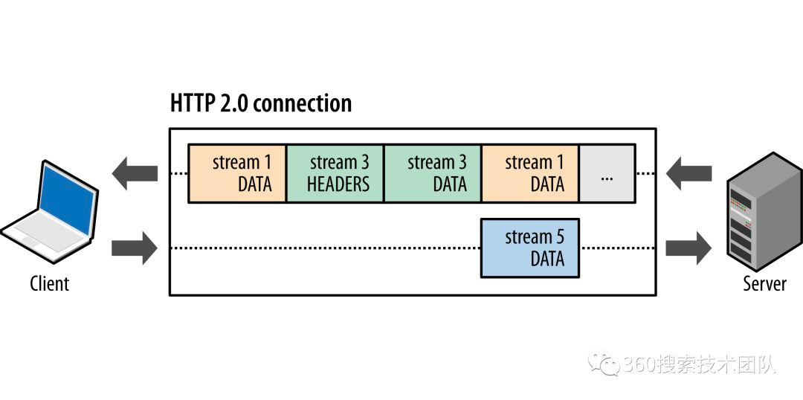
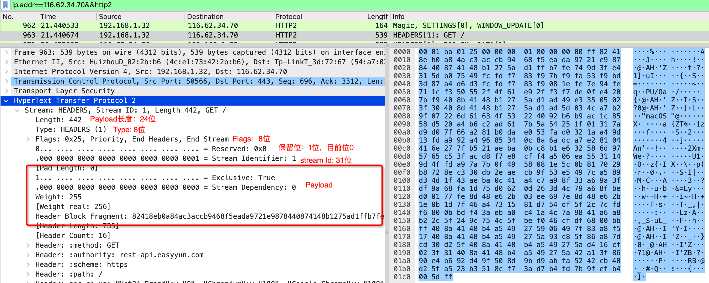
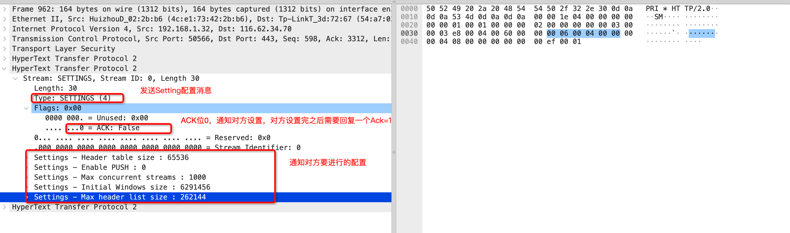

## 名词

- Frame，帧，HTTP/2协议里通信的最小单位，每个帧有自己的格式，不同类型的帧负责传输不同的消息
- Message, 消息，类似Request/Response消息，每个消息包含一个或多个帧（抽象概念）
- Stream，流，建立链接后的一个双向字节流，用来传输消息，每次传输的是一个或多个帧

## 多路复用

在 HTTP/1 中，如果客户端要想发起多个并行请求以提升性能，则必须使用多个 TCP 连接。在单个链接中，HTTP/1对每个请求每次交付一个响应，并且必须受到影响后，才能继续发起请求。

HTTP/2 中新的二进制分帧层突破了这些限制，实现了完整的请求和响应复用：客户端和服务器可以将 HTTP 消息分解为互不依赖的帧，通过不同的Stream交错发送，最后再在另一端把它们重新组装起来。所以这里也能看到，他的请求响应模型跟HTTP/1也是一样的，只不过在传输的内容内部做了些手脚，来实现了多路复用。



如图，在一个TCP链接内，客户端发送了一个stream ID=5的DATA帧的数据包，但同时服务端响应的是Stream ID=1和ID=3的一些数据包，这样，就真正做到了，在一个链接内，同时有三个流并行的传输数据。 将 HTTP 消息分解为独立的帧，交错发送，然后在另一端重新组装是 HTTP/2 最重要的一项增强。事实上，这个机制会在整个网络技术栈中引发一系列连锁反应，从而带来巨大的性能提升，让我们可以：

- 并行交错地发送多个请求，请求之间互不影响。 
- 并行交错地发送多个响应，响应之间互不干扰。 
- 使用一个连接并行发送多个请求和响应。 
- 不必再为绕过 HTTP/1.x 限制而做很多工作(例如级联文件、image sprites 和域名分片)
- 消除不必要的延迟和提高现有网络容量的利用率，从而减少页面加载时间。

HTTP/2 中的新二进制分帧层解决了 HTTP/1.x 中存在的队首阻塞问题，也消除了并行处理和发送请求及响应时对多个连接的依赖。应用速度更快、开发更简单、部署成本更低。


## frame

frame是http2中最小的传输单位。下面是frame的整体结构，frame头信息都是一样的，不同类型的frame传输的数据类型不同



```
+-----------------------------------------------+
|                 Length (24)                   |
+---------------+---------------+---------------+
|   Type (8)    |   Flags (8)   |
+-+-------------+---------------+-------------------------------+
|R|                 Stream Identifier (31)                      |
+=+=============================================================+
|                   Frame Payload (0...)                      ...
+---------------------------------------------------------------+
```

Frame头部总共72位，9字节

**Length(24)**

表示Frame Payload的大小，是一个24-bit的整型，表明Frame Payload的大小不应该超过2^24-1字节。
但其实payload默认的大小是不超过2^14字节，可以通过SETTING Frame来设置SETTINGS_MAX_FRAME_SIZE修改允许的Payload大小。

**Type(8)**

表示Frame的类型,目前定义了0-9共10种类型。

**Flags(8)**

**R(1)**

Reserved 保留位，目前位0

**Stream Identifier (31)** 

Steam的id标识，表明id的范围只能为0到2^31-1之间，其中0用来传输控制信息，比如Setting, Ping；

客户端发起的Stream id 必须为奇数，服务端发起的Stream id必须为偶数；

并且每次建立新Stream的时候，id必须比上一次的建立的Stream的id大；

当在一个连接里，如果无限建立Stream，最后id大于2^31时，必须从新建立TCP连接，来发送请求。

如果是服务端的Stream id超过上限，需要对客户端发送一个GOWAY的Frame来强制客户端重新发起连接。

**Frame Payload**

这个就是frame传输的具体内容了，根据不同类型传输的数据也不同，Header头Length就是来读取这里面的内容。

### 不同类型Frame

根据Frame中的Type类型不同，传输的Payload内容就是不同的，不同类型的传输的Payload结构也不同，下面介绍不同类型的Payload

#### Data(0x0)

DATA Frame(type=0x0)，用来传输可变长度的二进制流，这部分最主要的用途就是用来传递之前HTTP/1中的Request或Response的Body部分。

```
 +---------------+
 |Pad Length? (8)|
 +---------------+-----------------------------------------------+
 |                            Data (*)                         ...
 +---------------------------------------------------------------+
 |                           Padding (*)                       ...
 +---------------------------------------------------------------+
```

Pad Length和Padding主要是保证数据安全和完整性校验。中间的Data就是传输的数据。在为了保证一个Message是否传输完成，其中用到了Frame Header中的Flags标志位中的`End Stream`，为1表示传输完成。发起Stream的一方会进入half-closed(local)或者closed状态

### HEADERS(0x1)

HEADERS Frame(type=0x1)用于开启一个Stream，当然也用于传输正常HTTP请求中的Header信息。

```
 +---------------+
 |Pad Length? (8)|
 +-+-------------+-----------------------------------------------+
 |E|                 Stream Dependency? (31)                     |
 +-+-------------+-----------------------------------------------+
 |  Weight? (8)  |
 +-+-------------+-----------------------------------------------+
 |                   Header Block Fragment (*)                 ...
 +---------------------------------------------------------------+
 |                           Padding (*)                       ...
 +---------------------------------------------------------------+
```

**Header Block Fragment**

用于存放Header头信息

**E、Stream Dependency、Weight**

用于权重控制，控制传输优先级

### PRIORITY(0x2)

PRIORITY Frame(type=0x2)用于指定Stream的优先级，这个在Stream Dependencies， Dependency Weighting等场景下会用到，PRIORITY帧不能在id为0的stream上发送

```
 +-+-------------------------------------------------------------+
 |E|                  Stream Dependency (31)                     |
 +-+-------------+-----------------------------------------------+
 |   Weight (8)  |
 +-+-------------+
```

### RST_STREAM(0x3)

RST_STREAM Frame(type=0x3)用于立即终止Stream.主要用来取消流，或者发生异常时表明需要终止。

错误包含一个32-bit的整型数来表示错误的原因。

```
 +---------------------------------------------------------------+
 |                        Error Code (32)                        |
 +---------------------------------------------------------------+
```

### SETTINGS(0x4)

SETTINGS Frame(type=0x4)用来控制客户端和服务端之间通信的一些配置。

SETTINGS帧必须在连接开始时由通信双方发送，并且可以在任何其他时间由任一端点在连接的生命周期内发送。

SETTINGS帧必须在id为0的stream上进行发送，不能通过其他stream发送；

SETTINGS影响的是整个TCP链接，而不是某个stream；

在SETTINGS设置出现错误时，必须当做connection error重置整个链接

SETTINGS帧带有Ack的Flag，接收方必须收到ack为0的SETTINGS后，应马上启用SETTING的配置并返回一个Ack为1的SETTINGS帧。




### PUSH_PROMISE(0x5)

PUSH_PROMISE Frame(type=0x5)用于服务端在发送PUSH之前先发送PUSH_PROMISE帧来通知客户端将要发送的PUSH信息。

```
+---------------+
 |Pad Length? (8)|
 +-+-------------+-----------------------------------------------+
 |R|                  Promised Stream ID (31)                    |
 +-+-----------------------------+-------------------------------+
 |                   Header Block Fragment (*)                 ...
 +---------------------------------------------------------------+
 |                           Padding (*)                       ...
 +---------------------------------------------------------------+
```

### PING(0x6)

PING Frame(type=0x6) 是用来测量来自发送方的最小往返时间以及确定空闲连接是否仍然起作用的机制。 PING帧可以从任何一方发送。PING帧跟SETTINGS帧非常类似，一个是必须在id为0的stream上发送，另一个就是它也包含一个Ack的Flag，发送方发送ack=0的PING帧，接收方必须响应一个ack=1的PING帧，并且PING帧的响应 应该 优先于任何其他帧。

```
 +---------------------------------------------------------------+
 |                                                               |
 |                      Opaque Data (64)                         |
 |                                                               |
 +---------------------------------------------------------------+
```

### GOAWAY(0x7)

GOAWAY frame(type=0x7)用于关闭连接，GOAWAY允许端点优雅地停止接受新流，同时仍然完成先前建立的流的处理。

```
 +-+-------------------------------------------------------------+
 |R|                  Last-Stream-ID (31)                        |
 +-+-------------------------------------------------------------+
 |                      Error Code (32)                          |
 +---------------------------------------------------------------+
 |                  Additional Debug Data (*)                    |
 +---------------------------------------------------------------+
```

### WINDOW_UPDATE(0x8)

WINDOW_UPDATE frame(type=0x8)用于流控(flow control

```
 +-+-------------------------------------------------------------+
 |R|              Window Size Increment (31)                     |
 +-+-------------------------------------------------------------+
```

### CONTINUATION(0x9)

CONTINUATION frame(type=0x9)用于持续的发送未发送完的HTTP header信息.如果前边是这三个帧(HEADERS, PUSH_PROMISE, or CONTINUATION)，并且未携带END_HEADERS的flag，就可以继续发送CONTINUATION帧。

```
 +---------------------------------------------------------------+
 |                   Header Block Fragment (*)                 ...
 +---------------------------------------------------------------+
```