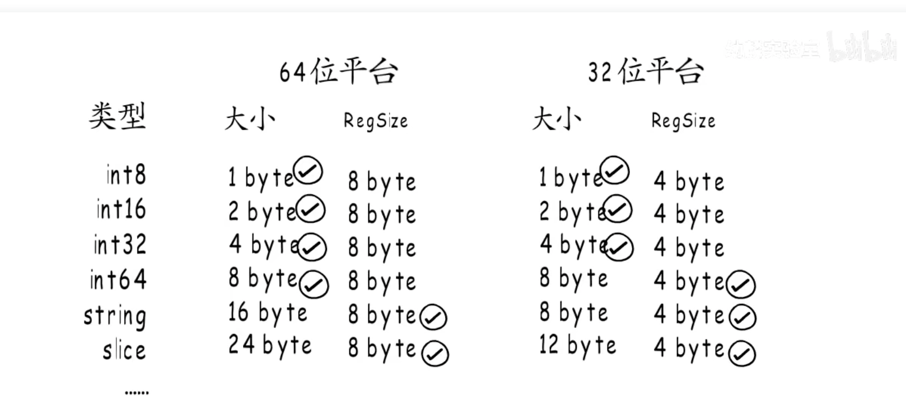
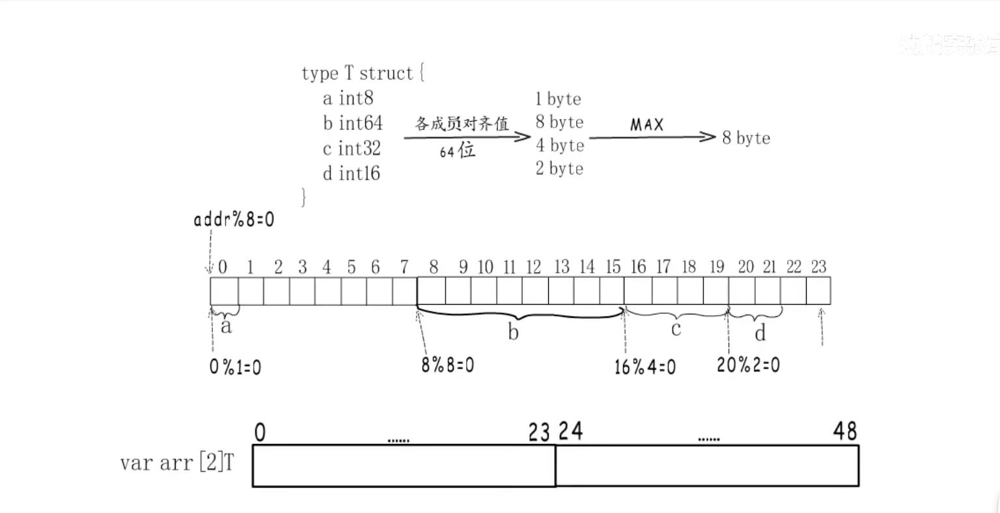

## 内存对齐

CPU读取的内存需要内存对齐，这是网上经常说的为啥要内存对齐！

其实内存对齐是针对于内存来说，数据在内存中存储不是逻辑上的线性结构，实际存储为了访问速度，内存被划分为一个个芯片`chip`，这些`chip`使用共同地址，
例如要访问`0x00`开始的8字节，则是分别在8个`chip`中分别读取1字节，然后组合一起形成8字节。所以为了提高访问效率，给出的访问内存地址需要内存对齐。
要不然就需要多次CPU访问，然后组合。

## 常见数据类型对齐



## 结构体

结构体是连续的一段内存，需要每个成员变量都内存对齐，然后整体的结构体大小需要内存对齐

```go
// 64位CPU
type T struct {
	a int8   // 1 byte
	b int64 // 8 byte   
	c int32 // 4 byte
	d int16 // 2 byte
}
最大内存对齐8byte
```



