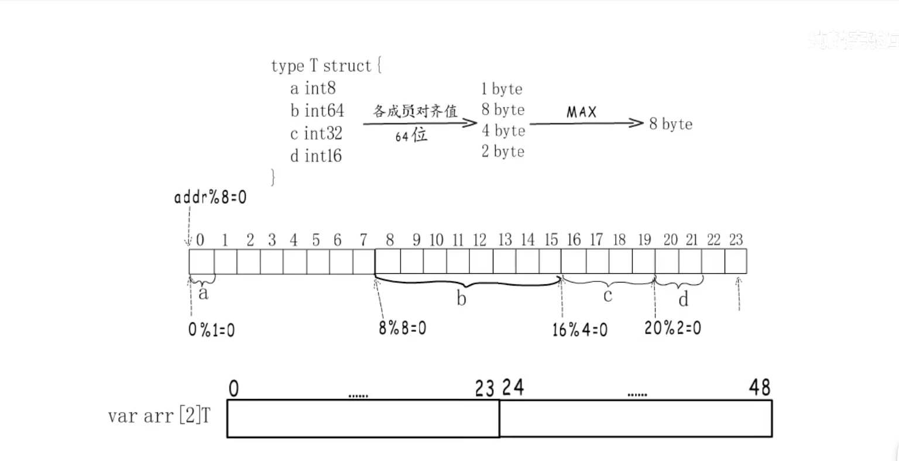

## 内存对齐

CPU读取的内存需要内存对齐，这是网上经常说的为啥要内存对齐！

其实内存对齐是针对于内存来说，数据在内存中存储不是逻辑上的线性结构，实际存储为了访问速度，内存被划分为一个个芯片`chip`，这些`chip`使用共同地址，
例如要访问`0x00`开始的8字节，则是分别在8个`chip`中分别读取1字节，然后组合一起形成8字节。所以为了提高访问效率，给出的访问内存地址需要内存对齐。
要不然就需要多次CPU访问，然后组合。

## 常见数据类型对齐


## 结构体

结构体是连续的一段内存，需要每个成员变量都内存对齐，然后整体的结构体大小需要内存对齐

```go
// 64位CPU
type T struct {
	a int8   // 1 byte
	b int64 // 8 byte   
	c int32 // 4 byte
	d int16 // 2 byte
}
最大内存对齐8byte
```



```go
package main

import (
	"fmt"
	"unsafe"
)

type T struct {
	a int8  // 1 byte
	b int64 // 8 byte
	c int32 // 4 byte
	d int16 // 2 byte
}

func main() {
	t := T{}

	fmt.Println("T.a对齐=", unsafe.Alignof(t.a)) // 1
	fmt.Println("T.b对齐=", unsafe.Alignof(t.b)) // 8
	fmt.Println("T.c对齐=", unsafe.Alignof(t.c)) // 4
	fmt.Println("T.d对齐=", unsafe.Alignof(t.d)) // 2

	fmt.Println("T对齐=", unsafe.Alignof(t)) // 8

	fmt.Println("T类型size=", unsafe.Sizeof(t)) //	24, 成员变量需要内存对齐，然后整体的T需要内存对齐（这个是为了如果定义一个T类型的数组)

	fmt.Println("T.a对齐偏移=", unsafe.Offsetof(t.a)) // 0
	fmt.Println("T.b对齐偏移=", unsafe.Offsetof(t.b)) // 8
	fmt.Println("T.c对齐偏移=", unsafe.Offsetof(t.c)) // 16
	fmt.Println("T.d对齐偏移=", unsafe.Offsetof(t.d)) // 20

	// 通过指针来修改结构体
	*(*int8)(unsafe.Add(unsafe.Pointer(&t), unsafe.Offsetof(t.a))) = 1
	*(*int64)(unsafe.Add(unsafe.Pointer(&t), unsafe.Offsetof(t.b))) = 2
	*(*int32)(unsafe.Add(unsafe.Pointer(&t), unsafe.Offsetof(t.c))) = 3
	*(*int16)(unsafe.Add(unsafe.Pointer(&t), unsafe.Offsetof(t.d))) = 4

	fmt.Printf("%+v\n", t)

	// 这个是创建一个类型为T的数组，长度和length都是2，切片起始位置为&t的位置
	at := unsafe.Slice(&t, 2)
	fmt.Println(at[0].c)
	t.d = 333
	fmt.Println(at)
}

# 输出结果

T.a对齐= 1
T.b对齐= 8
T.c对齐= 4
T.d对齐= 2
T对齐= 8
T类型size= 24
T.a对齐偏移= 0
T.b对齐偏移= 8
T.c对齐偏移= 16
T.d对齐偏移= 20
{a:1 b:2 c:3 d:4}
3
[{1 2 3 333} {1 2 3 4}]

```
