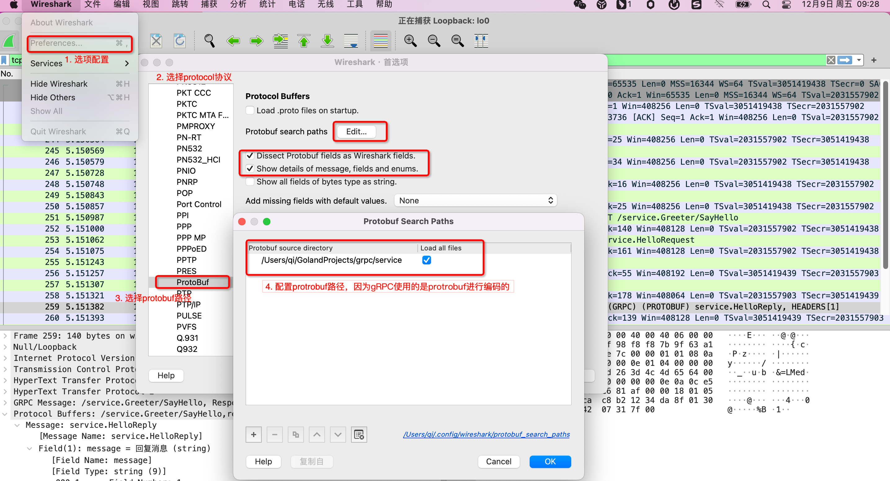
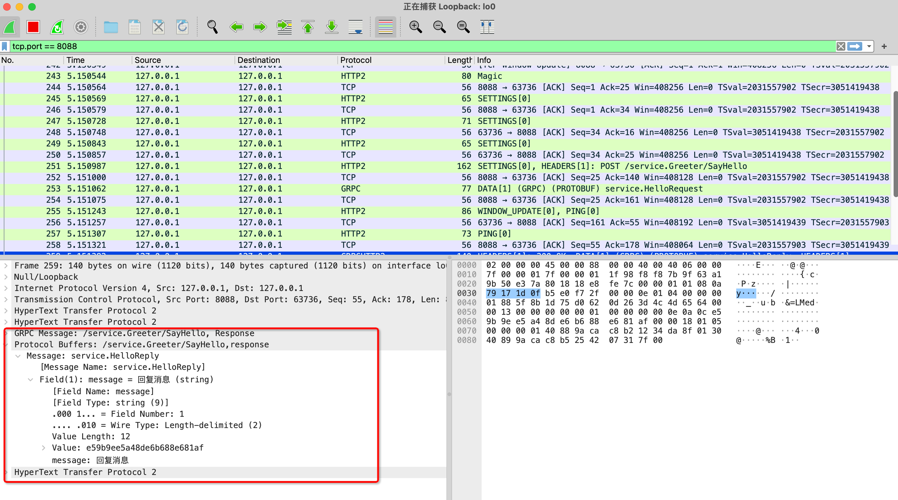

gRPC使用的是`HTTP2`协议，使用的`protobuf`进行数据的编码与解码。而我们可以使用`wireshark`进行抓包查看里面的细节。下面介绍下`wireshark`如何抓包`gRPC`通信

## wireshark配置

当前使用的`wireshark`版本是`4.0.1`

**1. 配置`protobuf`路径**

**菜单->wireshark->preferences->protocols->protobuf**

## 抓包测试

1. 使用过滤端口号
2. 查看抓包内容

