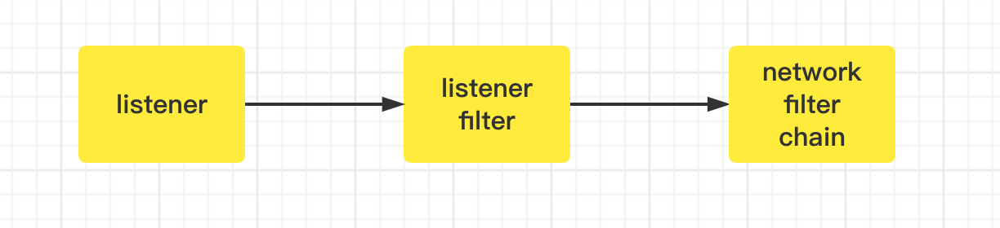

## 概念

envoy是接收下游客户端的请求，然后根据规则发送给上游。envoy通过插件配置的形式来处理流量的生命周期，所以了解了流量在envoy中如何进行处理的就比较清楚了。



基本配置模版

```
static_resources:
  listeners:
    - name: listener_0
      address: {}
      filter_chains: # 这就是网络过滤器链，也就是应用过滤器。通过配置的链，然后根据匹配规则找到对应的链去执行
      - filters: 
          - name: xxx
            typed_config: 
              "@type": type.googleapis.com/envoy.extensions.filters.network.tcp_proxy.v3.TcpProxy # 这里就是配置的应用端链扩展，这里必须根据已经支持的
              ...
              
        filter_chain_match: {} # 这里是针对该链的匹配，如果匹配不到，就继续查找下一个filter
        ...
```

### listener

**参考**

[listener]

### filter_chains

**参考**

[filter_chains]


[listener]: https://www.envoyproxy.io/docs/envoy/latest/api-v3/listeners/listeners
[filter_chains]: https://www.envoyproxy.io/docs/envoy/latest/api-v3/config/listener/v3/listener_components.proto#config-listener-v3-filterchain
