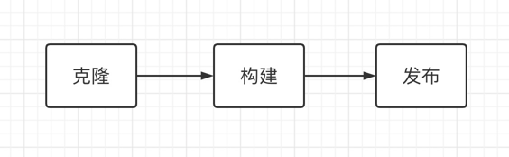
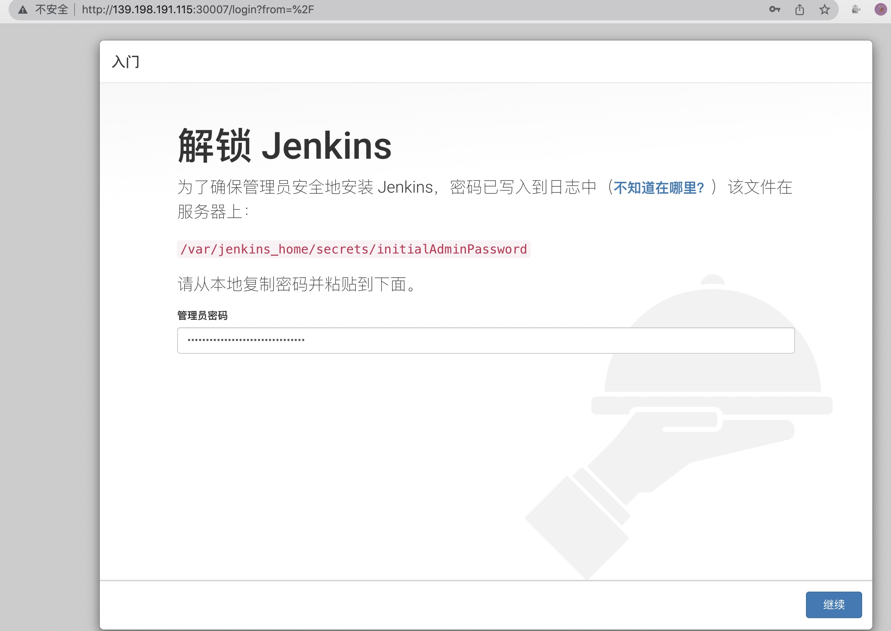
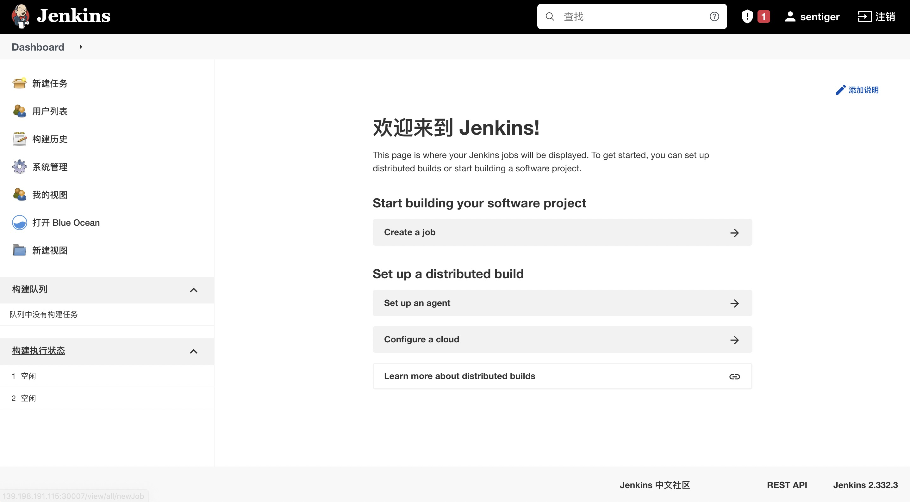
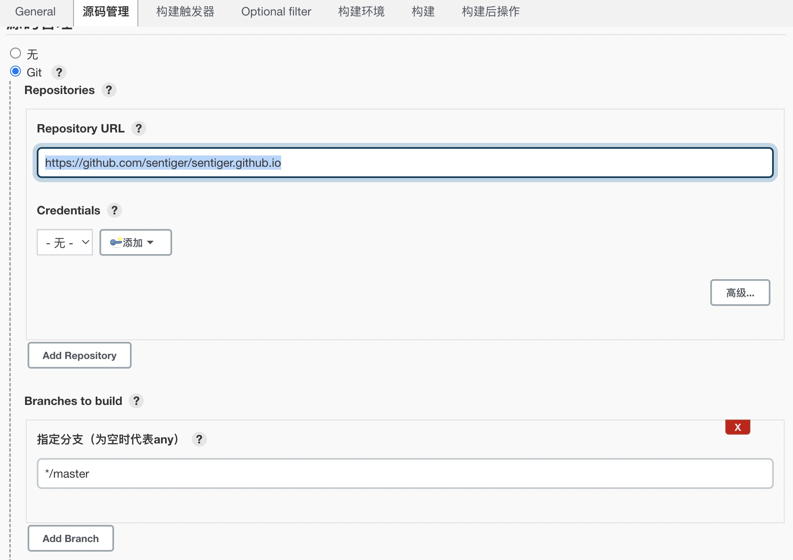
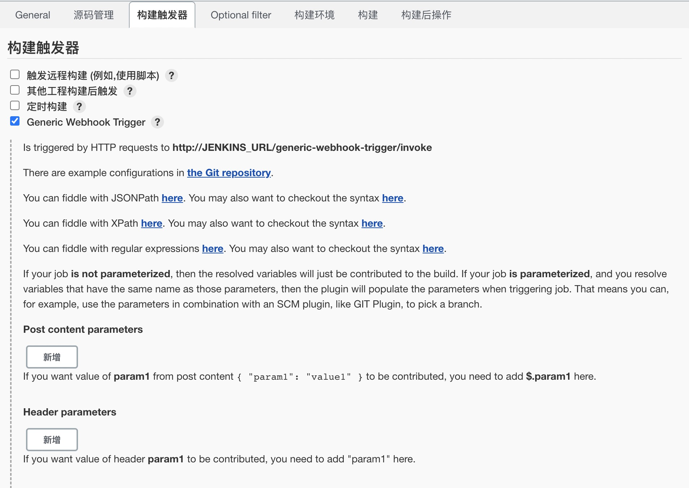
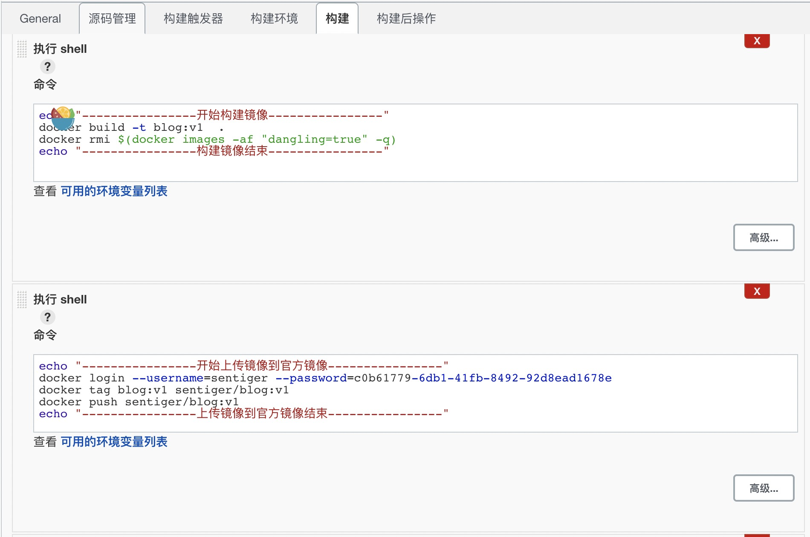
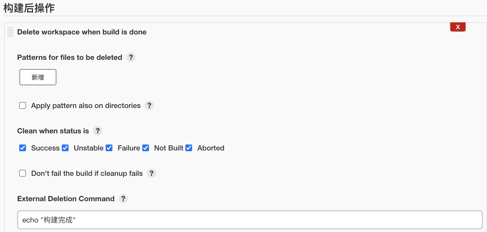
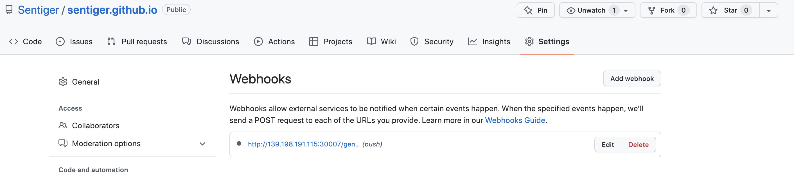
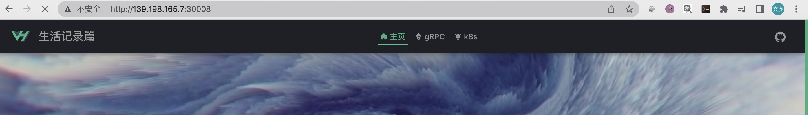

当前项目Blog使用Jenkins自动部署到k8s中

## 发布流程



## Jenkins安装

使用k8s安装Jenkins，官方链接[Jenkins官方][Jenkins]

**官方docker安装提示**

```sh
$ docker run \
  -u root \
  --rm \  
  -d \ 
  -p 8080:8080 \ 
  -p 50000:50000 \ 
  -v jenkins-data:/var/jenkins_home \ 
  -v /var/run/docker.sock:/var/run/docker.sock \ 
  jenkinsci/blueocean 
```

**在k8s中安装**

- 安装在web1主机上
- 创建一个新的`namespace` cicd
- 运行Jenkins
- 现在主机中下载镜像，要不然k8s运行以为出错了，一直卡着不动

```sh
# 下载镜像:latest
$ docker pull  jenkinsci/blueocean


```

**k8s运行Jenkins**

 **删除节点web1污染**

```sh
$ kubectl taint node web1 node-role.kubernetes.io/master-
```

**部署脚本cicd.yaml**

```yaml
#创建命名空间cicd
apiVersion: v1
kind: Namespace
metadata:
  name: cicd

---

# deploy
apiVersion: apps/v1
kind: Deployment
metadata:
  name: jenkins-deployment
  namespace: cicd
  labels:
    app: jenkins
spec:
  replicas: 1

  selector:
    matchLabels:
      app: jenkins

  template:
    metadata:
      labels:
        app: jenkins
    spec:
      # 定义节点选择器
      nodeSelector:
        kubernetes.io/hostname: "web1"

      # 定义容器
      containers:
        - name: jenkins
          image: jenkinsci/blueocean:latest
          imagePullPolicy: Never # IfNotPresent,Never,Always
          securityContext:
            runAsUser: 0 # 运行容器身份以当前用户，因为在Jenkins中要使用docker操作
          env:
            - name: "KUBECONFIG"  # 配置kubectl配置文件位置
              value: "/kubectl-config"
          ports:
            - containerPort: 8080
            - containerPort: 50000
          volumeMounts:
            - name: jenkins-data
              mountPath: /var/jenkins_home
            - name: docker-socket
              mountPath: /var/run/docker.sock
            - name: kubectl
              mountPath: /usr/bin/kubectl
            - name: kubectl-config
              mountPath: /kubectl-config

      # 定义数据卷
      volumes:
        - name: jenkins-data
          hostPath:
            path: /root/jenkins # 注意要给权限
            type: Directory
        - name: docker-socket
          hostPath:
            path: /var/run/docker.sock
            type: File
        - name: kubectl
          hostPath:
            path: /usr/bin/kubectl
            type: File
        - name: kubectl-config
          hostPath:
            path: /root/.kube/config
            type: File
---
# service
apiVersion: v1
kind: Service
metadata:
  name: jenkins
  namespace: cicd
spec:
  type: NodePort # 这里暂时使用节点端口映射
  selector:
      app: jenkins
  ports:
    - protocol: TCP
      port: 8080
      targetPort: 8080
      nodePort: 30007 # 这个是有范围的，--service-node-port-range 默认值：30000-32767

```

**初始化Jenkins**

- 浏览器访问 http://139.198.191.115:30007



**修改Jenkins镜像源**

```sh
$ cd /root/jenkins/updates
$ sed -i 's/http:\/\/updates.jenkins-ci.org\/download/https:\/\/mirrors.tuna.tsinghua.edu.cn\/jenkins/g'  default.json
# 重启应用（直接删除pod，deployment会自动启动一个pod）
$ kubectl rollout restart deployment -n cicd jenkins-deployment
```



## 编写Dockerfile

这个可以直接放在项目下，clone代码之后自动就构建镜像了

```Dockerfile
FROM node:16.15.1-alpine3.16 as builder
ADD . /blog
WORKDIR /blog
RUN npm install --registry=https://registry.npmmirror.com && npm run docs:build


FROM nginx:1.22.0-alpine
COPY --from=builder /blog/blog/.vuepress/dist /usr/share/nginx/html
COPY ./nginx.conf /etc/nginx/conf.d/default.conf
```

## 镜像

**构建镜像**

```shell
# 版本根据自己的规则来自增或者覆盖
$ docker build -t blog:v1  .
# 删除中间的无效层文件
$ docker rmi $(docker images -af "dangling=true" -q)
```

**推送镜像**

::: code-tabs#language

@tab 官方镜像

```shell
# 1. 首先在官方中创建镜像库
# 2. 登录
$ docker login --username sentiger --password xxx
# 3. 打标签
$ docker tag blog:v1 sentiger/blog:v1
# 4. 推送到官方仓库中
$ docker push sentiger/blog:v1
# 5. 退出
$ docker logout
```

@tab 推送到阿里云

```shell
# 1. 在阿里云中创建仓库
# 2. 登录
$ docker login --username=sentiger --password=xxx registry.cn-hangzhou.aliyuncs.com
# 3. 打标签
$ docker tag blog:v1 registry.cn-hangzhou.aliyuncs.com/easyyun/blog:v1
# 拉取镜像
$ docker pull registry.cn-hangzhou.aliyuncs.com/easyyun/blog:v1
# 4. 推送到官方仓库中
$ docker push registry.cn-hangzhou.aliyuncs.com/easyyun/blog:v1
# 5. 退出
$ docker logout registry.cn-hangzhou.aliyuncs.com
```

:::

## Jenkins部署blog

**k8s中配置docker秘钥**

这个是为了使用私有镜像库，如果共有镜像库可以忽略

```sh
$ kubectl create -n cicd secret docker-registry hub-registry \
--docker-server=index.docker.io \
--docker-username=username \
--docker-password=c0b61779-6db1-xxxxxx \
--docker-email=username@qq.com
```

**新建任务**

1. 构建一个自由风格的软件项目

2. 配置运行脚本

3. 配置代码仓库

   

4. 配置hook（这个需要安装插件:`Generic Webhook Trigger`）

   

5. 构建

   

   ```sh
   echo "----------------开始构建镜像----------------"
   docker build -t blog:v1  .
   docker rmi $(docker images -af "dangling=true" -q)
   echo "----------------构建镜像结束----------------"
   
   echo "----------------开始上传镜像到官方镜像----------------"
   docker login --username=sentiger --password=c0b61779-6db1-41fb-8492-92d8ead1678e
   docker tag blog:v1 sentiger/blog:v1
   docker push sentiger/blog:v1
   echo "----------------上传镜像到官方镜像结束----------------"
   
   echo "----------------开始删除镜像----------------"
   docker rmi blog:v1
   docker rmi sentiger/blog:v1
   echo "----------------开始删除结束----------------"
   
   echo "----------------开始构建blog----------------"
   kubectl apply -f deployment.yaml
   echo "----------------构建blog成功----------------"
   ```

6. 任务结束删除workspace

   

## 相关脚本

**deployment.yaml**

真实环境还需要添加ingress，这里可以自行去配置

```yaml
# deploy
apiVersion: apps/v1
kind: Deployment
metadata:
  name: blog-deployment
  namespace: default
  labels:
    app: blog
spec:
  replicas: 2

  selector:
    matchLabels:
      app: blog

  template:
    metadata:
      labels:
        app: blog
        version: v1
    spec:
      # 定义容器
      containers:
        - name: blog
          image: sentiger/blog:v1
          imagePullPolicy: Always # IfNotPresent,Never,Always
          ports:
            - containerPort: 80
---
# service
apiVersion: v1
kind: Service
metadata:
  name: blog
  namespace: default
spec:
  type: NodePort # 这里暂时使用节点端口映射
  selector:
    app: blog
  ports:
    - protocol: TCP
      port: 80
      targetPort: 80
      nodePort: 30008 # 这个是有范围的，--service-node-port-range 默认值：30000-32767


```

**Dockerfile**

```dockerfile
FROM node:16.15.1-alpine3.16 as builder
ADD . /blog
WORKDIR /blog
RUN npm install --registry=https://registry.npmmirror.com && npm run docs:build


FROM nginx:1.22.0-alpine
COPY --from=builder /blog/blog/.vuepress/dist /usr/share/nginx/html
COPY ./nginx.conf /etc/nginx/conf.d/default.conf
```


## 测试

**GitHub中配置webhook**



**提交代码**

提交代码看效果



## 总结

上面展示了一个简单的发布流程。从部署Jenkins，和配置Jenkins自动发布脚本，镜像构建脚本，k8s简单部署脚本等。目前这个仅仅是作为一个简单的流程展示

[Jenkins]: https://www.jenkins.io/zh/doc/book/installing/

