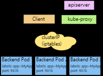
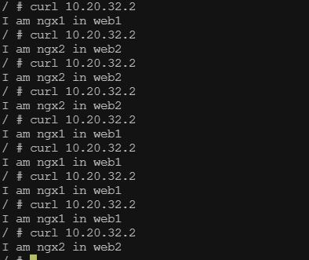
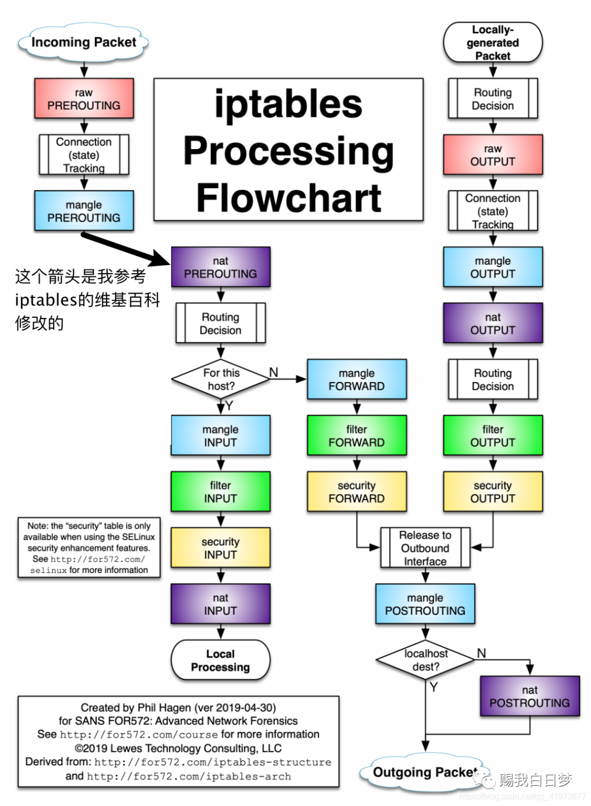

## 实现目标

之前我们实现了所有节点中容器通过flannel通信。这次我们来模拟下k8s中kube-proxy实现service的流程。相关的知识以下

- flannel底层通信
- iptables 配置负载规则
- DNS服务（coreDNS）实现域名服务
- 监控服务 负责监控集群中的容器发生变化，修改iptables规则，DNS域名等信息


## 搭建服务

使用两台云主机，配置好flannel，docker中的容器能互相通信。

### etcd 配置
**启动etcd**

使用host网络启动etcd，这里需要将数据文件目录映射到宿主机，方便下次启动
```shell
docker run -d --name etcd \
--network host \
--publish 2379:2379 \
--publish 2380:2380 \
--env ALLOW_NONE_AUTHENTICATION=yes \
--env ETCD_ADVERTISE_CLIENT_URLS=http://172.31.0.3:2379 \
bitnami/etcd:latest
```

**设置flannel配置文件**

```shell
# 将etcdctl客户端拷贝到宿主机上，这样好操作etcd
$ docker cp etcd:/opt/bitnami/etcd/bin/etcdctl /usr/local/bin/
$ etcdctl put /flannel/network/config '{ "Network": "10.10.0.0/16", "Backend": {"Type": "vxlan"}}'
```

### flannel配置
下载flannel镜像，或者直接下载二进制文件在本机运行。这里全都使用docker运行

**启动**

每台主机都配置flannel

```shell
$ docker run -d \
--privileged \
--name flannel \
--net host \
-v /run/flannel:/run/flannel \
flannelcni/flannel:v0.18.1 \
--etcd-endpoints=http://172.31.0.3:2379 \
--etcd-prefix=/flannel/network
```

**查看结果**

web1 被分配了一个子网
```shell
[root@web1 ~]# cat /run/flannel/subnet.env 
FLANNEL_NETWORK=10.10.0.0/16
FLANNEL_SUBNET=10.10.26.1/24
FLANNEL_MTU=1450
FLANNEL_IPMASQ=false

# 自动被添加了路由
[root@web1 ~]# route
Kernel IP routing table
Destination     Gateway         Genmask         Flags Metric Ref    Use Iface
default         gateway         0.0.0.0         UG    100    0        0 eth0
10.10.28.0      10.10.28.0      255.255.255.0   UG    0      0        0 flannel.1
10.10.63.0      10.10.63.0      255.255.255.0   UG    0      0        0 flannel.1
172.17.0.0      0.0.0.0         255.255.0.0     U     0      0        0 docker0
172.31.0.0      0.0.0.0         255.255.255.0   U     100    0        0 eth0
```

web2 被分配了个子网
```shell
[root@web2 ~]# cat /run/flannel/subnet.env 
FLANNEL_NETWORK=10.10.0.0/16
FLANNEL_SUBNET=10.10.28.1/24
FLANNEL_MTU=1450
FLANNEL_IPMASQ=false

# 自动被添加了路由
[root@web2 ~]# route -n
Kernel IP routing table
Destination     Gateway         Genmask         Flags Metric Ref    Use Iface
0.0.0.0         172.31.0.1      0.0.0.0         UG    100    0        0 eth0
10.10.26.0      10.10.26.0      255.255.255.0   UG    0      0        0 flannel.1
10.10.63.0      10.10.63.0      255.255.255.0   UG    0      0        0 flannel.1
172.17.0.0      0.0.0.0         255.255.0.0     U     0      0        0 docker0
172.31.0.0      0.0.0.0         255.255.255.0   U     100    0        0 eth0
```

### docker配置

docker创建一个网桥，子网分别设置为flannel分配，并且将网卡的MUT设置为flannel规定的。docker本来可以直接配合flannel运行的，而且这些事情都做好了，这里我们手动来操作。

**web1**

根据上面flannel的配置`/run/flannel/subnet.env` 创建网桥

```shell
# 设置子网段，和创建容器的时候网卡MTU值
$ docker network create --subnet 10.10.26.1/24 --opt com.docker.network.driver.mtu=1450 cni0
```

**web2**

和上面web1一样的操作，只是根据web2的主机flannel的配置

```shell
# 设置子网段，和创建容器的时候网卡MTU值
$ docker network create --subnet 10.10.28.1/24 --opt com.docker.network.driver.mtu=1450 cni0
```

### 测试

**分别在两个主机上启动容器**

- web1 启动一个容器ngx1 指定网桥为cni0
- web2 启动一个容器ngx2 指定网桥为cni0

```shell
# web1
[root@web1 ~]# docker run --name ngx1 --rm --network cni0 -d nginx:1.23.0-alpine 
86ff8b0c2c5cd2b0881dc26fc154f5101c79c288cedd20253019c37cb0c3f3de

# web2 
[root@web2 ~]# docker run --name ngx2 --rm --network cni0 -d nginx:1.23.0-alpine
b91ddef153befdb0b5b7dc712d83b7bd14c509e047a2f862c81575fe6fddeac5
```

**两台主机测试**

```shell
# web1 ngx1 ip为 10.10.26.2
# web1 ngx2 ip为 10.10.28.2
[root@web1 ~]# docker inspect ngx1 |grep IPAddress
            "SecondaryIPAddresses": null,
            "IPAddress": "",
                    "IPAddress": "10.10.26.2",
[root@web1 ~]# curl 10.10.28.2


[root@web2 ~]# docker inspect ngx2 |grep IPAddress
            "SecondaryIPAddresses": null,
            "IPAddress": "",
                    "IPAddress": "10.10.28.2",
                    
 
## 分别在两主机上测试和容器内测试
[root@web2 ~]# curl 10.10.26.2
<!DOCTYPE html>
<html>
<head>
<title>Welcome to nginx!</title>
....

[root@web2 ~]# curl 10.10.28.2
<!DOCTYPE html>
<html>
<head>
<title>Welcome to nginx!</title>                   
...

# 在容器中测试
## 结果都是通过的
```

### 总结

上面的流程分别模拟了夸主机内容器间通信原理，k8s的底层网络通信也是这样实现的，只是有对应的程序来实现。


## service/kube-proxy代理

上面的流程实现了主机间通信，现在模拟手工实现k8s中的service代理功能。也就是kube-proxy要干的工作

1. 构建一个虚拟ip作为service的ip
2. 启动多个相同的nginx服务，当做为高可用
3. 通过service代理访问具体的容器



### 部署应用

这里启动应用分别在两个主机上（负载，高可用），这里就模拟了deployment 生成两个pod

```shell
[root@web1 ~]# docker exec -it ngx1 sh
/ # echo "I am ngx1 in web1" > /usr/share/nginx/html/index.html

[root@web2 ~]# docker exec -it ngx2 sh
/ # echo "I am ngx2 in web2" > /usr/share/nginx/html/index.html
```

### 配置service

- 设置一个虚拟ip 10.20.32.2 作为ngx.service
- 通过访问10.20.32.2 自动代理到底层服务

```shell
$ iptables -t nat -A POSTROUTING -j MASQUERADE

# PREROUTING 这里是为了从容器中访问service
$ iptables -t nat -A PREROUTING \
-p tcp \
-d 10.20.32.2 \
--dport 80 \
-m statistic \
--mode random \
--probability 0.5 \
-j DNAT \
--to-destination 10.10.26.2:80


$ iptables -t nat -A PREROUTING \
-p tcp \
-d 10.20.32.2 \
--dport 80 \
-m statistic \
--mode random \
--probability 1 \
-j DNAT \
--to-destination 10.10.28.2:80


# OUTPUT 这个链是从宿主机中请求service的时候，做目的地址转换
$ iptables -t nat -A OUTPUT \
-p tcp \
-d 10.20.32.2 \
--dport 80 \
-m statistic \
--mode random \
--probability 0.5 \
-j DNAT \
--to-destination 10.10.26.2:80


$ iptables -t nat -A OUTPUT \
-p tcp \
-d 10.20.32.2 \
--dport 80 \
-m statistic \
--mode random \
--probability 1 \
-j DNAT \
--to-destination 10.10.28.2:80
```

**测试**

::: danger

这里service IP 是一个虚拟IP，所以要针对它的访问做一些拦截处理（DNAT），访问的入口有两个：

1. 从宿主机中访问，就是从用户态到内核态，此时走的是OUTPUT 链，这个时候就需要在OUTPUT上做DNAT转换。
2. 还有就是从容器中访问最后转发到了宿主机的网络协议栈。此时要对PREROUTING做DNAT

:::




## DNS绑定域名

上面的例子可以做到service访问底层不同的容器。但是存在一个问题，service IP也是经常变得，更何况在服务间相互调用的时候，是不知道IP的。这个时候需要加一层DNS，或者环境变量了。

1. k8s中在集群内访问service，都可以service.namespace.local这种访问，其实就是kube-proxy在创建service的时候，自动给对应的service ip 和域名绑定了，这个用DNS很好实现。

2. 还有一种就是在创建POD的时候，将先前创建的service ip 写到新创建的pod容器的环境变量中

3. 还有一种就是为啥不直接使用DNS A记录添加多个，使用DNS来做负载均衡，这个官方也有解释就是很多服务第一次DNS访问的时候，会缓存，再次请求就不在走了DNS解析了。


## 总结

上面流程总体模拟了kube-proxy的职责，以后了解k8s的网络部分应该很轻松。

## 参考
- 
- iptables
