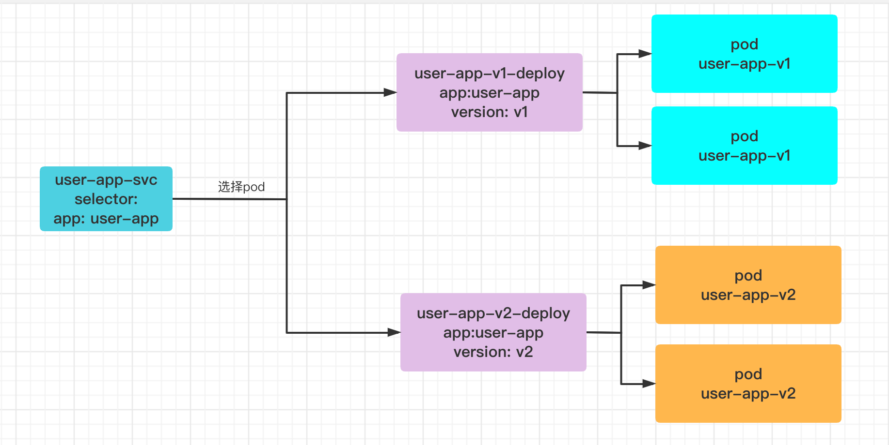

## istio流量代理

```
1. 找出istio-proxy容器PID，然后进入网络命名空间
nsenter -t 19094 -n

2. 查看iptables规则（这些规则都是init容器配置的）

[root@web1 ~]# iptables -t nat -S
-P PREROUTING ACCEPT
-P INPUT ACCEPT
-P OUTPUT ACCEPT
-P POSTROUTING ACCEPT
-N ISTIO_INBOUND
-N ISTIO_IN_REDIRECT
-N ISTIO_OUTPUT
-N ISTIO_REDIRECT
-A PREROUTING -p tcp -j ISTIO_INBOUND
-A OUTPUT -p tcp -j ISTIO_OUTPUT


-A ISTIO_INBOUND -p tcp -m tcp --dport 15008 -j RETURN
-A ISTIO_INBOUND -p tcp -m tcp --dport 15090 -j RETURN
-A ISTIO_INBOUND -p tcp -m tcp --dport 15021 -j RETURN
-A ISTIO_INBOUND -p tcp -m tcp --dport 15020 -j RETURN
-A ISTIO_INBOUND -p tcp -j ISTIO_IN_REDIRECT
-A ISTIO_IN_REDIRECT -p tcp -j REDIRECT --to-ports 15006


iptables -t nat -A ISTIO_OUTPUT -s 127.0.0.6/32 -o lo -j RETURN
iptables -t nat -A ISTIO_OUTPUT ! -d 127.0.0.1/32 -o lo -m owner --uid-owner 1337 -j ISTIO_IN_REDIRECT
iptables -t nat -A ISTIO_OUTPUT -o lo -m owner ! --uid-owner 1337 -j RETURN
iptables -t nat -A ISTIO_OUTPUT -m owner --uid-owner 1337 -j RETURN
iptables -t nat -A ISTIO_OUTPUT ! -d 127.0.0.1/32 -o lo -m owner --gid-owner 1337 -j ISTIO_IN_REDIRECT
iptables -t nat -A ISTIO_OUTPUT -o lo -m owner ! --gid-owner 1337 -j RETURN
iptables -t nat -A ISTIO_OUTPUT -m owner --gid-owner 1337 -j RETURN
iptables -t nat -A ISTIO_OUTPUT -d 127.0.0.1/32 -j RETURN
iptables -t nat -A ISTIO_OUTPUT -j ISTIO_REDIRECT

# 转发到15001这个端口处理
iptables -t nat -A ISTIO_REDIRECT -p tcp -j REDIRECT --to-ports 15001
```


### 流量分析

iptables规则都是通过init容器进行管理的

#### 进入istio-proxy流量

通过PREROUTING进行nat转发

1. 15008，15090，15021，15020 通过这四个端口进来的流量直接不做处理
2. 其他的直接转到端口`15006` 。也就是这个端口做一层处理（envoy）

### 从istio-proxy（用户态）发出去的流量

通过OUTPUT链进行拦截出去流量

出口流量过滤掉本地或者uid是1337发出的，都进行给到15001处理


## demo1

构建一个普通的service应用



**简单yaml**

::: code-tabs#language

@tab user-app-v1-deploy.yaml

```yaml
apiVersion: apps/v1
kind: Deployment
metadata:
  name: user-app-v1
  labels:
    app: user-app
    version: v1
  annotations:
    kubernetes.io/change-cause: "用户服务v1版本"

spec:
  replicas: 1
  selector:
    matchLabels:
      app: user-app
      version: v1
  template:
    metadata:
      name: user-app-v1
      labels:
        app: user-app
        version: v1
    spec:
      containers:
      - name: user-app-v1
        image: nginx:1.18-alpine
        command: ["sh", "-c", "echo 'user service for v1' > /usr/share/nginx/html/index.html; nginx -g 'daemon off;'"]
```


@tab user-app-v2-deploy.yaml

```yaml
apiVersion: apps/v1
kind: Deployment
metadata:
  name: user-app-v2
  labels:
    app: user-app
    verison: v2
  annotations:
    kubernetes.io/change-cause: "用户服务v2版本"

spec:
  replicas: 1
  selector:
    matchLabels:
      app: user-app
      version: v2
  template:
    metadata:
      name: user-app-v2
      labels:
        app: user-app
        version: v2
    spec:
      containers:
        - name: user-app-v2
          image: nginx:1.18-alpine
          command: ["sh", "-c", "echo 'user service for v2' > /usr/share/nginx/html/index.html; nginx -g 'daemon off;'"]
```

@tab user-app-svc.yaml

```yaml
apiVersion: v1
kind: Service
metadata:
  name: user-app-svc
  labels:
    app: user-app-svc

spec:
  selector:
    app: user-app
  ports:
  - name: http
    protocol: TCP
    port: 80
    targetPort: 80
```

:::

**手动注入istion**

由于istio是无侵入式的，对于应用来说并没有改变任何地方，仅仅是发布的时候不同。将user-app应用加入到网格服务

```shell
istioctl kube-inject -f user-app-v1-deploy.yaml |kubectl apply -f -
istioctl kube-inject -f user-app-v2-deploy.yaml |kubectl apply -f -
```


### 配置权重的负载均衡

k8s 自带的service只能支持pod之间的负载均衡，一般一个service针对的是相同后端提供服务发现。而针对于像不同版本的应用，在部署的时候会存在以下问题：
1. 同一个应用的service name肯定不能变化，假设发布了一个v2版本的user，肯定还是使用之前的service name提供服务，要不然别的调用服务都要更改
2. 由于第一点的问题，所以只能定义相同的selector选择后端的pod，所以这里就没法区分不同版本应用
3. istio正好就解决了这个问题

::: code-tabs#language

@tab user-app-destinationrule.yaml

```yaml
apiVersion: networking.istio.io/v1alpha3
kind: DestinationRule
metadata:
  name: user-app-destinationrule

spec:
  host: user-app-svc # 选择要区分的service name
  subsets: # 定义不同的节点
  - name: v1  
    labels:
      version: v1 # 从相同的service name中又过滤一遍其中的version:v1的pod
  - name: v2
    labels:
      version: v2
```

@tab user-app-virtualservice.yaml

```yaml
apiVersion: networking.istio.io/v1alpha3
kind: VirtualService
metadata:
  name: user-app-virtualservice
spec:
  hosts:  # 这里是从哪些service name进来的流量
  - user-app-svc 
  http: # 提供的http服务
  - name: user-app-svc-route
    route: 
    - destination: # 这里定义的是后端destinationrule
        host: user-app-svc
        subset: v1
      weight: 90 # 90%权重到达这个destination
    - destination:
        host: user-app-svc
        subset: v2
      weight: 10
```

:::

**测试**

```shell
# 进入其中一个应用容器
kubectl exec -it user-app-v2-6c57679bfc-2zdgp -c user-app-v2 -- sh

# 测试
curl user-app-svc
```

**总结**

针对上面的应用，包括k8s中的任何配置都没任何改变，仅仅是加了一步将应用加入到了`service mesh`，这个操作完全对开发是无感的。对于k8s的原来操作也基本没改变。

其实软件开发，都是这样，一层不能实现功能，然后在现有的基础上再次抽象出一层来改变。

### 配置网关允许网格外访问

针对于网格外的流量如何进入呢？使用ingress，这个时候也需要将ingress中注入到网格内部。istio提供了我们一种方式，使用gateway的方式将外部流量注入到网格内部。

gateway默认安装的时候如果选择了，会在`istio-system`中会启动服务，会暴力端口nodeport 31221，或者loadbalace。

::: code-tabs#language

@tab 网关定义

```yaml
# user-app-gateway.yaml
apiVersion: networking.istio.io/v1alpha3
kind: Gateway
metadata:
  name: user-app-gateway

spec:
  selector:
    app: istio-ingressgateway # 选择一个网关服务，kubectl -n istio-system get pods --show-labels  来查看ingress-gateway 

  servers:
  - hosts:  # 外部进来的域名
    - user-app.com
    port:
      number: 80 # 这个端口是gateway服务的端口 kubectl -n istio-system get svc
      name: http
      protocol: HTTP
```

@tab 定义网关后面进入的virtualService

```yaml
# user-app-gateway-virtualservice.yaml
apiVersion: networking.istio.io/v1alpha3
kind: VirtualService
metadata:
  name: user-app-gateway-virtualservice
spec:
  hosts: # 进入virtualservice域名
  - user-app.com
  gateways: # 允许哪些网关，其他的定义和内部virtualservice一样
    - user-app-gateway
  http: #
  - name: user-app-svc-route
    route:
    - destination:
        host: user-app-svc
        subset: v1
      weight: 90
    - destination:
        host: user-app-svc
        subset: v2
      weight: 10
```

:::

**测试**

一般正式操作都是会配合loadBalance来使用的，我们暂时使用网关暴露出来的nodePort`31221`访问

```shell
[root@web1 demo]# curl -i -H "Host: user-app.com" 172.31.0.3:31221
HTTP/1.1 200 OK
server: istio-envoy
date: Mon, 19 Sep 2022 07:08:17 GMT
content-type: text/html
content-length: 20
last-modified: Mon, 19 Sep 2022 03:47:33 GMT
etag: "6327e655-14"
accept-ranges: bytes
x-envoy-upstream-service-time: 0

user service for v1


[root@web1 demo]#  curl -i -H "Host: user-app.com" 139.198.165.7:31221
HTTP/1.1 200 OK
server: istio-envoy
date: Mon, 19 Sep 2022 07:08:42 GMT
content-type: text/html
content-length: 20
last-modified: Mon, 19 Sep 2022 03:47:42 GMT
etag: "6327e65e-14"
accept-ranges: bytes
x-envoy-upstream-service-time: 0

user service for v2
```

### 重写URI

istio也支持URI重写，参考下面这个demo

```yaml
apiVersion: networking.istio.io/v1alpha3
kind: VirtualService
metadata:
  name: user-app-gateway-virtualservice
spec:
  hosts:
    - user-app.com
  gateways:
    - user-app-gateway
  http:
    - name: user-app-svc-route-v1
      match:
        - uri:
            prefix: "/v1"
      rewrite:
        uri: "/"
      route:
        - destination:
            host: user-app-svc
            subset: v1
    - name: user-app-svc-route-v2
      match:
        - uri:
            prefix: "/v2"
      rewrite:
        uri: "/"
      route:
        - destination:
            host: user-app-svc
            subset: v2
    - name: user-app-svc-route-default
      route:
        - destination:
            host: user-app-svc
            subset: v1
```

**测试**

```shell
# 访问v1版本
[root@web1 demo]# curl -i -H "Host: user-app.com" 172.31.0.3:31221/v1
HTTP/1.1 200 OK
server: istio-envoy
date: Mon, 19 Sep 2022 07:42:17 GMT
content-type: text/html
content-length: 20
last-modified: Mon, 19 Sep 2022 03:47:33 GMT
etag: "6327e655-14"
accept-ranges: bytes
x-envoy-upstream-service-time: 1

user service for v1

# 访问v2版本
[root@web1 demo]# curl -i -H "Host: user-app.com" 172.31.0.3:31221/v2
HTTP/1.1 200 OK
server: istio-envoy
date: Mon, 19 Sep 2022 07:42:44 GMT
content-type: text/html
content-length: 20
last-modified: Mon, 19 Sep 2022 03:47:42 GMT
etag: "6327e65e-14"
accept-ranges: bytes
x-envoy-upstream-service-time: 0

user service for v2

# 默认
[root@web1 demo]# curl -i -H "Host: user-app.com" 172.31.0.3:31221
HTTP/1.1 200 OK
server: istio-envoy
date: Mon, 19 Sep 2022 07:42:56 GMT
content-type: text/html
content-length: 20
last-modified: Mon, 19 Sep 2022 03:47:33 GMT
etag: "6327e655-14"
accept-ranges: bytes
x-envoy-upstream-service-time: 0

user service for v1
```