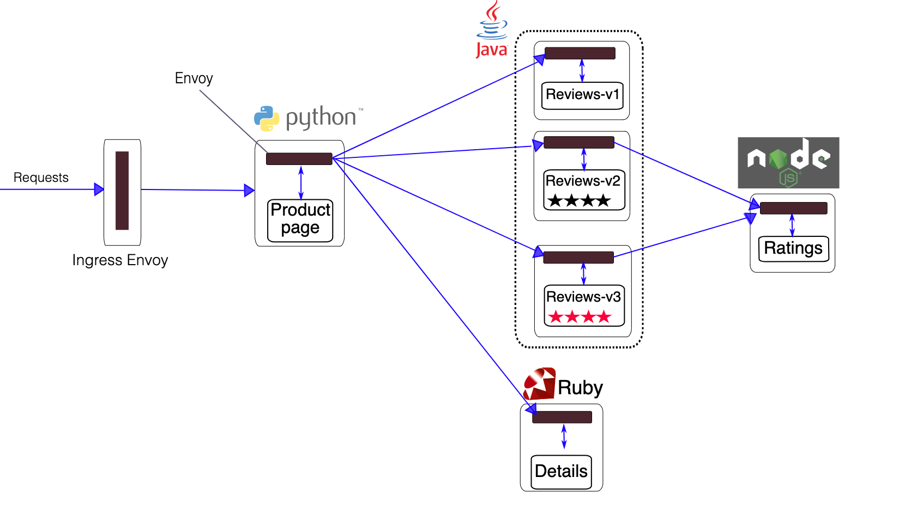

使用istio自带的bookinfo示例来了解其特性。



**服务解析**

```
分别有四个服务：

productpage
    v1 版本
    
reviews
    v1 版本
    v2 版本
    v3 版本

details
    v1 版本

ratings
    v1 版本    

```

## 安装bookinfo示例

::: code-tabs#language

@tab 部署应用
```shell
# 将bookinfo应用都装在这个namespace中
kubectl create namespace bookinfo

# 为了不手动注入sidecar，直接打上标签，在这个namespace下创建的pod都会自动加入网格
kubectl label namespace bookinfo istio-injection=enabled

# 创建应用（sample在下载istio的时候会自带）
kubectl -n bookinfo apply -f samples/bookinfo/platform/kube/bookinfo.yaml

# 安装结果
[root@web1 bookinfo-demo]# kubectl get pods -n bookinfo 
NAME                              READY   STATUS    RESTARTS   AGE
details-v1-b48c969c5-6pjff        2/2     Running   0          18h
productpage-v1-74fdfbd7c7-7tbkq   2/2     Running   0          18h
ratings-v1-b74b895c5-jl5st        2/2     Running   0          18h
reviews-v1-68b4dcbdb9-m927w       2/2     Running   0          18h
reviews-v2-565bcd7987-9w4ql       2/2     Running   0          18h
reviews-v3-d88774f9c-98rfs        2/2     Running   0          18h

[root@web1 bookinfo-demo]# kubectl -n bookinfo get deployments
NAME             READY   UP-TO-DATE   AVAILABLE   AGE
details-v1       1/1     1            1           18h
productpage-v1   1/1     1            1           18h
ratings-v1       1/1     1            1           18h
reviews-v1       1/1     1            1           18h
reviews-v2       1/1     1            1           18h
reviews-v3       1/1     1            1           18h

[root@web1 bookinfo-demo]# kubectl -n bookinfo get svc
NAME          TYPE        CLUSTER-IP      EXTERNAL-IP   PORT(S)    AGE
details       ClusterIP   10.96.170.138   <none>        9080/TCP   18h
productpage   ClusterIP   10.96.203.207   <none>        9080/TCP   18h
ratings       ClusterIP   10.96.101.46    <none>        9080/TCP   18h
reviews       ClusterIP   10.96.119.61    <none>        9080/TCP   18h
```

@tab 配置gateway

```
apiVersion: networking.istio.io/v1alpha3
kind: Gateway
metadata:
  name: bookinfo-gateway
  namespace: bookinfo

spec:
  selector:
    app: istio-ingressgateway
  servers:
  - hosts:
    - 139.198.165.7
    port:
      name: http
      number: 80
      protocol: HTTP


---
apiVersion: networking.istio.io/v1alpha3
kind: VirtualService
metadata:
  name: gateway-virtualservice
  namespace: bookinfo

spec:
  hosts:
  - 139.198.165.7
  gateways:
  - bookinfo-gateway
  http:
  - name: bookinfo-svc-route
    route:
    - destination:
        host: productpage
        port:
          number: 9080
```

@tab 测试

```
1. 由于没有域名备案，这里直接就使用的是IP访问
2. 配置了网关，外部流量进入到网格
3. 浏览器访问 http://139.198.165.7/productpage
```

:::

## 添加默认路由v1

::: code-tabs#language

@tab 默认后端

```yaml
# destinationrule.yaml

apiVersion: networking.istio.io/v1alpha3
kind: DestinationRule
metadata:
  name: productpage
  namespace: bookinfo
spec:
  host: productpage
  subsets:
  - name: v1
    labels:
      app: v1
---
apiVersion: networking.istio.io/v1alpha3
kind: DestinationRule
metadata:
  name: reviews
  namespace: bookinfo
spec:
  host: reviews
  subsets:
  - name: v1
    labels:
      version: v1
  - name: v2
    labels:
      version: v2
  - name: v3
    labels:
      version: v3

---
apiVersion: networking.istio.io/v1alpha3
kind: DestinationRule
metadata:
  name: detail
  namespace: bookinfo
spec:
  host: details
  subsets:
  - name: v1
    labels:
      version: v1

---
apiVersion: networking.istio.io/v1alpha3
kind: DestinationRule
metadata:
  name: ratings
  namespace: bookinfo
spec:
  host: ratings
  subsets:
  - name: v1
    labels:
      version: v1
```

@tab 默认虚拟服务
```yaml
# virtualservice.yaml
# 默认都是配置v1版本

apiVersion: networking.istio.io/v1alpha3
kind: VirtualService
metadata:
  name: productpage
  namespace: bookinfo
spec:
  hosts:
  - productpage
  http:
  - route:
    - destination:
        host: productpage
        subset: v1
---
apiVersion: networking.istio.io/v1alpha3
kind: VirtualService
metadata:
  name: reviews
  namespace: bookinfo
spec:
  hosts:
  - reviews
  http:
  - route:
    - destination:
        host: reviews
        subset: v1

---
apiVersion: networking.istio.io/v1alpha3
kind: VirtualService
metadata:
  name: ratings
  namespace: bookinfo
spec:
  hosts:
  - ratings
  http:
  - route:
    - destination:
        host: ratings
        subset: v1
---
apiVersion: networking.istio.io/v1alpha3
kind: VirtualService
metadata:
  name: details
  namespace: bookinfo
spec:
  hosts:
  - details
  http:
  - route:
    - destination:
        host: details
        subset: v1
```

@tab 测试

```
# 配置
kubectl apply -f destinationrule.yaml
kubectl apply -f virtualservice.yaml 

# 访问
现在访问都是走的v1版本服务
```

:::