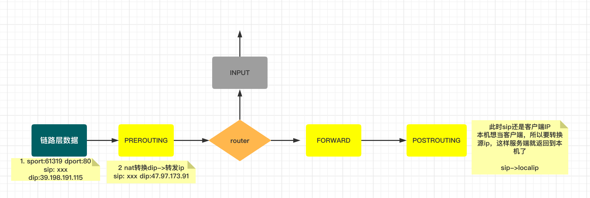

## NAT转换

### 转发本机端口

本地程序端口为8080，然后外部通过80来访问，本机内外IP`172.31.0.2`

```shell
iptables -t nat -A PREROUTING -p tcp --dport 80 -j DNAT --to-destination 172.31.0.2:8080

# 测试，使用外网IP访问 curl 139.198.191.115（在本机内访问不能通过内网IP访问，下面有解决方法）
[root@web2 ~]# curl -i 139.198.191.115
HTTP/1.1 200 OK
Date: Sat, 22 Oct 2022 02:06:39 GMT
Content-Length: 21
Content-Type: text/plain; charset=utf-8
```


**不能通过内网IP访问解决**

由于本机访问本机程序的时候，应该是和外网访问流量不一样，没有进入到`PREROUTING`，所以访问有问题。具体可查阅本机访问内网和外网访问不同

```shell
# 解决这个问题也比较简单，在OUTPUT层进行处理
iptables -t nat -A OUTPUT -p tcp --destination 127.0.0.1 --dport 80 -j DNAT --to-destination 127.0.0.1:8080
iptables -t nat -A OUTPUT -p tcp --destination 172.31.0.2 --dport 80 -j DNAT --to-destination 127.0.0.1:8080

# 测试
[root@web2 ~]# curl -i 172.31.0.2
HTTP/1.1 200 OK
Date: Sat, 22 Oct 2022 02:12:11 GMT
Content-Length: 16
Content-Type: text/plain; charset=utf-8

172.31.0.2:57826[root@web2 ~]# curl -i 127.0.0.1
HTTP/1.1 200 OK
Date: Sat, 22 Oct 2022 02:12:16 GMT
Content-Length: 15
Content-Type: text/plain; charset=utf-8
```

### FORWARD做转发

访问本机80端口，然后转到其他外网IP

```shell
# 开启FORWARD
echo 1 > /proc/sys/net/ipv4/ip_forward
iptables -t filter -P FORWARD ACCEPT

# 清除规则（慎重）

# 添加转发
iptables -t nat -A PREROUTING -p tcp --dport 80 -j DNAT --to-destination 47.97.173.91:80
# 这里是修改源IP，转发完，也要接收。
iptables -t nat -A POSTROUTING -p tcp --destination 47.97.173.91 --dport 80 -j SNAT --to-source 172.31.0.2
# 或者上面替换下面这个。做智能转换，出口IP自动找到合适的网卡出去
iptables -t nat -A POSTROUTING -p tcp --destination 47.97.173.91 --dport 80 -j MASQUERADE 
```



### 总结

1. nat转换使用tcp扩展的时候，一定要先指定-p tcp，然后再接其他参数。
2. nat转换技术是不需要自己再次返转的，这是依赖于`nf_conntrack`模块，`/proc/net/nf_conntrack`记录转换信息，返回会自动帮转。