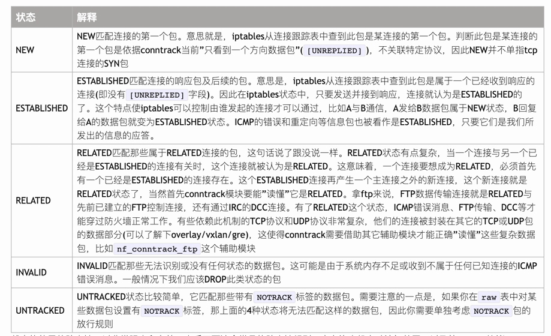

**参考资料**

- [文档]
- [conntrack]

## 基本命令

```shell
# 完整命令操作
iptables [-t table] CMD [chain] [rules] [-j target]

Usage: iptables -[ACD] chain rule-specification [options]
       iptables -I chain [rulenum] rule-specification [options]
       iptables -R chain rulenum rule-specification [options]
       iptables -D chain rulenum [options]
       iptables -[LS] [chain [rulenum]] [options]
       iptables -[FZ] [chain] [options]
       iptables -[NX] chain
       iptables -E old-chain-name new-chain-name
       iptables -P chain target [options]
```

### CMD

| 缩写  | 完整命令           | 后面跟内容               | 说明                                 |
|-----|----------------|---------------------|------------------------------------|
| -A  | --append       | chain               | 在chain后面追加内容                       |
| -C  | --check        | chain               | 检查链中的规则是否存在                        |
| -D  | --delete       | chain rulenum       | 删除链中的规则                            |
| -I  | --insert       | chain [rulenum]     | 在链中插入规则，这个时候要指出插入的位置 --line-number |
| -R  | --replace      | chain rulenum       | 在链中插入规则，这个时候要指出插入的位置 --line-number |
| -L  | --list         | [chain [rulenum]]   | 列出链上的规则,可以查看指定行                    |
| -S  | --list-rules   | [chain [rulenum]]   | 打印指定链或者所有链的rule，这个就是能操作的命令         |
| -F  | --flush        | [chain]             | 删除所有的规则或者指定链的规则                    |
| -Z  | --zero         | [chain [rulenum]]   | 清除链上的计数器                           |
| -N  | --new          | chain               | 新建一个自定义链                           |
| -X  | --delete-chain | [chain]             | 删除用户自定义链                           |
| -P  | --policy       | chain target        | 修改链默认规则 ACCEPT DROP                |
| -E  | --rename-chain | old-chain new-chain | 更改链名                               |

### Options

| 缩写  | 完整命令               | 后面跟内容               | 说明                                 |
|-----|--------------------|---------------------|------------------------------------|
| -4  | --ipv4             |                     |                                    |
| -6  | --ipv6             |                     |                                    |
| -p  | --protocol         | proto               | 指定协议 tcp,udp,icmp                  |
| -s  | --source           | address[/mask][...] | 源地址                                |
| -d  | --destination      | address[/mask][...] | 目标地址                               |
| -i  | --in-interface     | input name[+]       | 网卡                                 |
| -j  | --jump             | target              | 执行结果，可以跳转到自定义的操作链                  |
| -g  | --goto             | chain               | 直接跳转到链上，不返回                        |
| -m  | --match            | chain               | 扩展操作                               |
| -n  | --numeric          |                     | 将输出的语义词为完整的数字表达，例如anywhere 0.0.0.0 |
| -v  | --verbose          |                     | 详细信息列出                             |
| -w  | --wait             | [seconds]           | 放弃前获取表锁的最长等待时间                     |
| -W  | --wait-interval    | [usecs]             | 尝试获取                               |
| -   | --line-numbers     |                     | 打印的时候显示行号                          |
| -x  | --exact            |                     | 展开数字(显示精确值)                        |
| -f  | --fragment         |                     | 仅匹配第二个或更多片段                        |
| -   | --modprobe=command |                     | 尝试使用此命令插入模块                        |
| -   | --set-counters     | PKTS BYTES          | 在插入/附加期间设置计数器                      |

### 匹配条件


```
通用匹配:
    -s 匹配的数据包中源IP
    -d 匹配的数据包中的目的IP
    -i 匹配从指定接口进来的数据包
    -o 匹配指定接口向外发送的数据包
  iptables -t filter -A INPUT -s 1.2.3.4 -d 4.3.2.1 -j ACCEPT     
  
扩展匹配:
  1. 隐式扩展：在使用扩展匹配时候，不指定扩展模块直接使用扩展匹配
   TCP 扩展：
    -p: 【协议扩展】指定数据包的协议类型 tcp,udp,icmp  
        -p tcp --tcp-flags 列表1 列表2  #tcp标志位。 列表1指定要检查的标志位，列表2：指定在列表1中有的标志位，并且标志位为1
        -p tcp --tcp-flags syn,fin,ack syn,fin   # 匹配syn=1,fin=1,ack=0
    --dport: 【端口扩展】 目的端口
    --sport: 【端口扩展】 源端口
    
    iptables -t filter -A INPUT -s 1.2.3.4 -p tcp --dport 22 -j ACCEPT
   
   ICMP扩展: -p icmp --icmp-type
     1. 将客户端1.2.3.4发的ping放行
      iptables -A INPUT -t filter 
  
  UDP扩展：
   -p udp --dport
    
    
  2. 显示扩展
    nf_conntrack
    作用： 可以追踪记录当前系统中每个链接的状态
    /proc/net/nf_conntrack
    cfstate:状态模块
        NEW: 新的连接请求
        ESTABLISHED: 
        INVALID:
        RELATED:
        
    

```


### 示例

**查看信息**

```shell
# 查看filter表完整信息信息
iptables -L -t filter -nv

# 查看filter表INPUT链信息
iptables -L INPUT -t filter -nv

# 查看filter表INPUT链第一行信息
iptables -L INPUT 1 -nv

# 查看filter表INPUT链第1行 rule
iptables -S INPUT 1 -t filter 
-A INPUT -p tcp -m tcp --dport 22 -m comment --comment "允许ssh连接" -j ACCEPT
```

## filter表

filter表的相关操作是用来拦截数据的，外部数据能否进入协议栈IP层（INPUT）(FORWARD)，用户空间数据或者IP层数据能否被发送出去到链路层（OUTPUT）。一般当做防火墙来使用 在这个表中所以有三个链可以操作:
- INPUT
- FORWARD
- OUTPUT

**设置filter表中链的默认规则**

```shell
#设置链默认拒绝、放行
iptables -P INPUT DROP
iptables -P INPUT ACCEPT
```

**相关场景**

```shell
# 1. 放行22端口
iptables -A INPUT  -t filter -p tcp -s 0/0 --dport 22 -m comment --comment "放行ssh连接" -j ACCEPT

# 将INPUT链设置默认为DROP,这样此台服务器是不会收到攻击的（程序），因为进入不了INPUT。但是数据还是到达了链路层 ，在网络层接受的时候丢弃
iptables -P INPUT DROP

# 上面INPUT drop,所以不仅外网访问不了本机，且本机也访问不了外网，因为虽然发出去没问题，但是外网会进行响应
# 例如想ping 172.31.0.3
iptables -A INPUT -t filter -p icmp -s 172.31.0.3 -m comment --comment "放行ping"  -j ACCEPT

# 上面虽然阻止了所有的外来请求，但是同样也访问不了外网，这样不可能每次都放行。除非特殊原因，限制只能访问哪些网站
# 但是想主机可以访问任意外网。下面这个操作是使用conntrack模块来查找发出去的包能匹配直接放行
iptables -A INPUT -m conntrack --ctstate RELATED,ESTABLISHED -j ACCEPT

```

## nat表

nat表主要是用来做地址转换的。`SNAT`, `DNAT`, `LOG` 所以涉及到的链有：

- PREROUTING
- INPUT
- OUTPUT
- POSTROUTING

网卡->防火墙->用户空间

```shell
# 1. 地址转换，访问本机的80，然后访问其他的ip。（做代理用）用到了ip_conntrack模块
## 将访问本机的80端口，然后直接直接转发到另一个ip
iptables -t nat -A PREROUTING -p tcp --dport 80 -j DNAT --to-destination 139.198.165.7:80
## 然后进入了output->postrouting 此时ip是这样的 clientIP:80 -> 139.198.165.7:80
## 因为139.198.165.7:80要回数据包，总不能直接回给client，所以这样还要做一次转换。改变原地址
iptables -t nat -A POSTROUTING -d 120.26.148.228  -j SNAT --to-source 172.31.0.2
## 这样代理服务器收到数据之后会直接返回给client。此时是通过/proc/net/nf_conntrack 这个文件记录的数据来的。使用的是conntrack模块

## 智能的 MASQUERADE。这个是发送到网卡的时候，自动的修改源地址。好处就是如果多个网卡的时候，自动识别使用哪个出口ip。不用指定
iptables -t nat -A POSTROUTING -d 120.26.148.228  -j SNAT MASQUERADE

```


## 扩展模块

### conntrack

ctstate会记录每个连接的状态



```
ipv4     2 tcp      6 118 SYN_SENT src=172.31.0.2 dst=172.31.0.45 sport=53418 dport=80 [UNREPLIED] src=172.31.0.45 dst=172.31.0.2 sport=80 dport=53418 mark=0 zone=0 use=3

ipv4     2 tcp      6 300 ESTABLISHED src=122.224.68.82 dst=172.31.0.2 sport=62120 dport=22 src=172.31.0.2 dst=122.224.68.82 sport=22 dport=62120 [ASSURED] mark=0 zone=0 use=2
```


[文档]: https://linux.die.net/man/8/iptables
[conntrack]: https://blog.csdn.net/dhRainer/article/details/84846417
[conntrack]: https://opengers.github.io/openstack/openstack-base-netfilter-framework-overview/#iptables%E7%8A%B6%E6%80%81%E5%8C%B9%E9%85%8D