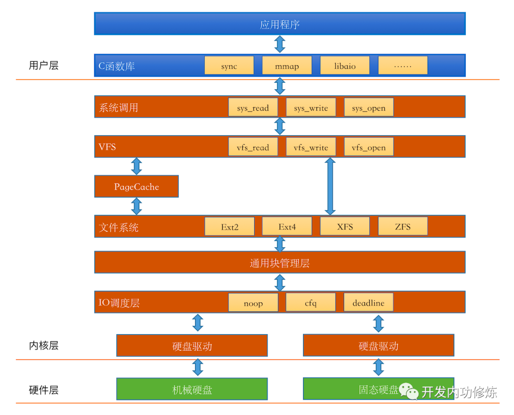

**参考资料**

1. [理解node]
2. [磁盘]



## 基本术语

1. 磁盘操作的基本单位是扇区 `sector`
2. 操作系统中文件系统操作的基本单位是块 `block`
3. 分区是把所有的扇区按照柱面分割成不同的大块
4. 刚分完区的设备也不是完全不能用，这个时候的分区叫裸分区，也叫裸设备。比如oracle就是绕开操作系统直接使用裸设备的。但是这个时候你就无法利用Linux文件系统里为你封装好的inode、block组成的文件与目录了，开发工作量会增加。 
5. 格式化就把原始的扇区数组变成了可被Linux文件系统使用的inode、block等基本元素了
6. VFS虚拟文件系统，是一层抽象，提供给系统调用的，下层是文件系统，文件系统实现了VFS的接口。用户就无需关心真正的文件系统调用
7. PageCache，VFS和文件系统中的一层缓存

## 什么是inode

inode是磁盘在分区格式化之后在磁盘上的一个固定区域，这块区域被分为一个个inode大小区域，用来存储信息。可通过`df -i`来查看磁盘中目前使用的inode。

inode中的基本信息

```
 文件的字节数

　　* 文件拥有者的User ID

　　* 文件的Group ID

　　* 文件的读、写、执行权限

　　* 文件的时间戳，共有三个：ctime指inode上一次变动的时间，mtime指文件内容上一次变动的时间，atime指文件上一次打开的时间。

　　* 链接数，即有多少文件名指向这个inode

　　* 文件数据block的位置
```

## 文件是如何存储的

在创建一个文件的时候，会消耗一个inode，然后这个文件就被分配一个inode号。文件相关的信息就存储到inode中，如果操作系统中的inode使用完，则没法再创建文件了。

**相关命令**

```
查看文件信息
state 文件 

查看系统inode使用状态
df -i

列车文件并加上inode号
ls -i 
```

## 目录是如何存储的

创建一个目录也是会消耗一个inode，目录里面存储的是一个类似map的数据结构，`文件名：inode号`，所以文件名是存储在上层目录中的。

## 链接远离

在表明看来，链接是指多个文件名指向同一个文件。

**硬链接**

```
硬连接命令
ln 源文件 目的文件

硬链接是不会消耗inode的，只是在上层目录中加了一项 文件名:inode号，并且inode中的links会加1，当links为0，则表示要删除文件。

[root@web2 disk]# stat a-s.txt 
  File: ‘a-s.txt’ -> ‘a.txt’
  Size: 5               Blocks: 0          IO Block: 4096   symbolic link
Device: fd01h/64769d    Inode: 1318303     Links: 1
Access: (0777/lrwxrwxrwx)  Uid: (    0/    root)   Gid: (    0/    root)
Access: 2022-10-19 09:22:25.465536867 +0800
Modify: 2022-10-19 09:22:21.269427273 +0800
Change: 2022-10-19 09:22:21.269427273 +0800
 Birth: -
[root@web2 disk]# stat a-1.txt 
  File: ‘a-1.txt’
  Size: 0               Blocks: 0          IO Block: 4096   regular empty file
Device: fd01h/64769d    Inode: 1318302     Links: 2
Access: (0644/-rw-r--r--)  Uid: (    0/    root)   Gid: (    0/    root)
Access: 2022-10-19 09:21:32.220146211 +0800
Modify: 2022-10-19 09:21:32.220146211 +0800
Change: 2022-10-19 09:21:57.633809961 +0800

软链接
ln -s 源文件 目的文件

软链接是会消耗一个inode，文件的内容是存储的是源文件的文件名。所以如果删除源文件，则链接文件的操作会提示找不到相应的文件。
```

**删除文件**

1. 删除文件，首先是根据文件名来删除的，会在目录中删除该文件名的一项。
2. 然后文件中的inode信息中的Links会减1
3. 最后如果inode中的link为0，则表示要真正删除文件
4. 硬连接仅仅是在目录项中增加一个key:value，然后文件的inode中inode增加1
5. 软链接是会消耗一个inode,里面的信息存储的就是源文件的文件名。是一个完整的文件
6. 软连接硬链接的原理就知道了吧


## 新建一个文件占用多大空间

1. 新建一个空文件需要消耗掉一个inode，用来保存用户、创建时间等元数据。

2. 新建一个空文件还需要消耗掉其所在目录的block中一定的空间，这些空间用来保存文件名，inode号等信息

## 只有1个字节的文件实际占用多少磁盘空间

文件系统是按照inode+block来组织的，所以不管你的文件多小，哪怕只有一个字节，在数据上都会消耗掉整整一个块(当然还得算上inode等开销)。这个块大小可以通过dumpe2fs等命令来查看。如果想改变这个块大小怎么办?对不起，只能重新格式化。

再扯的远一点，所有的文件系统理念都是按照块来分配的，包括分布式文件系统，例如HDFS。由于HDFS应用场景是各种GB、TB甚至是PB级别的数据处理。所以为了降低block的管理成本，它的block size设置的非常大。在比较新的版本里，一个block直接就是128M，你没看错，单位是M。 所以如果你没有block的概念，天天在HDFS上都保存一堆KB级别的小文件，就等着去财务处领钱吧！

## 文件过多时ls命令为什么会卡住？

文件的存储是在上层目录的block中，如果文件过多，则要申请的block过多，如果没有命中PageCache则需要io。

工程实践中，一般的做法就是通过一级甚至是二级hash把文件散列到多个目录中，把单目录文件数量控制在十万或万以下

## read 文件一个字节实际会发生多大的磁盘IO？

参考：[read]

## write文件一个字节后何时发起写磁盘IO？

参考：[write]


## Linux文件系统十问

参考：[linux文件系统]

[理解node]: https://www.ruanyifeng.com/blog/2011/12/inode.html
[磁盘]: https://mp.weixin.qq.com/mp/appmsgalbum?__biz=MjM5Njg5NDgwNA==&action=getalbum&album_id=1371808335259090944&scene=173&from_msgid=2247483902&from_itemidx=1&count=3&nolastread=1#wechat_redirect
[read]: https://mp.weixin.qq.com/s?__biz=MjM5Njg5NDgwNA==&mid=2247484994&idx=1&sn=20c63d5f6e2be4fced5ab09a3047da93&chksm=a6e3077991948e6f79b9a6a22f4a3305bced889d770cc8922ba7e68da2b3cd8c16f33b8fb3ed&scene=178&cur_album_id=1371808335259090944#rd
[write]: https://mp.weixin.qq.com/s?__biz=MjM5Njg5NDgwNA==&mid=2247483940&idx=1&sn=46a2ce2be6920cd25960f3fb73e541f3&chksm=a6e3031f91948a09ea9faa25a90c7fc9bcc3a8d633fcd2fdcfed33217c31d0ce6ee378213a7c&scene=178&cur_album_id=1371808335259090944#rd
[linux文件系统]: https://mp.weixin.qq.com/s?__biz=MjM5Njg5NDgwNA==&mid=2247487146&idx=1&sn=2786cd64da86d3d3c976ec8ddf0cbbf8&chksm=a6e30f91919486871b7e3e2530e8915a6d9034de905fcd81d9b673ac2d5b745f84dee936e9a8&scene=178&cur_album_id=1371808335259090944#rd