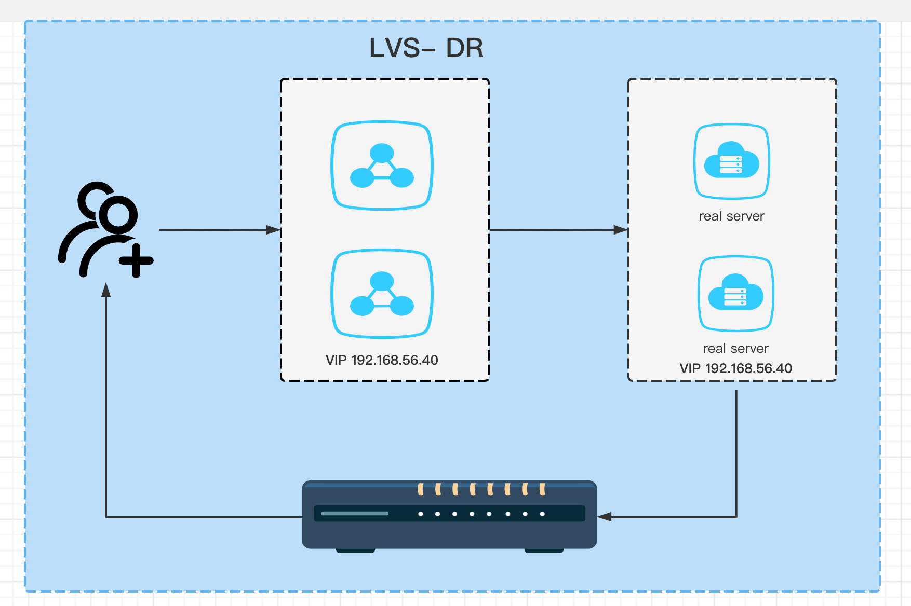
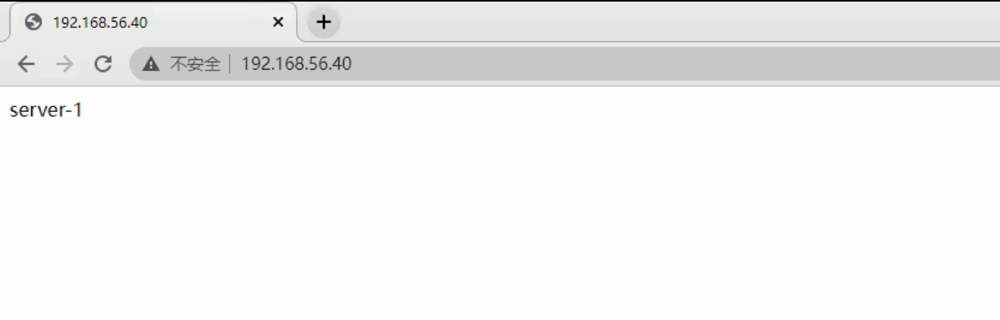

## DR模式



**环境**

| 主机类型  | IP            | VIP           |
|-------|---------------|---------------|
| 虚拟服务  | 192.168.56.41 | 192.168.56.40 |
| 真实服务1 | 192.168.56.42 | 192.168.56.40 |
| 真实服务2 | 192.168.56.43 | 192.168.56.40 |
| 测试主机  | 外部win主机       |               |


**虚拟服务**

```shell

# 配置ipvs
modprobe ip_vs
cat /proc/net/ip_vs
ipvsadm-save >/etc/sysconfig/ipvsadm
systemctl start ipvsadm.service
ipvsadm -C

ipvsadm -A -t 192.168.56.40:80 -s rr
ipvsadm -a -t 192.168.56.40:80 -r 192.168.56.42:80 -g
ipvsadm -a -t 192.168.56.40:80 -r 192.168.56.43:80 -g

# 配置虚拟IP
vim /etc/sysconfig/network-scripts/ifcfg-eth1:1

NAME="eth1:1"
DEVICE="eth1:1"
ONBOOT="yes"
IPADDR=192.168.56.40
NETMASK=255.255.255.255

# 重启网络
service network restart

```

**真实服务1、2**

```shell
vim /etc/sysctl.conf

net.ipv4.conf.all.arp_ignore = 1
net.ipv4.conf.all.arp_announce = 2
net.ipv4.conf.default.arp_ignore = 1
net.ipv4.conf.default.arp_announce = 2
net.ipv4.conf.lo.arp_ignore = 1
net.ipv4.conf.lo.arp_announce = 2

vim /etc/sysconfig/network-scripts/ifcfg-lo:1 

DEVICE=lo:1
IPADDR=192.168.56.40
NETMASK=255.255.255.255
NETWORK=127.0.0.0
ONBOOT=yes

# 这个默认在创建网卡会启动
route add -host 192.168.56.40 dev lo:1
```

**验证**



**注意**

不要在lvs服务和real server上验证。具体分析数据流向


**参考**

- [DR]

[DR]: https://www.ngui.cc/el/1251476.html?action=onClick
