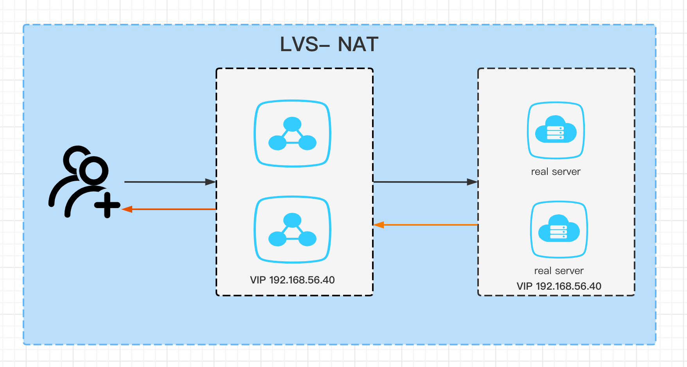

## DR模式


**环境**

| 主机类型  | IP            | VIP           |
|-------|---------------|---------------|
| 虚拟服务  | 192.168.56.41 | 192.168.56.40 |
| 真实服务1 | 192.168.56.42 | 192.168.56.40 |
| 真实服务2 | 192.168.56.43 | 192.168.56.40 |
| 测试主机  | 外部win主机       |               |


**虚拟服务**

```shell

# 配置ipvs
modprobe ip_vs
cat /proc/net/ip_vs
ipvsadm-save >/etc/sysconfig/ipvsadm
systemctl start ipvsadm.service
ipvsadm -C

ipvsadm -A -t 192.168.56.40:80 -s rr
ipvsadm -a -t 192.168.56.40:80 -r 192.168.56.42:80 -g
ipvsadm -a -t 192.168.56.40:80 -r 192.168.56.43:80 -g

# 配置虚拟IP
vim /etc/sysconfig/network-scripts/ifcfg-eth1:1

NAME="eth1:1"
DEVICE="eth1:1"
ONBOOT="yes"
IPADDR=192.168.56.40
NETMASK=255.255.255.255

# 重启网络
service network restart

```

**真实服务1、2**

```shell
vim /etc/sysctl.conf

net.ipv4.conf.all.arp_ignore = 1
net.ipv4.conf.all.arp_announce = 2
net.ipv4.conf.default.arp_ignore = 1
net.ipv4.conf.default.arp_announce = 2
net.ipv4.conf.lo.arp_ignore = 1
net.ipv4.conf.lo.arp_announce = 2

vim /etc/sysconfig/network-scripts/ifcfg-lo:1 

DEVICE=lo:1
IPADDR=192.168.56.40
NETMASK=255.255.255.255
NETWORK=127.0.0.0
ONBOOT=yes

# 这个默认在创建网卡会启动
route add -host 192.168.56.40 dev lo:1
```

**实现原理**

1. lvs服务收到请求之后，然后通过负载算法获取后端的real server
2. 将二层数据帧最外层的目的地址改为负载均衡后的real server的mac
3. 在每一台的real server上接收到了目的mac的数据，但是此时路由发现目的IP不是自己的
4. 最后在每一台服务器上面的lo网卡添加一个与lvs一样的ip，目的就是为了能正常接收数据包，为啥不在别的网卡上添加，其实也是可以的，只是lo网卡接收到不响应而已。不能单独请求readl server
5. 这个时候real server就直接返回数据到客户端，此时大大减轻了lvs接收返回的数据压力。


**验证**


**注意**

- 不要在lvs服务和real server上验证。具体分析数据流向
- DR模式不支持端口转发，这个应该是为了最大支持性能，因为这样不用解析数据包，只要 将最外层的目的MAC地址更换为real server
- DR模式要求lvs服务和real server是在同一个网段下面

**参考**

- [DR]

## NAT模式



nat模式比较简单，就是和iptable一样，通过修改源地址和源端口，目的ip和目的端口


[DR]: https://www.ngui.cc/el/1251476.html?action=onClick
