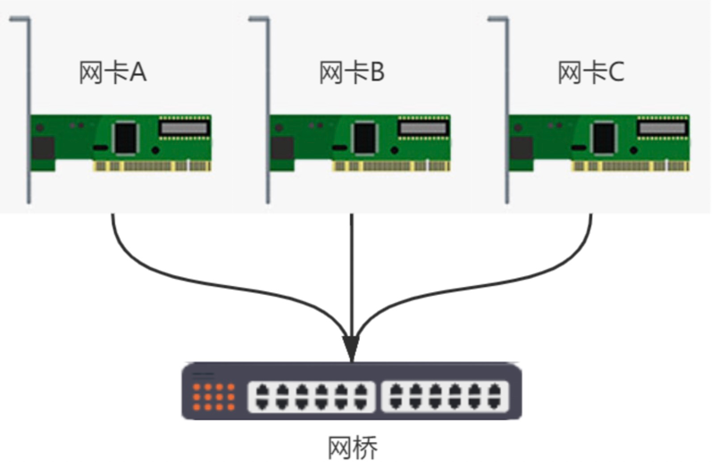
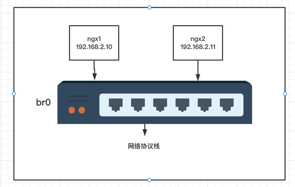
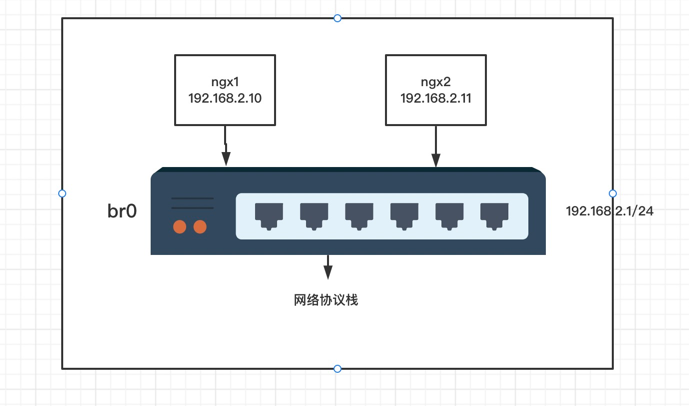
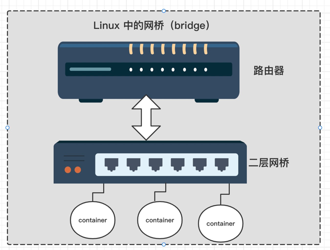

网桥在OSI参考模型中处于第二层，直接通过MAC通信。真实的物理交换机是没有配置IP地址的。直接通过端口通信，网桥会自动学习每个端口的MAC地址。

下面通过实验来实现docker中的网桥模式



## 配置网络


**创建网桥**

- 创建网桥
- 启动网桥

```shell
$ brctl addbr br0
$ ip link set dev br0 up
```

**创建容器ngx1并自定义网络**

- 创建ngx1容器，并设置网络为none
- 床架veth设备，并将veth一头设置到docker中，另一头绑定到网桥
- 设置容器的ip

```shell
$ docker run --name ngx1 --rm --network none -d nginx:1.22-alpine
$ ip link add veth1 type veth peer name veth1-p
# 查看容器的Pid
$ docker inspect ngx1 |grep Pid
# 创建网络namespace，然后将veth一头绑定到容器namespace中
$ mkdir /var/run/netns
$ ln -s /proc/2600/ns/net /var/run/netns/ngx1
$ ip link set veth1 netns ngx1
$ ip netns exec ngx1 ip link set name eth0 dev veth1
$ ip netns exec ngx1 ip addr add 192.168.2.10/24 dev eth0 
$ ip netns exec ngx1 ip link set dev eth0 up
$ docker exec -it ngx1 ifconfig
$ brctl addif br0 veth1-p
$ ip link set dev veth1-p up
$ brctl show br0
```

> 注意：docker默认创建的网络namespace是隐式的，所以上面进行了显示绑定`/var/run/netns`目录下

**创建容器ngx2并自定义网络**
这里的步骤和上面创建ngx1是一样的

```shell
$ docker run --name ngx2 --rm --network none -d nginx:1.22-alpine
$ ip link add veth2 type veth peer name veth2-p
$ docker inspect ngx2 |grep Pid # Pid 为3256
$ ln -s /proc/3256/ns/net /var/run/netns/ngx2
$ ip link set veth2 netns ngx2
$ ip netns exec ngx2 ip link set name eth0 dev veth2
$ ip netns exec ngx2 ip addr add 192.168.2.11/24 dev eth0 
$ ip netns exec ngx2 ip link set dev eth0 up
$ docker exec -it ngx2 ifconfig
$ brctl addif br0 veth2-p
$ ip link set dev veth2-p up
$ brctl show br0
```

## 防火墙设置

**打开防火墙网络转发**

- 开启iptables转发。默认这个链是`DROP`的，曾经这个问题找了好久
- ngx1访问ngx2的时候，会先到br0网桥。
- 此时已经进入到了宿主机的网络协议栈，然后就开始走netfilter各种链。
- 因为目标ip不是本协议栈中的ip，所以会走filter表中的forward规则。所以这里要开启转发。

```shell
$ echo 1 > /proc/sys/net/ipv4/ip_forward
$ iptables -t filter -P FORWARD ACCEPT
```

**测试**

- 此时容器已经可以互相通了。
- 但是容器访问外网是不能通的。后面流程就介绍如何外网通信原理

```shell
$ docker exec -it ngx1 ping 192.168.2.11
```

## 外网通信


上面流程是在二层链路上通信，无需路由。

要想容器能访问外网，前提条件就是容器流量能流向外网，还有本宿主机能接受，并转发到容器内。

所以肯定要用到iptables和路由，此时已经在三层网络上。

**配置容器外网访问**

- 给网桥配置一个ip，这个当做默认网关。（网桥不是二层上的吗？怎么能配置路由。看文尾介绍）
- 并且将容器内的默认网关配置到网桥中
- 设置nat表中流量出去的时候做智能（MASQUERADE）转换。如果是内网就无需了。

```shell
$ ip addr add 192.168.2.1/24 dev br0
$ ip netns exec ngx1 ip route add default via 192.168.2.1
$ ip netns exec ngx2 ip route add default via 192.168.2.1
$ iptables -t nat -A POSTROUTING -s 192.168.2.0/24 ! -o br0 -j MASQUERADE
```

**Linux中的网桥示意图**

- 是路由器+二层网桥结合体
- 在二层上通信无需配置ip
- 跨网段则需要路由器配置ip
  

## 总结

1. 在二层网络中通信是直接通过MAC地址。
2. Linux中的网桥是路由器和网桥的结合体。`路由器<->网桥<->容器`
3. Linux网桥在二层网络上通信，可以不设置ip。但是如果跨网段则需要。
4. 重点是要理解网络协议栈中的netfilter。这个才是很核心内容，这个要单独章节来说明。