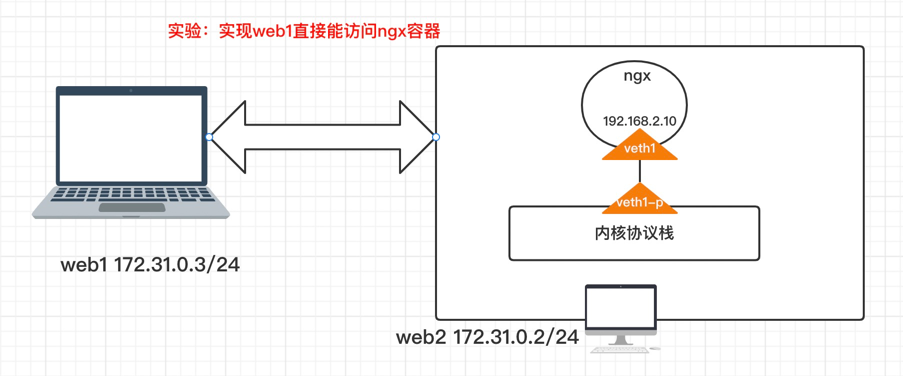

docker容器中网络默认只允许在本机内访问，现在实现一个流程。在局域网内容(172.31.0.2)web1 访问 (172.31.0.2)web2中的容器。

我们不使用docker中的默认网络，自己从0自定义网络模型，实现通信。下面是实验的设计流程图：



## web2创建容器ngx

web2中操作，创建容器，且自定义网络。

- 在web2中启动一个网络为`none`的容器`ngx`
- 创建一对`veth peer`并配置ip，和绑定到`ngx`容器内
- 这里没有使用到网桥（bridge）测试。具体网桥配合可参见上一篇

```shell
$ docker run --name ngx1 --rm --network none -d nginx:1.18-alpine
$ ip link add veth1 type veth peer name veth1-p
$ mkdir /var/run/netns
$ docker inspect ngx1 |grep Pid # 查找出容器进程
$ ln -s /proc/869389/ns/net /var/run/netns/ngx1
$ ip link set veth1 netns ngx1
$ ip netns exec ngx1 ip link set name eth0 dev veth1
$ ip netns exec ngx1 ip addr add 192.168.2.10/24 dev eth0
$ ip netns exec ngx1 ip link set dev eth0 up
$ docker exec -it ngx1 ifconfig
# 因为这里没有使用网桥，直接veth1-p连接到宿主机的内核协议栈。所以配置ip即可
$ ip addr add 192.168.2.20/24 dev veth1-p
$ ip link set dev veth1-p up
```

## web2配置netfilter/route

最终web1访问ngx容器，肯定是走web1和web2的物理网络通信。web1访问ngx时候，目的ip是ngx的，不是本主机内的，所以要走FORWARD。

而且还要配置路由目的ip是`192.168.2.0/24`的要走veth1-p接口。这个默认创建veth对的时候自动创建

最后到达veth1-p的时候，源ip还是web1的，虽然流量进入了ngx容器，但是ngx回包的时候，到达veth1-p的时候，发现不是本机ip，则直接丢弃。

**查看/配置路由**

```shell
# 查看结果
$ route -n

# 默认配置veht1-p的ip会自动创建 如果不存在则自己手动创建路由。原理上面也介绍了。
Destination     Gateway         Genmask         Flags Metric Ref    Use Iface
0.0.0.0         172.31.0.1      0.0.0.0         UG    100    0        0 eth0
192.168.2.0     0.0.0.0         255.255.255.0   U     0      0        0 veth1-p 
```

**配置源地址转换(SNAT)**

```shell
# 将web1的地址转换为veth1-p的地址。这样ngx就能正常接收，且回包的时候，能正常回到veth1-p接口（这种方式一般不用，用下面的智能选择），但是手动配置可以理解原理
$ iptables -t nat -A POSTROUTING -s 172.31.0.3 -j  SNAT --to-source 192.168.2.20

# 或智能转换（推荐使用）这里可以自动查找应该出去的ip。好处是如如果出去的ip经常发生变化，无需修改规则
$ iptables -t nat -A POSTROUTING -s 172.31.0.3 -j  MASQUERADE

# 开启FORWARD功能（默认是关闭的，这个要注意）
$ echo 1 > /proc/sys/net/ipv4/ip_forward
$ iptables -t filter -P FORWARD ACCEPT 

```

## web1配置路由

web1访问ngx不同网段，肯定要走路由规则。所以要配置路由如何通。最终都是要通过web1-web2之间的物理网络通信。

```shell
# 这里精准设置192.168.2.10 这个直接就到网关web2中
$ route add -host 192.168.2.10 gw 172.31.0.2 dev eth0

$ route -n

Destination     Gateway         Genmask         Flags Metric Ref    Use Iface
0.0.0.0         172.31.0.1      0.0.0.0         UG    100    0        0 eth0
192.168.2.10    172.31.0.2      255.255.255.255 UGH   0      0        0 eth0
```

## 测试

web1访问ngx容器

```shell
curl 192.168.2.10

HTTP/1.1 200 OK
Server: nginx/1.18.0
Date: Wed, 15 Jun 2022 05:39:40 GMT
Content-Type: text/html
Content-Length: 612
Last-Modified: Thu, 29 Oct 2020 15:23:06 GMT
Connection: keep-alive
ETag: "5f9ade5a-264"
Accept-Ranges: bytes
....
```

## 抓包

**web2中抓包veth2-p的包**

- 这里做了地址转换，虽然源IP显示的是web2，这里是本机添加了host主机
- 这里可以自己测试下，如果不添加SNAT，或者SNAT 源ip不转换成veth1-p的ip，能接收不?肯定不能了，自行测试，更加深刻理解

```shell
$ tcpdump -i veth1-p

dropped privs to tcpdump
tcpdump: verbose output suppressed, use -v or -vv for full protocol decode
listening on veth1-p, link-type EN10MB (Ethernet), capture size 262144 bytes
13:41:03.989650 IP web2.39192 > 192.168.2.10.http: Flags [S], seq 3715858371, win 29200, options [mss 1410,sackOK,TS val 3389769701 ecr 0,nop,wscale 7], length 0
13:41:03.989977 IP 192.168.2.10.http > web2.39192: Flags [S.], seq 2902368008, ack 3715858372, win 28960, options [mss 1460,sackOK,TS val 1590072217 ecr 3389769701,nop,wscale 7], length 0
13:41:03.990145 IP web2.39192 > 192.168.2.10.http: Flags [.], ack 1, win 229, options [nop,nop,TS val 3389769701 ecr 1590072217], length 0
13:41:03.990190 IP web2.39192 > 192.168.2.10.http: Flags [P.], seq 1:77, ack 1, win 229, options [nop,nop,TS val 3389769701 ecr 1590072217], length 76: HTTP: GET / HTTP/1.1
13:41:03.990194 IP 192.168.2.10.http > web2.39192: Flags [.], ack 77, win 227, options [nop,nop,TS val 1590072217 ecr 3389769701], length 0
13:41:03.990254 IP 192.168.2.10.http > web2.39192: Flags [P.], seq 1:239, ack 77, win 227, options [nop,nop,TS val 1590072217 ecr 3389769701], length 238: HTTP: HTTP/1.1 200 OK
13:41:03.990308 IP 192.168.2.10.http > web2.39192: Flags [P.], seq 239:851, ack 77, win 227, options [nop,nop,TS val 1590072217 ecr 3389769701], length 612: HTTP
13:41:03.990361 IP web2.39192 > 192.168.2.10.http: Flags [.], ack 239, win 237, options [nop,nop,TS val 3389769701 ecr 1590072217], length 0
13:41:03.990398 IP web2.39192 > 192.168.2.10.http: Flags [.], ack 851, win 247, options [nop,nop,TS val 3389769702 ecr 1590072217], length 0
13:41:03.990468 IP web2.39192 > 192.168.2.10.http: Flags [F.], seq 77, ack 851, win 247, options [nop,nop,TS val 3389769702 ecr 1590072217], length 0
13:41:03.990491 IP 192.168.2.10.http > web2.39192: Flags [F.], seq 851, ack 78, win 227, options [nop,nop,TS val 1590072217 ecr 3389769702], length 0
13:41:03.990592 IP web2.39192 > 192.168.2.10.http: Flags [.], ack 852, win 247, options [nop,nop,TS val 3389769702 ecr 1590072217], length 0
13:41:09.498945 ARP, Request who-has 192.168.2.10 tell web2, length 28
13:41:09.498994 ARP, Request who-has web2 tell 192.168.2.10, length 28
13:41:09.499001 ARP, Reply web2 is-at 36:e9:05:f1:0f:5d (oui Unknown), length 28
13:41:09.499005 ARP, Reply 192.168.2.10 is-at 16:02:41:45:d3:c7 (oui Unknown), length 28
```

**抓包web2中eth0**

```shell
$ tcpdump -i eth0 port 80 


13:42:53.069109 IP web1.39666 > 192.168.2.10.http: Flags [S], seq 4025916727, win 29200, options [mss 1410,sackOK,TS val 3389878780 ecr 0,nop,wscale 7], length 0
13:42:53.069173 IP 192.168.2.10.http > web1.39666: Flags [S.], seq 2688927125, ack 4025916728, win 28960, options [mss 1460,sackOK,TS val 1590181296 ecr 3389878780,nop,wscale 7], length 0
13:42:53.069339 IP web1.39666 > 192.168.2.10.http: Flags [.], ack 1, win 229, options [nop,nop,TS val 3389878781 ecr 1590181296], length 0
13:42:53.069359 IP web1.39666 > 192.168.2.10.http: Flags [P.], seq 1:77, ack 1, win 229, options [nop,nop,TS val 3389878781 ecr 1590181296], length 76: HTTP: GET / HTTP/1.1
13:42:53.069369 IP 192.168.2.10.http > web1.39666: Flags [.], ack 77, win 227, options [nop,nop,TS val 1590181296 ecr 3389878781], length 0
13:42:53.069454 IP 192.168.2.10.http > web1.39666: Flags [P.], seq 1:239, ack 77, win 227, options [nop,nop,TS val 1590181296 ecr 3389878781], length 238: HTTP: HTTP/1.1 200 OK
13:42:53.069494 IP 192.168.2.10.http > web1.39666: Flags [P.], seq 239:851, ack 77, win 227, options [nop,nop,TS val 1590181296 ecr 3389878781], length 612: HTTP
13:42:53.069547 IP web1.39666 > 192.168.2.10.http: Flags [.], ack 239, win 237, options [nop,nop,TS val 3389878781 ecr 1590181296], length 0
13:42:53.069593 IP web1.39666 > 192.168.2.10.http: Flags [.], ack 851, win 247, options [nop,nop,TS val 3389878781 ecr 1590181296], length 0
13:42:53.069661 IP web1.39666 > 192.168.2.10.http: Flags [F.], seq 77, ack 851, win 247, options [nop,nop,TS val 3389878781 ecr 1590181296], length 0
13:42:53.069697 IP 192.168.2.10.http > web1.39666: Flags [F.], seq 851, ack 78, win 227, options [nop,nop,TS val 1590181296 ecr 3389878781], length 0
13:42:53.069789 IP web1.39666 > 192.168.2.10.http: Flags [.], ack 852, win 247, options [nop,nop,TS val 3389878781 ecr 1590181296], length 0
```

## 总结

很多网络组件是实现原理就是这样，通过安装代理，然后创建容器的时候，分配ip，路由，记录MAC地址等各种信息同步到不同主机和中。就实现了容器网络互通。其实真正原理还是绕不过物理网络，无非就是如何转换而已。或者使用隧道进行重新封包解包，还是要依赖各种软件

1. 这个实验理解了两个不同主机之间容器互通原理。
2. 仅仅使用veth对不使用网桥也能通信。
3. 了解了路由，netfilter的一些基本原理。
4. 抓包分析数据包的走向。以及转换过程