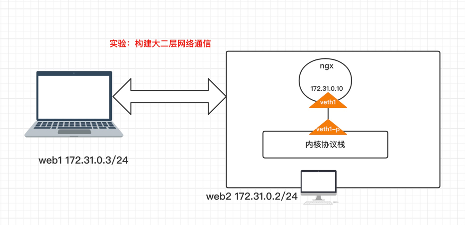

实验目的：在宿主机内容的docker容器的ip段都是物理主机的ip段。这样就类似容器和宿主机在同一个网段内，这样不同宿主机内的容器就可以在二层网络之间通信，这里涉及到MAC地址欺骗。




## web2创建容器ngx

web2中操作，创建容器，且自定义网络。

- 在web2中启动一个网络为`none`的容器`ngx`
- 创建一对`veth peer`并配置ip，和绑定到`ngx`容器内

```shell
$ docker run --name ngx1 --rm --network none -d nginx:1.18-alpine
$ ip link add veth1 type veth peer name veth1-p
$ mkdir /var/run/netns
$ docker inspect ngx1 |grep Pid # 查找出容器进程
$ ln -s /proc/869389/ns/net /var/run/netns/ngx1
$ ip link set veth1 netns ngx1
$ ip netns exec ngx1 ip link set name eth0 dev veth1
$ ip netns exec ngx1 ip addr add 172.31.0.10/24 dev eth0
$ ip netns exec ngx1 ip link set dev eth0 up
$ docker exec -it ngx1 ifconfig
# 因为这里没有使用网桥，直接veth1-p连接到宿主机的内核协议栈。所以配置ip即可
$ ip addr add 172.31.0.10/24 dev veth1-p
$ ip link set dev veth1-p up
```

## web2配置netfilter/route

最终web1访问ngx容器，肯定是走web1和web2的物理网络通信。web1访问ngx时候，目的ip是ngx的，不是本主机内的，所以要走FORWARD。

而且还要配置路由目的ip是`172.31.0.10/24`的要走veth1-p接口。这个默认创建veth对的时候自动创建，需要删除默认的自定义创建


**查看/配置路由**

```shell

$ route del -net 172.31.0.0 netmask 255.255.255.0 dev veth1-p
$ route add -host 172.31.0.10 dev veth1-p

Destination     Gateway         Genmask         Flags Metric Ref    Use Iface
0.0.0.0         172.31.0.1      0.0.0.0         UG    100    0        0 eth0
172.31.0.0      0.0.0.0         255.255.255.0   U     100    0        0 eth0
172.31.0.10     0.0.0.0         255.255.255.255 UH    0      0        0 veth1-p
```

**配置源地址转换(SNAT)**

```shell
$ iptables -t nat -A POSTROUTING -s 172.31.0.3 -j  MASQUERADE

# 开启FORWARD功能（默认是关闭的，这个要注意）
$ echo 1 > /proc/sys/net/ipv4/ip_forward
$ iptables -t filter -P FORWARD ACCEPT 

```

**给容器ngx手动添加web1的MAC地址**

- 这里因为容器是无法通过arp获取web1的MAC地址，所以这里手动添加上，做实验。
- 很多第三方软件也是在创建容器的时候，默认将节点的MAC地址添加到容器内。

```shell
# 将web1的MAC地址添加到ngx容器内，二层通信都是MAC地址。
$ ip netns exec ngx1 arp -s 172.31.0.3 52:54:99:e0:b1:2d
```

## web1配置路由以及MAC地址

web1访问ngx容器，虽然现在对于ip是同一个网段，交换机会进行广播，但是ngx在web2里是另一个namespace，web2是不会进行代答的。

所以这里就要构造个假的。将172.31.0.10的MAC地址换成web2的eth0或者web2中的veth1-p都是可以，因为交换机都能找到这两块网卡。

```shell
# 这样就直接能通过MAC通信了。
$ arp -s 192.168.2.10 52:54:99:8f:67:73
```

## 测试

web1访问ngx容器

```shell
curl -i 172.31.0.10

HTTP/1.1 200 OK
Server: nginx/1.18.0
Date: Wed, 15 Jun 2022 05:39:40 GMT
Content-Type: text/html
Content-Length: 612
Last-Modified: Thu, 29 Oct 2020 15:23:06 GMT
Connection: keep-alive
ETag: "5f9ade5a-264"
Accept-Ranges: bytes
....
```


## 总结_

容器构造大二层网络，这里唯一要解决的就是宿主机内容器内发网卡是不能被真实交换机知道的。所以宿主机是不知道另一个宿主机内容器的ip，所以一般都是在创建容器的时候，默认添加到容器中MAC地址

第三方软件就是这样，或者使用路由器代答模式

