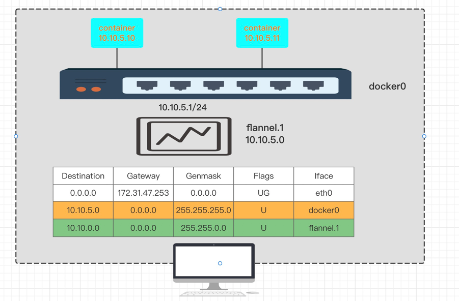
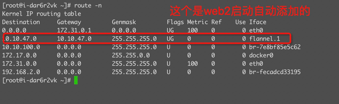

flannel组件就是其实还是通过物理网络来转发不同主机内的二层数据帧。是一个软件，可以为每个容器分配一个不重复的ip，且这些ip能互相通信。
其实现目标也很简单，如下几个步骤：

- 统一管理所有的容器。保证每个主机内的容器ip不重复，这个可以由docker这种来管理。例如创建一个网桥，分配ip自网段，然后确保每个主机分配的自网段不同。
- 当本主机内网段通信直接走网桥就行。然后再夸网段的时候，通过路由匹配，到flannel网卡。
- 每个主机的上层有一个大的网段flannel，这个网段最终会走到flannel网卡。也就走到了flanneld程序。然后就好办了，直接通过传输层协议来输出数据包到对应的主机。
- flanneld程序可以通过vxlan，udp，等各种技术手段将数据传到对应的主机，然后被对应主机的flannel网卡接受，然后又到对应的flanneld程序。又转发到对应的容器。





- 10.10.5.10 发送给 10.10.5.11 直接是通过网桥docker0转发的，因为是同个网段
- 10.10.5.10 发送给 10.10.4.10 这个时候docker0接受到数据，然后会到物理机的内核协议栈。
- 通过路由匹配直接到flannel网卡
- flannel网卡会将数据发送给flanneld程序。
- 到了flanneld程序就好办了，通过udp，vxlan等各种形式发送给对应的主机（eth0，出口网卡）。（因为网段都是flanneld程序通过etcd配置中心注册的，所以知道每个网段在哪个主机上）
- 收到数据包的主机也通过flanneld程序反向发送到本机就行
- 没新增一台机器启动flanneld，其他机器都能watch到，然后把路由添加到本地
- 计算机解决问题其实就在上底层实现上在加一层，一层不行就加两层形式。

## etcd安装

**docker安装etcd**

```shell
$ docker network create --subnet 192.168.2.1/24 etcd

# 启动etcd
$ docker run -d --name etcd \
    --network etcd \
    --publish 2379:2379 \
    --publish 2380:2380 \
    --env ALLOW_NONE_AUTHENTICATION=yes \
    --env ETCD_ADVERTISE_CLIENT_URLS=http://etcd-server:2379 \
    bitnami/etcd:latest

# 配置flannel网络，和后端模式为vxlan    
$ docker exec -it etcd etcdctl put /flannel/network/config '{ "Network": "10.10.0.0/16", "Backend": {"Type": "vxlan"}}'
```

## flannel

**web1启动flanneld**
```shell
# 这里注意下载flannel的版本和服务器要能兼容，我这边测试服务器试了好多个版本，启动就报错，最终是centos7.6+flannel-v0.18.1
$ wget https://github.com/flannel-io/flannel/releases/download/v0.18.1/flannel-v0.18.1-linux-amd64.tar.gz
# 启动了flanneld，这个时候就会为本机分配自网段。而且会监听其他的主机加入进来之后自动发现网段，并加到本机路由（可查看上图）
$ ./flanneld --etcd-endpoints=http://172.31.0.3:2379 --etcd-prefix=/flannel/network

# 启动的时候这里可以看到给本机分配的子网，然后docker可以创建一个这个子网的网桥
$ cat /var/run/flannel/subnet.env

FLANNEL_NETWORK=10.10.0.0/16
FLANNEL_SUBNET=10.10.100.1/24
FLANNEL_MTU=1450
FLANNEL_IPMASQ=false
```

**web1创建网桥和启动ngx**
```shell
# 创建网桥并指定子网为flanneld分配的子网
$ docker network create --subnet 10.10.100.1/24 flannel
# 因为flanneld分配的子网里可以看到，MUT为1450（vxlan模式），所以也要将创建的docker网桥设置为1450，要不然数据传输可能会丢帧
$ ip link set dev br-7e8bf85e5c62 mtu 1450
# 启动ngx并指定网桥为刚创建的flannel
$ docker run --name ngx1 --rm --network flannel -d nginx:latest
# 查看ip(10.10.100.2)
$ docker inspect ngx1
```

**web2启动flanneld**

这里和web1一样，没任何区别，最终web2启动的ngx1 ip为 10.10.47.2


**测试**

分别在两个主机内进行测试ngx测试，都可以访问
```shell
[root@i-2tz37tue ~]# curl -i 10.10.100.2
HTTP/1.1 200 OK
Server: nginx/1.21.5
Date: Fri, 17 Jun 2022 10:25:06 GMT
Content-Type: text/html
Content-Length: 615
Last-Modified: Tue, 28 Dec 2021 15:28:38 GMT
Connection: keep-alive
ETag: "61cb2d26-267"
Accept-Ranges: bytes

[root@i-2tz37tue ~]# curl -i 10.10.47.2
HTTP/1.1 200 OK
Server: nginx/1.21.5
Date: Fri, 17 Jun 2022 10:25:33 GMT
Content-Type: text/html
Content-Length: 615
Last-Modified: Tue, 28 Dec 2021 15:28:38 GMT
Connection: keep-alive
ETag: "61cb2d26-267"
Accept-Ranges: bytes
```

## 总结

- 上面使用flannel来做了一个完整的流程，就是在三层网络上构建一个大二层网络。
- 多理解underlay网络有很好的帮助，而且可以自己使用underlay网络通过路由，转发等流程模拟实验下不同主机容器通信，对这个很有帮助。本站也写了几篇这样的文章
- 其他的软件流程也是类似原理，都是underlay网络上构建一个overlay网络，只是实现方式不同
- k8s cni插件也是做了上面一个流程的类似管理。理解这个很重要。


