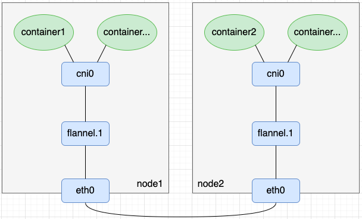

实验：使用vxlan组网。

:::info

VNI：每个vxlan子网通过唯一的VNI来标识区分，该标识是个24bit范围的整数；

VTEP：VXLAN Tunnel Endpoints，即vxlan网络的边缘设备，为了方便理解，本文把VTEP设备也叫作“vxlan设备”。VNI配置在VTEP设备上，VNI相同的VTEP设备属于同一个vxlan子网网络。

vtep设备可以进行发送UDP数据和是一个UDP服务接收UDP数据

:::



:::info

node1: 机器

eth1: 192.168.56.41

node2: 机器

eth1: 192.168.56.42

node3: 机器

eth1: 192.168.56.43

:::

## flannel.1之间能访问

```

1. node1 服务器添加vxlan设备

# 添加vxlan设备 flannel.1 (id: 通一个lan相同，dstport: 接收和发送的upd端口号，dev: 通过哪个设备发送出去udp和监听udp)
ip link add flannel.1 type vxlan id 1 dstport 8472 dev eth1

# 启动并配置网络
ifconfig flannel.1 1.1.0.1/16 up

# 此时能查看vxlan已经在监听udp服务了
[root@test1 ~]# netstat -nulp | grep 8472
udp        0      0 0.0.0.0:8472            0.0.0.0:*                           - 

最后的- 表示是内核态监听

# 启动flannel.1网卡，会自动配置到达这个网卡的路由
[root@test1 ~]# route -n
Kernel IP routing table
Destination     Gateway         Genmask         Flags Metric Ref    Use Iface
1.1.0.0         0.0.0.0         255.255.0.0     U     0      0        0 flannel.1


2. node2配置vxlan

ip link add flannel.1 type vxlan id 1 dstport 8472 dev eth1
ifconfig flannel.1 1.1.0.2/16 up
ip -d link show flannel.1
route -n

3. 测试 node1 ping node2 flannel.1

# 发现不能ping
[root@test1 ~]# ping  1.1.0.2
PING 1.1.0.2 (1.1.0.2) 56(84) bytes of data.
From 1.1.0.1 icmp_seq=1 Destination Host Unreachable
From 1.1.0.1 icmp_seq=2 Destination Host Unreachable

# 抓包查看问题，此时flannel.1一直在询问1.1.0.2的MAC地址，目前肯定是获取不到了
[root@test1 ~]# tcpdump -i flannel.1 -n
tcpdump: verbose output suppressed, use -v or -vv for full protocol decode
listening on flannel.1, link-type EN10MB (Ethernet), capture size 262144 bytes
16:23:25.329962 ARP, Request who-has 1.1.0.2 tell 1.1.0.1, length 28
16:23:26.330728 ARP, Request who-has 1.1.0.2 tell 1.1.0.1, length 28
16:23:27.332738 ARP, Request who-has 1.1.0.2 tell 1.1.0.1, length 28

# 手动添加MAC地址
[root@test1 ~]# arp -i flannel.1 -s 1.1.0.2  a2:be:c4:ef:4d:17
[root@test1 ~]# ip neigh show dev flannel.1
1.1.0.2 lladdr a2:be:c4:ef:4d:17 PERMANENT

# 继续ping和抓包，发现此时flannel.1在发送完整的链路数据了，只是没有收到回答
[root@test1 ~]# tcpdump -i flannel.1 -n
tcpdump: verbose output suppressed, use -v or -vv for full protocol decode
listening on flannel.1, link-type EN10MB (Ethernet), capture size 262144 bytes
16:26:10.203661 IP 1.1.0.1 > 1.1.0.2: ICMP echo request, id 4060, seq 1, length 64
16:26:11.241495 IP 1.1.0.1 > 1.1.0.2: ICMP echo request, id 4060, seq 2, length 64
16:26:12.241710 IP 1.1.0.1 > 1.1.0.2: ICMP echo request, id 4060, seq 3, length 64
16:26:13.251889 IP 1.1.0.1 > 1.1.0.2: ICMP echo request, id 4060, seq 4, length 64

# 通过VETP设备发送UDP，上面已经构造出了完整的二层链路数据帧了。此时配合VTEP设备来发送到目的的主机。
# 此时又出现了一个新的表FDB表，具体可以查阅，反正是配置了，VTEP就能自动将vxlan的数据发送到指定节点，其实目的是二层协议转换
[root@test1 ~]# bridge fdb append a2:be:c4:ef:4d:17 dev flannel.1 dst 192.168.56.42
[root@test1 ~]# bridge fdb show dev flannel.1
a2:be:c4:ef:4d:17 dst 192.168.56.42 self permanent

# 继续ping和抓包，发现node1还是没有收到应答，此时抓包node2中的，查看数据是否已经到达
# 发现node2中已经有封装好的数据，并且通过vtep解封装了，并发送到网卡，此时抓包看到的是1.1.0.2不知道1.1.0.1的mac地址
[root@test2 ~]# tcpdump -i flannel.1 -n
tcpdump: verbose output suppressed, use -v or -vv for full protocol decode
listening on flannel.1, link-type EN10MB (Ethernet), capture size 262144 bytes
16:32:15.576382 IP 1.1.0.1 > 1.1.0.2: ICMP echo request, id 4250, seq 64, length 64
16:32:16.575705 IP 1.1.0.1 > 1.1.0.2: ICMP echo request, id 4250, seq 65, length 64
16:32:16.575739 ARP, Request who-has 1.1.0.1 tell 1.1.0.2, length 28

# 配置node2中node1的flannel.1 MAC
arp -i flannel.1 -s 1.1.0.1 9e:59:43:cf:84:da

# 继续测试，发现能ping通
[root@test1 ~]# ping  1.1.0.2
PING 1.1.0.2 (1.1.0.2) 56(84) bytes of data.
64 bytes from 1.1.0.2: icmp_seq=1 ttl=64 time=0.500 ms
64 bytes from 1.1.0.2: icmp_seq=2 ttl=64 time=0.610 ms

# 此时有个问题，node2还没有配置FDB表，通过查看在接收数据的时候自动帮配置好了，这个一般最好手动配置也可以
[root@test2 ~]# bridge fdb show dev flannel.1
9e:59:43:cf:84:da dst 192.168.56.41 self


```

## 新增node3

```
1. node3 配置

# 添加设备
ip link add flannel.1 type vxlan id 1 dstport 8472 dev eth1
ifconfig flannel.1 1.1.0.2/16 up

# 配置arp MAC 
arp -i flannel.1 -s 1.1.0.1 9e:59:43:cf:84:da
arp -i flannel.1 -s 1.1.0.2  a2:be:c4:ef:4d:17

# 配置FDB表
bridge fdb append 9e:59:43:cf:84:da dev flannel.1 dst 192.168.56.41
bridge fdb append a2:be:c4:ef:4d:17 dev flannel.1 dst 192.168.56.42

2. node1,node配置
arp -i flannel.1 -s 1.1.0.3 16:39:fa:a8:a2:ee
bridge fdb append 16:39:fa:a8:a2:ee dev flannel.1 dst 192.168.56.43

3. 测试：可以互相ping通

```

## 总结

现在能理解vxlan是在三层网络上构建一个大二层网络，因为到vxlan中的数据都是完整的二层数据，只是这个时候将二层数据包通过udp发送出去。此时udp是当成了一个链路过程，保证数据完整性还是靠双方tcp的

## flannel.1 vxlan实现

flannel.1的实现是不做数据包的封装和发送，完全是依赖vxlan，flanneld仅仅是充当一个数据平面来管理各个节点之间的路由，MAC，FDB的关系。

所以在集群节点比较大的时候，新增节点会有延迟，因为会更新整个集群中的路由，MAC，FDB关系

## 参考

- [flannel VXLAN模式的实现]


[flannel VXLAN模式的实现]: https://www.modb.pro/db/399005


