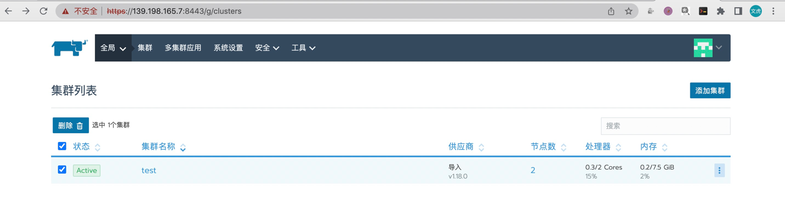

使用kubeadm安装k8s

## 环境

- 青云服务器centos7.6两台
- web1：172.31.0.3
- web2：172.31.0.2

## 环境初始化

**设置主机名**

```shell
# 设置主机名
$ hostnamectl set-hostname web1
# 主机2
$ hostnamectl set-hostname web2

# 设置ip
$ cat >> /etc/hosts << EOF
172.31.0.3 web1
172.31.0.2 web2
EOF
```

**关闭firewalld**

```shell
$ systemctl disable firewalld
$ systemctl stop firewalld
```

**关闭selinux**

```shell
# 临时关闭
$ setenforce 0
# 永久关闭
$ vi /etc/sysconfig/selinux
...
SELINUX=disabled
# 查看
$ sestatus -v
```

**关闭swap**

```shell
# 查看开启状态
$ free -m
# 如果Swap这一行都为0，则表示关闭
total        used        free      shared  buff/cache   available
Mem:           7821         184        6120          16        1516        7333
Swap:          8191           0        8191

# 临时关闭
$ swapoff -a 
# 永久关闭(注释中最后一行)
$ vi /etc/fstab
#LABEL=YUNIFYSWAP swap                    swap    defaults        0 0
```

**开启ipv4转发**
关于为啥要开启转发可以参考前面文章

```shell
$ echo 1 > /proc/sys/net/ipv4/ip_forward
```

**将桥接的IPv4流量传递到iptables的链**

```shell
$ cat > /etc/sysctl.d/k8s.conf << EOF
net.bridge.bridge-nf-call-ip6tables = 1
net.bridge.bridge-nf-call-iptables = 1
EOF
# 生效
$ sysctl --system  
```

## 安装docker

```shell

# 安装docker （可以指定版本）
$ curl -fsSL https://get.docker.com | bash -s docker --mirror Aliyun

# 配置镜像加速器，并配置cgroupdriver
$ mkdir -p /etc/docker
$ tee /etc/docker/daemon.json <<-'EOF'
{
  "registry-mirrors": ["https://rwgxai1f.mirror.aliyuncs.com"],
  "exec-opts": ["native.cgroupdriver=systemd"]
}
EOF

$ systemctl daemon-reload
$ systemctl restart docker
```

## 安装kubeadm

官方文档[kubeadm]

**使用阿里云镜像**

镜像地址配置 [阿里云镜像][k8s-aliyun]

**yum 相关配置**

```shell
# 指定仓库（最新参见阿里云文档）
$ cat <<EOF > /etc/yum.repos.d/kubernetes.repo
[kubernetes]
name=Kubernetes
baseurl=https://mirrors.aliyun.com/kubernetes/yum/repos/kubernetes-el7-x86_64/
enabled=1
gpgcheck=1
repo_gpgcheck=1
gpgkey=https://mirrors.aliyun.com/kubernetes/yum/doc/yum-key.gpg https://mirrors.aliyun.com/kubernetes/yum/doc/rpm-package-key.gpg
EOF

# 查看yum镜像源
$ yum repolist 
# --showduplicates 列出所有版本 --nogpgcheck:gpg检查
$ yum list --showduplicates kubeadm
# 这个是列出kubernets仓库中所有可用的包
$ yum --disablerepo="*" --enablerepo="kubernetes" list available --showduplicates
# 安装指定版本 [软件]-[版本].[平台]
$ yum install -y --enablerepo="kubernetes" --nogpgcheck kubelet-1.18.0-0.x86_64 kubectl-1.18.0-0.x86_64 kubeadm-1.18.0-0.x86_64

# 查看安装版本
$ kubeadm version
$ kubelet --version
$ kubectl version

# 或者查看版本  
$ yum list installed kubectl kubeadm kubelet

# 卸载
$ yum remove kubectl kubeadm kubectl
```

## 初始化节点

**部署Kubernetes Master**

```shell
# 这里会检查相关的内容是否已经配置好
$ kubeadm init --apiserver-advertise-address=172.31.0.3 \
--image-repository registry.aliyuncs.com/google_containers \
--kubernetes-version v1.18.0 \
--service-cidr=10.96.0.0/16  \
--pod-network-cidr=10.244.0.0/16

# 配置kubectl(根据生成的)
mkdir -p $HOME/.kube
sudo cp -i /etc/kubernetes/admin.conf $HOME/.kube/config
sudo chown $(id -u):$(id -g) $HOME/.kube/config

# 查看节点
$ kubectl get nodes

# 删除节点
$ kubectl delete web2

# 重置节点
$ kubeadm reset

# 其他worker节点安装(这个是安装完master节点之后生成的)
$ kubeadm join 172.31.0.3:6443 --token l0imbn.kbkdwxt42c516pio \
    --discovery-token-ca-cert-hash sha256:136c777e210af71a1e77f6e40f7a2d2b94e28dc3d99385bfb72849b0197a9ed6
    
# token有效期24小时，重新生成join数据
$ kubeadm token create --print-join-command
```

**部署cni插件**

```shell
# 下载网络插件配置
$ wget https://raw.githubusercontent.com/coreos/flannel/master/Documentation/kube-flannel.yml
# 运行
$ kubectl apply -f kube-flannel.yml
# 查看运行结果
$ kubectl get pods -A
```

## 测试

**查看安装结果**

```shell
$ kubectl get pods -A

kube-system   coredns-7ff77c879f-nf2g7       1/1     Running   0          14m
kube-system   coredns-7ff77c879f-zwzb5       1/1     Running   0          14m
kube-system   etcd-web1                      1/1     Running   0          14m
kube-system   kube-apiserver-web1            1/1     Running   0          14m
kube-system   kube-controller-manager-web1   1/1     Running   0          14m
kube-system   kube-flannel-ds-cbzhk          1/1     Running   0          2m44s
kube-system   kube-flannel-ds-dglgh          1/1     Running   0          2m44s
kube-system   kube-proxy-cmxjf               1/1     Running   0          5m2s
kube-system   kube-proxy-m9vfd               1/1     Running   0          14m
kube-system   kube-scheduler-web1            1/1     Running   0          14m

# 创建一个deployment
$ kubectl create deployment nginx --image=nginx:latest

# 查看
$ kubectl describe pod nginx-f89759699-gjkjd
```

## 安装自动提示插件

kubectl命令经常得使用，但是有些命令记不住，希望实现tab自动提示，这个官方有提供

文档地址 [kubectl自动提示][kubectl-auto]

```shell
$ yum install bash-completion -y
$ source /usr/share/bash-completion/bash_completion
$ source <(kubectl completion bash)
```

## 安装rancher

v2.4.8

```shell
$ docker pull rancher/rancher:v2.4.8
$ docker run -d --restart=unless-stopped -p 8080:80 -p8443:443 \
-v /root/rancher:/var/lib/rancher/ rancher/rancher:v2.4.8
```



[k8s-aliyun]: https://developer.aliyun.com/mirror/kubernetes?spm=a2c6h.13651102.0.0.5c211b119mQxkE

[kubeadm]: https://kubernetes.io/zh-cn/docs/reference/setup-tools/kubeadm/

[kubectl-auto]: https://kubernetes.io/zh-cn/docs/reference/kubectl/cheatsheet/


