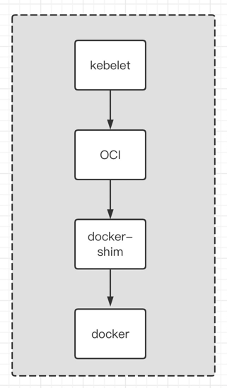
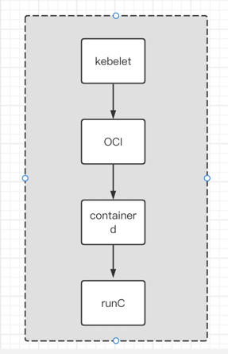

k8s1.24有很多重大的更新，例如直接丢弃原有的docker支持，完全通过CRI接口调用容器。在这里我们切换成containerd服务作为k8s的容器运行时管理软件。

containerd实现了CRI接口。

**1.18**




**1.24**



## 前置工作

对系统的一些基本设置

```shell
hostnamectl set-hostname web1

cat >> /etc/hosts << EOF
172.31.0.3 web1
172.31.0.2 web2
EOF

systemctl disable firewalld
systemctl stop firewalld

setenforce 0
vi /etc/sysconfig/selinux
# ... 修改
# SELINUX=disabled

swapoff -a 
vi /etc/fstab
#LABEL=YUNIFYSWAP swap                    swap    defaults        0 0

echo 1 > /proc/sys/net/ipv4/ip_forward
cat > /etc/sysctl.d/k8s.conf << EOF
net.bridge.bridge-nf-call-ip6tables = 1
net.bridge.bridge-nf-call-iptables = 1
EOF
sysctl --system  

modprobe br_netfilter
sysctl -w net.bridge.bridge-nf-call-iptables=1
```

## containerd安装

containerd细节架构可参见[containerd细节]

```shell
# 下载并解压
wget https://github.com/containerd/containerd/releases/download/v1.6.8/cri-containerd-cni-1.6.8-linux-amd64.tar.gz
tar -zxvf cri-containerd-cni-1.6.8-linux-amd64.tar.gz

# 将相关的执行文件和配置文件拷贝到对应的默认目录下
cp -R opt/* /opt/
cp -R etc/* /etc/
cp -R usr/local/bin/* /usr/local/bin/
cp -R usr/local/sbin/* /usr/local/sbin/
cp etc/systemd/system/containerd.service /usr/lib/systemd/system/

# 注意：这里下载的runc在启动的时候会报下面错误，少了些相关的安装，这里我们手动下载runc
# runc: symbol lookup error: runc: undefined symbol: seccomp_notify_respond
wget https://github.com/opencontainers/runc/releases/download/v1.1.3/runc.amd64
mv runc.amd64 runc
chmod +x runc
cp runc /usr/local/sbin/

# 设置containerd的默认配置
mkdir /etc/containerd
containerd config default > /etc/containerd/config.toml

# 启动containerd
systemctl daemon-reload
systemctl enable --now containerd

# 安装nerdctrl，这个是和docker操作类似的客户端工具
wget https://github.com/containerd/nerdctl/releases/download/v0.22.2/nerdctl-0.22.2-linux-amd64.tar.gz
tar -zxvf nerdctl-0.22.2-linux-amd64.tar.gz 
cp nerdctl /usr/local/bin/

# 测试
# --net 这里是指定网络配置，默认的话nerdctl会帮创建一个
nerdctl run --name ngx --net containerd-net -p 8080:80  -d nginx
curl 127.0.0.1:8080
ls /etc/cni/net.d/
```

**注意**
发现直接下载这个包的时候，CNI支持的版本比较老，而且nerctl默认创建的版本是比较新的。如果创建pod的时候发现CNI版本不对，记得对应升级

```shell
# 查看CNI插件支持的版本
[root@web1 ~]# CNI_COMMAND=VERSION  /opt/cni/bin/bridge 
{"cniVersion":"0.4.0","supportedVersions":["0.1.0","0.2.0","0.3.0","0.3.1","0.4.0"]}
```


## kubeadm安装k8s

```shell
cat <<EOF > /etc/yum.repos.d/kubernetes.repo
[kubernetes]
name=Kubernetes
baseurl=https://mirrors.aliyun.com/kubernetes/yum/repos/kubernetes-el7-x86_64/
enabled=1
gpgcheck=1
repo_gpgcheck=1
gpgkey=https://mirrors.aliyun.com/kubernetes/yum/doc/yum-key.gpg https://mirrors.aliyun.com/kubernetes/yum/doc/rpm-package-key.gpg
EOF

yum install -y --enablerepo="kubernetes" --nogpgcheck kubelet-1.24.4-0.x86_64 kubectl-1.24.4-0.x86_64 kubeadm-1.24.4-0.x86_64

kubeadm version
kubelet --version
kubectl version

kubeadm init --apiserver-advertise-address=172.31.0.3 \
--cri-socket unix:///run/containerd/containerd.sock \
--image-repository registry.aliyuncs.com/google_containers \
--kubernetes-version v1.24.0 \
--service-cidr=10.96.0.0/16  \
--pod-network-cidr=10.244.0.0/16

# 安装自动提示
yum install bash-completion -y
source /usr/share/bash-completion/bash_completion
source <(kubectl completion bash)

# 安装flanneld
wget https://raw.githubusercontent.com/coreos/flannel/master/Documentation/kube-flannel.yml
wget https://raw.githubusercontent.com/flannel-io/flannel/master/Documentation/kube-flannel.yml     
kubectl apply -f kube-flannel.yml
kubectl get pods -A

```

## 相关目录

```
1. kubelet启动的静态podmul 
/etc/kubernetes/manifests/

2. CNI配置目录
/etc/cni/net.d/

3. CNI 插件目录
/opt/cni/bin/
```


## 相关名词

有一句话说的好：一流的企业制造标准，二流的企业做品牌，三流的企业做产品。其实这个可用于到k8s相关的产业链中

### OCI

[oci]是指定规范的一个组织，是Docker和其他的组织一起参与的。主要指定了Linux下容器的运行时的规范。这个类似一个协议，然后有具体的产品来实现。

### runC

[runc]是OCI的一个具体实现。这家伙也是Docker捐出来给到OCI组织的，伟大，所以最后k8s就"抛弃了Docker"

### CRI

[cri]是k8s自己定义的一套规范，用来接入容器的，类似的还有网络规范CNI,容器存储规范CSI。所以只要实现CRI接口的产品都能接入到k8s中作为底层容器

### containerd

[containerd] 是实现了CRI，所以k8s1.24可以用containerd作为容器运行时软件。这家伙也是Docker的产品，也是捐献给CNCF


[containerd细节]: 30-protocol.md
[k8s-1.18]: 11-k8s安装-kubeadm.md
[oci]: https://opencontainers.org
[runc]: https://github.com/opencontainers/runc
[containerd]: https://github.com/containerd/containerd
[cri]: https://github.com/kubernetes/cri-api/blob/c75ef5b/pkg/apis/runtime/v1/api.proto