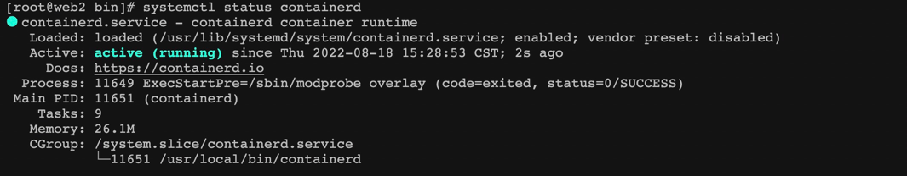

## containerd

1. containerd是一个守护进程
2. 可以通过`OCI`接口来调用对应的容器（1.6.8版本通过containerd-shim-v2插件实现）
3. 可以通过`CNI`接口协议来调用任意CNI插件
4. 实现了k8s中的`CRI`接口

概括：containerd是一个守护进程，通过containerd-shim来运行容器（开启子进程）。封装了原生API和CRI实现，管理工具可以使用原生API封装或者CRI接口封装

### 安装配置

**安装**

通过官方的文档进行安装[containerd安装文档]

```
1. 下载解压缩

2. 下载systemd文件

chmod +x /usr/lib/systemd/system/containerd.service

3. 根据containerd.service中的bin，将containerd拷贝到系统目录中

ExecStart=/usr/local/bin/containerd

4. 启动containerd，此时仅仅是启动了containerd守护进程

systemctl daemon-reload
systemctl enable --now containerd

```


### 实验

#### 1. 运行容器流程步骤

```

$ ctr images pull docker.io/library/redis:alpine

$ ctr run docker.io/library/redis:alpine redis

报错：这里明确了，没有找到containerd-shim-runc-v2, 所以证明containerd调用runc不是通过自己，而是通过调用一层containerd-shim。（v1.6.8版本是这样）

ctr: failed to start shim: failed to resolve runtime path: runtime "io.containerd.runc.v2" binary not installed "containerd-shim-runc-v2": file does not exist: unknown

containerd中但是有一个这个记录，containerd是管理这些。具体运行时runc，是开辟一个子进程，然后通过containerd-shim调用

[root@web2 bin]# ctr container ls
CONTAINER    IMAGE                             RUNTIME                  
redis        docker.io/library/redis:alpine    io.containerd.runc.v2

runc在containerd中是以一个个任务来运行的。查看任务

[root@web2 bin]# ctr task ls
TASK    PID    STATUS

解决：拷贝containerd-shim-v2到系统bin目录中

cp containerd-shim-runc-v2 /usr/local/bin/

启动：还是报错，这个时候是OCI中的容器运行时没装好。containerd默认是使用runc
[root@web2 bin]# ctr task start redis
ctr: failed to create shim task: OCI runtime create failed: unable to retrieve OCI runtime error (open /run/containerd/io.containerd.runtime.v2.task/default/redis/log.json: no such file or directory): exec: "runc": executable file not found in $PATH: unknown

安装runc

wget https://github.com/opencontainers/runc/releases/download/v1.1.3/runc.amd64
mv runc.amd64 runc
chmod +x runc
cp runc /usr/local/bin/

重新运行redis 容器任务（运行成功）
[root@web2 bin]# ctr task start redis
1:C 18 Aug 2022 07:59:49.852 # oO0OoO0OoO0Oo Redis is starting oO0OoO0OoO0Oo
1:C 18 Aug 2022 07:59:49.852 # Redis version=7.0.4, bits=64, commit=00000000, modified=0, pid=1, just started
1:C 18 Aug 2022 07:59:49.852 # Warning: no config file specified, using the default config. In order to specify a config file use redis-server /path/to/redis.conf

[root@web2 ~]# ctr task ls
TASK     PID      STATUS    
redis    13523    RUNNING

```
总结：通过上面实验，了解了containerd的基本架构
1. containerd是一个守护进程
2. 运行容器是启动一个子进程调用containerd-shim-runc来启动runc
3. 所以containerd是在runc上进行的一个封装，里面还包括很多内容，通过接下来的实验来验证


#### 2. 接入CNI插件

默认如果不接入CNI插件，创建的容器都是没有网络的，containerd可以指定CNI插件。

1. 安装CNI插件
```
1 下载插件
wget https://github.com/containernetworking/plugins/releases/download/v1.1.1/cni-plugins-linux-amd64-v1.1.1.tgz

安装

```


[containerd安装文档]: https://github.com/containerd/containerd/blob/main/docs/getting-started.md