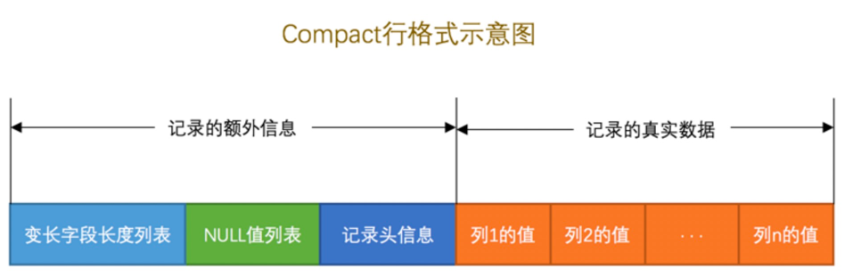

MySQL提供存储的接口是底层的存储引擎，所以数据以什么样的方式存储都是靠存储引擎的实现，反正对上层server只提供接口调用而已。

对于innodb存储引擎中的Compact格式存储是怎么样的设计？

## 结构




一条记录分为记录额外信息和真实数据，额外信息其实就是对这条数据的一些限制描述。这里简单的描述下这几块的作用。

### 记录额外信息


**变长字段列表**

- 因为数据存储的时候是按着的，就是没有所谓的边界，所以没个记录中的字段存储了多长的数据，这个时候就需要来描述下。 变长字段描述就可以为变长字段提供边界限制。
- 如果一条记录中所有字段都是定长的，则变长字段列表是为空的。
- 变长字段列表是个数字类型，其实也有长度的，不可能直接用Bigint来存储，所以这里也是有算法的，根据表中的结构varchar()长度+字符集来计算存储这个字段的最大长度，应该用多少字节来存储。


**NULL值列表**

innodb 也是为了存储的空间做出优化，对于可为null的字段不存储，直接标记下位置就行。这个和变长字段一个含义。


**记录头信息**

后面具体单独介绍


### 真实数据

一条记录包含额外信息和真实数据，真实数据中除了表中定义的字段还有额外的几个字段

**DB_ROW_ID**

在创建表的时候，如果没有指定主键，或者唯一字段，则创建表的时候，会自动的创建一个row_id作为隐藏唯一字段

**DB_TRX_ID**

这个也是有一个隐藏的列，事物ID。

**DB_ROLL_PRT**

事物回滚的id

**定义的列**

剩余的就是表中定义的列。


:::danger

MySQL中一条记录最大长度为65535个字节=记录的额外信息长度+表中定义的列（不包含隐藏列）

:::


## 问题

### varchar/char中的长度

在创建表的时候，varchar(N)，char(N)，这里的N是什么单位呢？

这里的N是字符单位，那么长度就是一个未知的，需要根据当前字段的字符集来计算长度

ascii则是一个字符一个字节，utf8则是3个字节一个字符。

### varchar最大长度

上面介绍了，MySQL中一行的最大长度是65535，那么varchar则最大是多少呢？

这里要看表的额外信息+真实数据

额外信息则是null ,变长字段列表。真实数据：非隐藏列长度

```sql
       Table: varchar_size_demo
Create Table: CREATE TABLE `varchar_size_demo` (
  `id` char(1) NOT NULL,
  `c` varchar(65532) NOT NULL
) ENGINE=InnoDB DEFAULT CHARSET=ascii ROW_FORMAT=COMPACT
1 row in set (0.00 sec)
```

1. 这里id是定长的，非null，ascii,所以就占1个字节 65535-1=65534
2. c 非null，变长字段因为要存储65535，则需要2个字节。65534-2=65532


