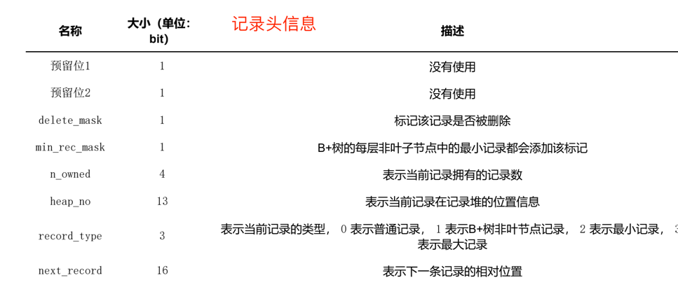

Innodb存储引擎在维护数据的时候，肯定是有自己的一套设计规则的。具体可以划分为下面几个部分：

## 记录头信息

## File Header

没页大小是16K，那么要维护这些页，肯定在最首部要设定固定大小的通用信息。File Header就是页的通用信息，每个字段占用的字节数都不一样，这样就能整体描述一个页在整个文件中的基本信息

## Page Header

由于Innodb中所有的数据都是以页来存储的，所以要设计不同的页类型，这个是描述当前16K页的一些基本信息

## User Record

用户记录这里就是按照之前介绍的用户一行行记录的存储，里面有变长字段列表，Null值列表，记录头信息，真实数据。这里有两个特殊的隐藏列

**infimum**

这个是一个隐藏的列，自动创建和维护的，表示最小记录，结构就是行头信息+infimum字符串

**supremum**

这个和Infimum一样类型，表示的是本页最大记录

## Page Directory

在数据查找的时候，可以根据当前Page Header找到Infimum，然后通过Infimum遍历，来查找对应的数据。

但是这样在一个页中数据比较多的时候，会比较慢，所以对这些数据在存储的时候，会维护一个Page Directory，这里不是按照一条条记录做Directory。

是先分组，然后每个分组的最大记录组成一个Directory。所以查找的时候，先二分查找Directory。然后在遍历分组中的记录

## Page Trailer

这个就是页尾部的一些基本信息，因为页是抽象成最小的存储。所以防止这个页是否有问题，在这里做校验和就知道这个页是否完整。

