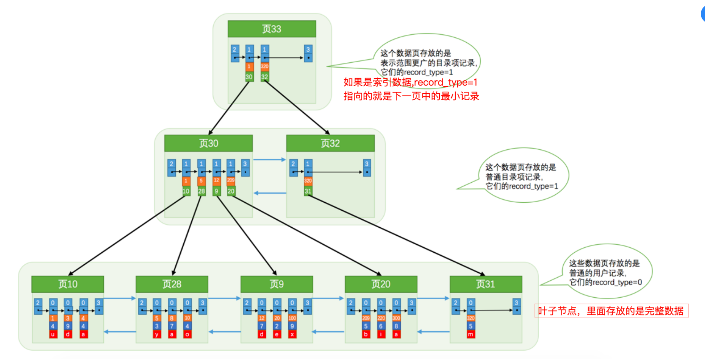
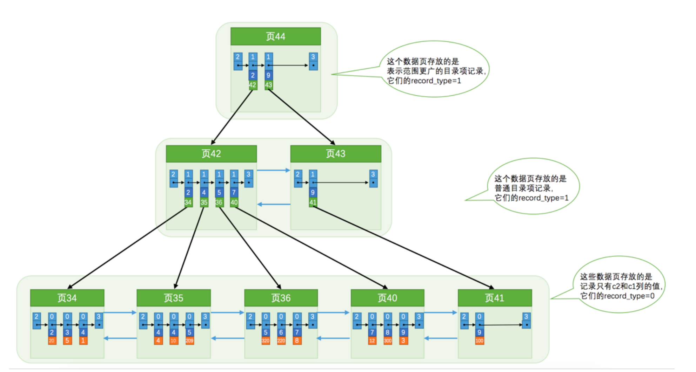

Innodb存储引擎在维护数据的时候，肯定是有自己的一套设计规则的。具体可以划分为下面几个部分：

## 记录头信息

## File Header

没页大小是16K，那么要维护这些页，肯定在最首部要设定固定大小的通用信息。File Header就是页的通用信息，每个字段占用的字节数都不一样，这样就能整体描述一个页在整个文件中的基本信息

## Page Header

由于Innodb中所有的数据都是以页来存储的，所以要设计不同的页类型，这个是描述当前16K页的一些基本信息

## User Record

用户记录这里就是按照之前介绍的用户一行行记录的存储，里面有变长字段列表，Null值列表，记录头信息，真实数据。这里有两个特殊的隐藏列

**infimum**

这个是一个隐藏的列，自动创建和维护的，表示最小记录，结构就是行头信息+infimum字符串

**supremum**

这个和Infimum一样类型，表示的是本页最大记录

## Page Directory

在数据查找的时候，可以根据当前Page Header找到Infimum，然后通过Infimum遍历，来查找对应的数据。

但是这样在一个页中数据比较多的时候，会比较慢，所以对这些数据在存储的时候，会维护一个Page Directory，这里不是按照一条条记录做Directory。

是先分组，然后每个分组的最大记录组成一个Directory。所以查找的时候，先二分查找Directory。然后在遍历分组中的记录

## Page Trailer

这个就是页尾部的一些基本信息，因为页是抽象成最小的存储。所以防止这个页是否有问题，在这里做校验和就知道这个页是否完整。

## innodb查询

**通过主键建聚簇索引来查询数据**

**通过二级索引查找数据**

给数据表中的其他字段建立索引称为二级索引。

- 二级索引和聚簇索引的区别就是叶子节点，二级索引叶子节点存放的不是完整数据，而是主键值
- 通过主键值再去聚簇索引查询数据，这一步也称为回表

## MyISAM查询

MyISAM是数据和索引文件都分开的，也是使用B+树来组织索引。但是索引和数据是分开的。

- 将表中的记录按照记录的插入顺序单独存储在一个文件中，称之为 数据文件 。这个文件并不划分为若干个 数据页，有多少记录就往这个文件中塞多少记录就成了。我们可以通过行号而快速访问到一条记录。
- 由于在插入数据的时候并没有刻意按照主键大小排序，所以我们并不能在这些数据上使用二分法进行查找。
- 使用 MyISAM 存储引擎的表会把索引信息另外存储到一个称为 索引文件 的另一个文件中。 MyISAM 会单独为 表的主键创建一个索引，只不过在索引的叶子节点中存储的不是完整的用户记录，而是 主键值 + 行号 的组 合。也就是先通过索引找到对应的行号，再通过行号去找对应的记录！
- 这一点和 InnoDB 是完全不相同的，在 InnoDB 存储引擎中，我们只需要根据主键值对 聚簇索引 进行一次查 找就能找到对应的记录，而在 MyISAM 中却需要进行一次 回表 操作，意味着 MyISAM 中建立的索引相当于全 部都是 二级索引 ！

### 对比

- MyISAM可以理解全是二级索引，但是回表速度快，因为叶子节点直接存的是数据文件中的行号。Innodb回表式要重新去聚簇索引找数据，慢一些
- 通过主键查找数据，innodb反而比myisam快，因为不用回表。
- 通过二级索引查找数据，myisam回表直接是行号（地址），所以回表快。所以这个时候myisam优势，这前提都是数据量大
- 所以对比这两种引擎的查询速度，要看前提条件，没有绝对的谁快谁慢，要适用业务项目
- innodb主要还支持事物

