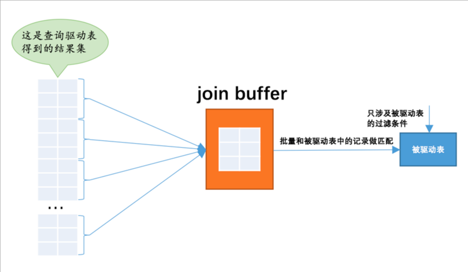

简单介绍下MySQL中连接查询

## 内查询

内连接查询其实就是笛卡尔积的结果基础上过条件。

```sql
select * from student,score;

SELECT * from student inner JOIN  score on student.number = score.number;

SELECT * from student inner JOIN  score where student.number = score.number;

```

:::danger

1. 内连接查询，不分驱动表和被驱动表，查询没有顺序区分。
2. 内连接可以不使用ON来作为条件查询，但是也可以使用，使用了话，会和where是一个意思，ON是针对外连接查询来过滤连接条件的
3. 内连接查询，如果驱动表中的记录没在被驱动表，则不会展示在结果集中

:::

## 外连接

外连接就是经常使用的left/right join 查询

### 查询过程

**针对于没有索引的情况下，查询过程**

1. 驱动表一次查询结果集
2. 然后遍历驱动表中的结果集，然后去遍历被驱动表查询
3. 就是驱动表的记录有多少，被驱动表就要查询多少次

### 优化

针对上面外连接的查询过程，我们就了解了查询的本质，从而做一些优化。

#### 索引优化

其实优化的本质就是如何优化被启动表，让其能以更快的速度来查询。这个时候就要使用到我们之前介绍的单表查询过程来优化了

```sql

-- 示例
select * from t1 left join t2 on t1.num = t2.num;

-- 优化1
1. 查询过程是：t1.的结果集，然后去查询t2.num 这里是等值比较
2. 所以可以给t2.num建立索引，这个在单表中算是ref查询了
3. 如果t2.num 可以设置为唯一索引，则在单表中算是const查询了
4. 针对上面做一些索引优化

-- 优化2
1. 在一些如果真的使用不到索引的情况下，可以建立联合索引
2. 假设t2表是全表扫描，最差是可以建立一个联合索引，将select的字段建立一个联合索引。这样就是使用单表的index查询了，总比all好
3. 所以连接查询尽量不能使用select * 查询

```

### 缓存优化



对于驱动表来查询匹配驱动表的记录是这样（全表扫描）：

1. 每次取出一条驱动表记录，然后被驱动表查询，然后释放内存，会整表扫描
2. 接着第二条，第三条这样
3. 所以能否一次遍历，多次匹配

MySQL针对这个有个缓存区join buffer ,就是来解决这个的。系统变量 join_buffer_size

MySQL会将驱动表中的记录缓存起来，然后驱动表一次性全表扫描多次对标buffer中的记录，这样能介绍io查询


**注意：**

join buffer 不会把所有的列都会放在里面，只有把select 中的列和条件的列放在buff中，所以不要使用* ，这样buffer就能存放跟多的记录，从而效率更高
