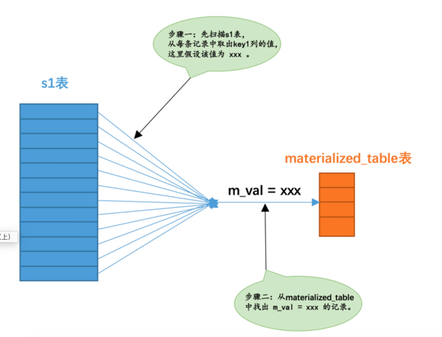
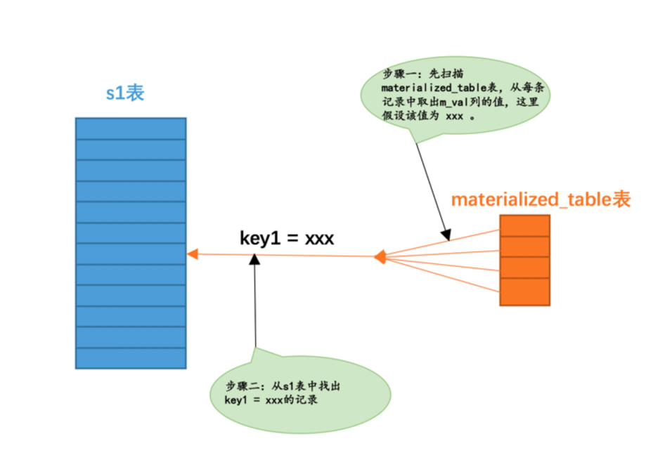

子查询会经常用到，这里简单介绍下平时用到的坑


## 连接查询

之前讲了连接查询的流程，这里再简单的复习下：

```sql

# 内查询==外查询
1. 内查询是驱动表中的记录不在被驱动表中，则直接不放入结果集
2. 外查询是驱动表记录不在被驱动表中，则驱动表记录也会在结果集中，只是被驱动表结果字段为null
3. 这个时候如果使用where条件限制外查询不为null，则外查询等于内查询

select * from t1 left join t2 on t1.num = t2.num where t2.id is not null
等于
select * from t1 inner join t2 on t1.num = t2.num

```

*** 好处 ***

有外查询可以转换为内查询，所以在查询的时候，查询优化器可以计算不同的查询成本（不同连接顺序，效率不同），从而选择最优的。这也是查询优化器做的事情


## 返回结果区分子查询

```sql

select (select * from t1);

select * from t1 where num in (select num from t2);

```

### 标量子查询

子查询只返回一个一条记录，且记录中只有一个字段

```sql
 SELECT (SELECT m1 FROM t1 LIMIT 1);
 
 SELECT * FROM t1 WHERE m1 = (SELECT MIN(m2) FROM t2);

```

### 行子查询

子查询返回一条记录，且这条记录中是有多个字段的

```sql

 SELECT * FROM t1 WHERE (m1, n1) = (SELECT m2, n2 FROM t2 LIMIT 1);
 
 ````
 
 ### 列子查询

子查询结果会返回多条记录，但是记录中只有一个字段

```sql

SELECT * FROM t1 WHERE m1 IN (SELECT m2 FROM t2);
 
```

### 表子查询

子查询返回多条记录，且记录中是多个字段

```sql

SELECT * FROM t1 WHERE (m1, n1) IN (SELECT m2, n2 FROM t2);

```

## 与外层关系区分子查询

### 不相关子查询

子查询可以单独运行，不依赖外层查询的结果集。

```sql
select * from t1 where num in (select num from t2);
```

### 相关子查询

如果子查询需要依赖外层的结果集，就是相关子查询

```sql
SELECT * FROM t1 WHERE m1 IN (SELECT m2 FROM t2 WHERE n1 = n2);
```

## 子查询bool值使用

### 比较符

使用 = 、 > 、 < 、 >= 、 <= 、 <> 、 != 、 <=> 作为布尔表达式的操作符

标量/行子查询
```sql

SELECT * FROM t1 WHERE m1 < (SELECT MIN(m2) FROM t2);

 SELECT * FROM t1 WHERE (m1, n1) = (SELECT m2, n2 FROM t2 LIMIT 1);

```

### [NOT] IN/ANY/SOME/ALL子查询
列/表自己查询


 ### EXISTS子查询
有的时候我们仅仅需要判断子查询的结果集中是否有记录，而不在乎它的记录具体是个啥，可以使用把
EXISTS 或者 NOT EXISTS 放在子查询语句前边，就像这样：

```sql

 SELECT * FROM t1 WHERE EXISTS (SELECT 1 FROM t2);
 
 对于子查询 (SELECT 1 FROM t2) 来说，我们并不关心这个子查询最后到底查询出的结果是什么，所以查询
 列表里填 * 、某个列名，或者其他啥东西都无所谓，我们真正关心的是子查询的结果集中是否存在记录。也
 就是说只要 (SELECT 1 FROM t2) 这个查询中有记录，那么整个 EXISTS 表达式的结果就为 TRUE 。

```

## 子查询语法注意事项
```
1. 子查询必须用小括号扩起来
2. 在 SELECT 子句中的子查询必须是标量子查询。
select (select number from student limit 1);

3. 对于 [NOT] IN/ANY/SOME/ALL 子查询来说，子查询中不允许有 LIMIT 语句。
[不允许] select * from student where number in (select number from score limit 10);
[允许] select * from student where number in (select number from score);

4. 不允许在一条语句中增删改某个表的记录时同时还对该表进行子查询。
[不允许] DELETE FROM t1 WHERE m1 < (SELECT MAX(m1) FROM t1);

```

## 子查询的执行流程

### 标量/行子查询


*** 不相关子查询 *** 

对于包含不相关的标量子查询或者行子查询的查询语句来说，MySQL会分别独立的执行外层查询和子查询，就当作两个单表查询就好了

```sql

SELECT * FROM s1 
 WHERE key1 = (SELECT common_field FROM s2 WHERE key3 = 'a' LIMIT 1);

 ```

*** 相关子查询 *** 

1. 先从外层查询中获取一条记录，本例中也就是先从 s1 表中获取一条记录。
2. 然后从上一步骤中获取的那条记录中找出子查询中涉及到的值，本例中就是从 s1 表中获取的那条记录中找出 s1.key3 列的值，然后执行子查询。
3. 最后根据子查询的查询结果来检测外层查询 WHERE 子句的条件是否成立，如果成立，就把外层查询的那条记录加入到结果集，否则就丢弃。
4. 再次执行第一步，获取第二条外层查询中的记录，依次类推～

```sql
SELECT * FROM s1 WHERE 
 key1 = (SELECT common_field FROM s2 WHERE s1.key3 = s2.key3 LIMIT 1);
```

 ### IN子查询优化

*** 不相关子查询 *** 

对于不相关的 IN 子查询，比如这样：
```sql
SELECT * FROM s1 
 WHERE key1 IN (SELECT common_field FROM s2 WHERE key3 = 'a');
 ```
 
 1. 由于in子查询的结果集可能会很多，所以存在以下优化
 2. 不直接将不相关子查询的结果集当作外层查询的参数，而是将该结果集写入一个临时表里
	2.1 该临时表的列就是子查询结果集中的列。
	2.2 写入临时表的记录会被去重。(省空间)
	2.3 一般如果in子查询结果集不是很大，会创建memory表，否则会创建物理表（超出tmp_table_size大小）
	2.4 这种过程称为雾化
	2.5 然后外表的记录直接在这个雾化表中查询，效率是非常高的（会建立索引）
	
	
***雾化转连接***

```sql
SELECT * FROM s1 
 WHERE key1 IN (SELECT common_field FROM s2 WHERE key3 = 'a');
 ```

当我们把子查询进行物化之后，假设子查询物化表的名称为 materialized_table ，该物化表存储的子查询结果集的列为 m_val ，那么这个查询其实可以从下边两种角度来看待：

1. 从表 s1 的角度来看待，整个查询的意思其实是：对于 s1 表中的每条记录来说，如果该记录的 key1 列的值在子查询对应的物化表中，则该记录会被加入最终的结果集。画个图表示一下就是这样：
   

2. 从子查询物化表的角度来看待，整个查询的意思其实是：对于子查询物化表的每个值来说，如果能在 s1 表 中对应的 key1 列的值与该值相等的记录，那么就把这些记录加入到最终的结果集。画个图表示一下就 是：



3. 也就是说其实上边的查询就相当于表 s1 和子查询物化表 materialized_table 进行内连接：

```sql
SELECT s1.* FROM s1 INNER JOIN materialized_table ON key1 = m_val;
```

转化成内连接之后就有意思了，查询优化器可以评估不同连接顺序需要的成本是多少，选取成本最低的那种查询 方式执行查询。我们分析一下上述查询中使用外层查询的表 s1 和物化表 materialized_table 进行内连接的成本 都是由哪几部分组成的：

1. 如果使用 s1 表作为驱动表的话，总查询成本由下边几个部分组成： 
   1. 物化子查询时需要的成本 
   2. 扫描 s1 表时的成本 
   3. s1表中的记录数量 × 通过 m_val = xxx 对 materialized_table 表进行单表访问的成本（我们前边说过 物化表中的记录是不重复的，并且为物化表中的列建立了索引，所以这个步骤显然是非常快的）。
2. 如果使用 materialized_table 表作为驱动表的话，总查询成本由下边几个部分组成： 
   1. 物化子查询时需要的成本 
   2. 扫描物化表时的成本 
   3. 物化表中的记录数量 × 通过 key1 = xxx 对 s1 表进行单表访问的成本（非常庆幸 key1 列上建立了索 引，所以这个步骤是非常快的）。
3. MySQL 查询优化器会通过运算来选择上述成本更低的方案来执行查询。

**将子查询转换为semi-join**
1. 上述过程是将转换为临时表过程
2. 其实可以转换为以下
```sql
SELECT * FROM s1 
 WHERE key1 IN (SELECT common_field FROM s2 WHERE key3 = 'a');
 
 转换：
 SELECT s1.* FROM s1 INNER JOIN s2 
 ON s1.key1 = s2.common_field 
 WHERE s2.key3 = 'a';
 
 问题：
 只要s2中没有重复的数据，就可以。但是这个我们确保不了
 
 所以MySQL内部可以去重概念.SEMI JOIN用户是不能使用的
 SELECT s1.* FROM s1 SEMI JOIN s2
 ON s1.key1 = s2.common_field
 WHERE key3 = 'a';
```

#### 半连接实现

**子查询中的表上拉**
字查询中查询的是主键。因为主键是不存在重复，可以直接使用inner join
```sql
 SELECT * FROM s1 
 WHERE key2 IN (SELECT key2 FROM s2 WHERE key3 = 'a');
 
-- 这里的key2是主键或者唯一键
SELECT s1.* FROM s1 INNER JOIN s2 
 ON s1.key2 = s2.key2 
 WHERE s2.key3 = 'a';
```

**重复值消除**

```sql
 SELECT * FROM s1 
 WHERE key1 IN (SELECT common_field FROM s2 WHERE key3 = 'a');
 
 转换为半连接查询后， s1 表中的某条记录可能在 s2 表中有多条匹配的记录，所以该条记录可能多次被添加到最后的结果集中，为了消除重复，我们可以建立一个临时表，比方说这个临时表长这样：
 
CREATE TABLE tmp (
 id PRIMARY KEY
 );
 
将查询的结果集插入到一个临时表中，如果能插入成功，则表名是唯一的，否则不加入到结果集中
```


**相关子查询**

```sql
对于某些使用 IN 语句的相关子查询，比方这个查询：
SELECT * FROM s1
WHERE key1 IN (SELECT common_field FROM s2 WHERE s1.key3 = s2.key3);

它也可以很方便的转为半连接，转换后的语句类似这样：
SELECT s1.* FROM s1 SEMI JOIN s2 
 ON s1.key1 = s2.common_field AND s1.key3 = s2.key3;
```

**semi-join的适用条件**

```sql
当然，并不是所有包含 IN 子查询的查询语句都可以转换为 semi-join ，只有形如这样的查询才可以被转换为semi-join ：
SELECT ... FROM outer_tables 
 WHERE expr IN (SELECT ... FROM inner_tables ...) AND ...
或者这样的形式也可以：
SELECT ... FROM outer_tables 
 WHERE (oe1, oe2, ...) IN (SELECT ie1, ie2, ... FROM inner_tables ...) AND ...
 
用文字总结一下，只有符合下边这些条件的子查询才可以被转换为 semi-join ：
该子查询必须是和 IN 语句组成的布尔表达式，并且在外层查询的 WHERE 或者 ON 子句中出现。
外层查询也可以有其他的搜索条件，只不过和 IN 子查询的搜索条件必须使用 AND 连接起来。
该子查询必须是一个单一的查询，不能是由若干查询由 UNION 连接起来的形式。
该子查询不能包含 GROUP BY 或者 HAVING 语句或者聚集函数。
... 还有一些条件比较少见，就不唠叨啦～
```

**不适用于semi-join的情况**

```sql
外层查询的WHERE条件中有其他搜索条件与IN子查询组成的布尔表达式使用 OR 连接起来
 SELECT * FROM s1 
 WHERE key1 IN (SELECT common_field FROM s2 WHERE key3 = 'a')
 OR key2 > 100;
 
使用 NOT IN 而不是 IN 的情况
 SELECT * FROM s1 
 WHERE key1 NOT IN (SELECT common_field FROM s2 WHERE key3 = 'a')
 
在 SELECT 子句中的IN子查询的情况
 SELECT key1 IN (SELECT common_field FROM s2 WHERE key3 = 'a') FROM s1 ;
 
子查询中包含 GROUP BY 、 HAVING 或者聚集函数的情况
 SELECT * FROM s1 
 WHERE key2 IN (SELECT COUNT(*) FROM s2 GROUP BY key1);
 
子查询中包含 UNION 的情况
 SELECT * FROM s1 WHERE key1 IN (
 SELECT common_field FROM s2 WHERE key3 = 'a' 
 UNION
 SELECT common_field FROM s2 WHERE key3 = 'b'
 );
```