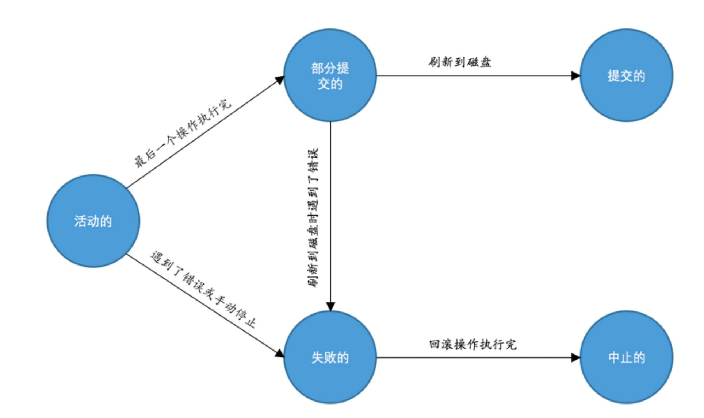

## 事物特性

### 原子性

一条sql或者N条sql语句当做一个原子，要么都执行成功，要么都执行失败。就算单个的sql其中也包含了很多步骤，如先写入buffer，然后刷新到磁盘。

### 隔离性

事物之间的操作是隔离的，不能影响。例如A事物中执行A-1，在B事物中获取A，再-1，之间是隔离的。就是不仅要原子操作，而且各个事物之间的操作不能影响其他的事物。

### 一致性

一致性其实就是一些约束条件，例如主键不能重复，枚举只能是定义里的值。也可以通过触发器建立约束条件

### 持久性

事物之间的操作，最后要持久化到磁盘

## 事物过程状态

