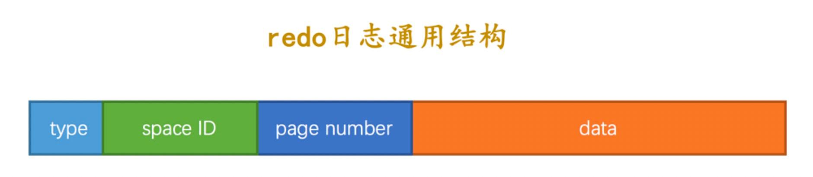

事物在持久化磁盘的时候，是如何保存呢？在提交事物的时候，将buffer pool中的页刷新到磁盘。会存在几个问题：

1. 一条sql可能只修改了一个页面的一个字节，如此操作会导致效率很慢
2. 一个事物可能包含了N个语句，这些语句的操作都可能不在同一个页面，所以保存回到随机IO很大。

解决方法：

1. 先将要修改的地方记录起来，即使数据库down机，启动的时候还能还原恢复就可以
2. 可以将这些动作记录到一个文件中，就是redo日志。好处就是每次都是顺序写redo日志，顺序读写，效率很高

## redo格式

- type ：该条 redo 日志的类型。在 MySQL 5.7.21 这个版本中，redo 日志设计了53种不同的类型
- space ID ：表空间ID。
- page number ：页号。
- data ：该条 redo 日志的具体内容。
