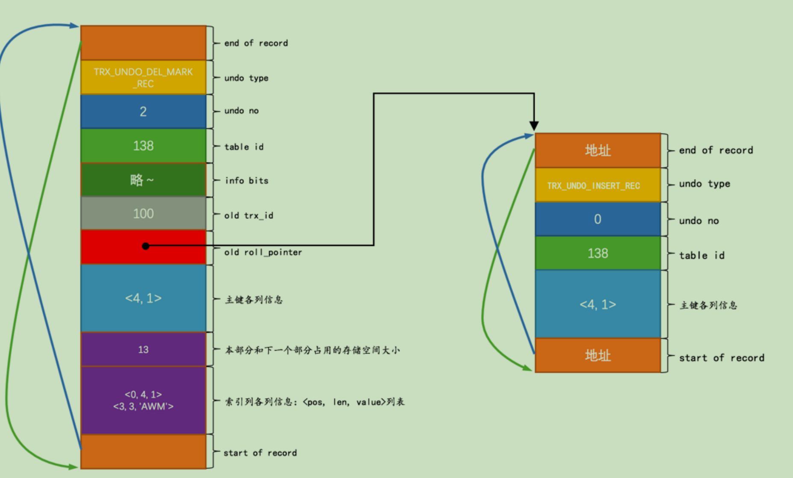

undo作用其实就是记录当前操作了什么，然后redo里面就记录如何恢复到操作之前。所以这里记录undo日志就是针对`增`，`删`，`改`的回滚

## 新增

对于insert产生的记录，undo日志其实只要记录插入的主键值就行。然后将undo日志位置记存放到记录中的`roll_point`里面。日志类型为`TRX_UNDO_INSERT_REC`

## 删除

删除一条记录其实要做两件真正的事情。

1. 将记录中的`delete_mask`设置为1，这个状态称之为`中间状态记录`
2. 当提交`commit`操作的时候，会将该记录存放到该页的垃圾链表中存放。

所以在记录删除操作的undo日志也是比较简单的。该日志类型`TRX_UNDO_DEL_MARK_REC`。该类型结构是这样：

1. 生成一条`TRX_UNDO_DEL_MASK_REC`日志
2. 将该日志记录中的old_trx_id,和old_roll_point去**最近**一次修改的undo日志里面找，存放到这里面。

## 更新

更新操作有两种，一种是不更新主键，另一种是更新主键

### 不更新主键

不更新主键又分为更新记录和原始记录大小相同，称为`原地更新`否则就是要先将原记录删除，然后重新插入，如果空间不足还要分页。

针对这种不更新主键的做undo日志类型是`TRX_UNDO_UPD_EXIST_REC`

