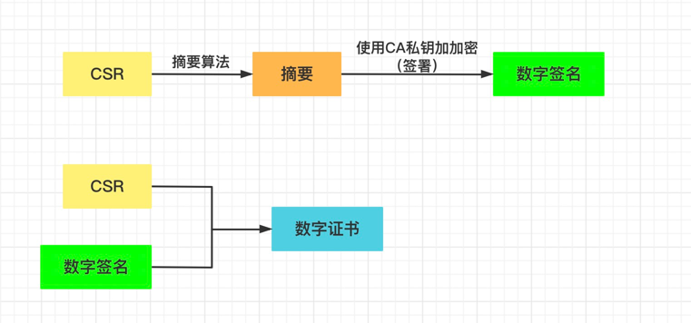

## 工具

- [证书工具]

## RSA

RSA是一套非对称加密算法，加密解密由一对秘钥对组成。私钥格式一般后缀为.key，公钥信息是_pub.key。从私钥中能提取公钥信息。

### 相关命令

```
1. 生成私钥（这个里面也包含公钥信息）
openssl genrsa -out ca.key 2048

2. 提取公钥
openssl rsa -in ca.key -pubout -out ca_pub.key

3. 加密信息(公钥加密)
openssl rsautl -encrypt -in hello.txt -inkey ca_pub.key -pubin -out hell.en

4. 解密(私钥解密)
openssl rsautl -decrypt -in hell.en -inkey ca.key -out hello.dec

5. 私钥签名
openssl dgst -sha1 -sign ca.key -out hello.signed hello.txt

6. 公钥验签
openssl dgst -sha1 -verify ca_pub.key -signature  hello.signed hello.txt

7. 查看私钥信息
openssl rsa -noout -text -in
```


## CSR （certificate signing request）

证书请求文件，按照一定的格式把以下相关信息写入到一个文件中

1. 包含基本信息（组织，国家，主机等）
2. 包含加密算法
3. 包含公钥信息

### 相关命令

```
1. 生成证书请求文件
openssl req -new -key ca.key -out ca.csr
# 组织可以是多个，这样是一个数组
openssl req -new -key ca.key -subj '/CN=jbeda/O=app1/O=app2' -out ca.csr

2. 提取证书请求文件里面信息
openssl req -in ca.csr -text -noout

3. 提取证书请求文件里面的公钥
openssl req -in ca.csr -pubkey  -noout
```

## 证书

所谓的证书就是通过第三方认证机构来给自己签署盖章。具体过程



### 相关命令

**生成CA根证书**

```
1. (自签证书)通过证书请求文件生成证书 (可以生成任意的证书，使用该证书去生成其他证书，然而这个证书就叫做根证书）
openssl x509 -req -days 365 -in ca.csr -signkey ca.key -out ca.crt

2. 查看证书信息
openssl x509 -noout -text -in ca.crt

3. 提取证书公钥
openssl x509 -pubkey -noout -in ca.crt
```

**通过根证书生成服务端证书**

````
1. 生成服务端私钥
openssl genrsa -out server.key 2048

2. 提取服务端公钥
openssl rsa -in server.key -pubout -out server_pub.key

3. 生成服务端证书请求文件
openssl req -new -key server.key -out server.csr

4. 通过CA机构签署服务端证书(这个证书里面包含server的csr基本信息以及签署CA机构的CSR信息)
openssl x509 -req -sha256 -in server.csr -CA ca.crt -CAkey ca.key -CAcreateserial -days 3650 -out server.crt

5. 查看生成的证书信息
openssl x509 -noout -text -in server.crt
````

**验证证书是否是CA签署的**

```
openssl verify -CAfile ca.crt server.crt
```

## https验证过程（主要）

1. 客户端请求服务端，服务端返回客户端证书文件（crt）
2. 客户端验证crt证书找到本地的ca根证书，一般浏览器都会安装（这个过程就是验证服务端证书是否是根证书颁发的）`openssl verify -CAfile ca.crt server.crt`
3. 验证通过则提取服务端证书公钥验证发送过来的内容。（生成接下来的对称加密公钥）
4. 交换对称加密算法的公钥和选择对称加密的算法
5. 使用对称加密算法加密传输内容

```shell
curl https://127.0.0.1:8080 --cacert ca.crt 
```


[证书工具]: https://www.ssleye.com/ssltool/cer_check.html