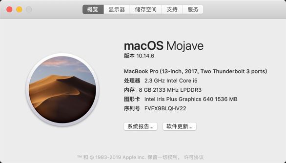
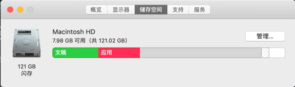

个人开发机器是17年公司给共购买的，当时买的就是乞丐版120G的。用到现在也还可以，但是最近一直提醒我存储满了。

看到分析发现系统占用空间越来越大，但是也不知道如何优化，看网上说的很多，感觉都不太适用，直接来了个重装。

在重新安装之前最难的就是备份本地的环境，记录装了哪些软件了。

## OLD环境

一直提醒我本地就剩下2个G，但是在准备重装之前竟然增加到了7个G，MAC应该自己优化删除了垃圾文件😁，但是还是不能阻止我下定决心重装系统，并且升级一个最新的。

**系统版本**

**存储空间**

## 软件清单

先将本机的软件清单先列举下，等装完新系统之后哪些需要重新安装了。

- brew
- valet
- nvm
- nodejs
- iterm2及自动补全
- git

**相关图标软件**

## 备份

### 文件

- .ssh秘钥对

### 代码