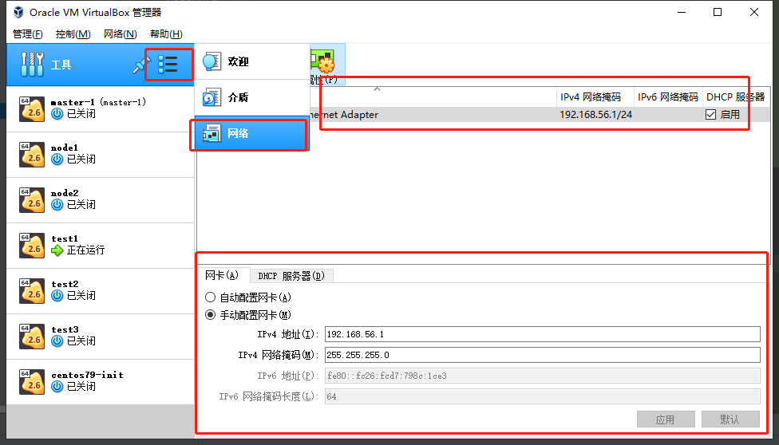
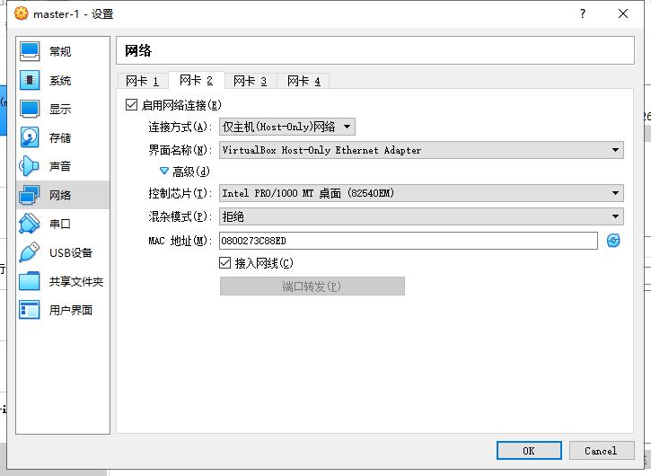

## test1

**网络配置**

```shell
[root@test1 network-scripts]# ip a
1: lo: <LOOPBACK,UP,LOWER_UP> mtu 65536 qdisc noqueue state UNKNOWN group default qlen 1000
    link/loopback 00:00:00:00:00:00 brd 00:00:00:00:00:00
    inet 127.0.0.1/8 scope host lo
       valid_lft forever preferred_lft forever
    inet6 ::1/128 scope host 
       valid_lft forever preferred_lft forever
2: eth0: <BROADCAST,MULTICAST,UP,LOWER_UP> mtu 1500 qdisc pfifo_fast state UP group default qlen 1000
    link/ether 08:00:27:65:42:b9 brd ff:ff:ff:ff:ff:ff
    inet 10.0.2.15/24 brd 10.0.2.255 scope global noprefixroute dynamic eth0
       valid_lft 86130sec preferred_lft 86130sec
    inet6 fe80::4096:ef5c:fed4:af8e/64 scope link noprefixroute 
       valid_lft forever preferred_lft forever
3: eth1: <BROADCAST,MULTICAST,UP,LOWER_UP> mtu 1500 qdisc pfifo_fast state UP group default qlen 1000
    link/ether 08:00:27:08:92:e0 brd ff:ff:ff:ff:ff:ff
    inet 192.168.56.41/24 brd 192.168.56.255 scope global noprefixroute eth1
       valid_lft forever preferred_lft forever
    inet6 fe80::a00:27ff:fe08:92e0/64 scope link 
       valid_lft forever preferred_lft forever
```

**网卡0**

网卡0是与NAT转换模式，是虚拟机中与外部通信的


```shell
[root@test1 network-scripts]# cat ifcfg-eth0 
TYPE="Ethernet"
PROXY_METHOD="none"
BROWSER_ONLY="no"
BOOTPROTO="dhcp"
DEFROUTE="yes"
IPV4_FAILURE_FATAL="no"
IPV6INIT="yes"
IPV6_AUTOCONF="yes"
IPV6_DEFROUTE="yes"
IPV6_FAILURE_FATAL="no"
IPV6_ADDR_GEN_MODE="stable-privacy"
NAME="eth0"
UUID="3ab22365-1384-4b26-a973-e27a40ff6d8b"
DEVICE="eth0"
ONBOOT="yes"
```

**网卡1**

这个是仅Host-only，是主机和虚拟机之间的通信网卡，形成个小型局域网。在虚拟机中首先要创建网卡，配置属性.最后可以配网络，注意在centos7上，都不是以`eth`开头的，都是ens，这个可改可不改。





```shell
[root@test1 network-scripts]# cat ifcfg-eth1 
TYPE="Ethernet"
PROXY_METHOD="none"
BROWSER_ONLY="no"
BOOTPROTO="static"
DEFROUTE="yes"
IPV4_FAILURE_FATAL="no"
NAME="eth1"
UUID="3ab22365-1384-4b26-a973-e27a40ff6d8a"
DEVICE="eth1"
ONBOOT="yes"
IPADDR=192.168.56.41
NETMASK=255.255.255.0
GATEWAY=192.168.56.1
DNS1=192.168.56.1
```

## 配置frp代理

为了家庭虚拟机可以被外面直接连接，可以找一台配置低的阿里云主机，装上`frp`,然后家里的装上frp客户端，这样就可以外网了。

```shell
vim /etc/systemd/system/frpc.service

[Unit]
# 服务名称，可自定义
Description = frp server
After = network.target syslog.target
Wants = network.target

[Service]
Type = simple
# 启动frps的命令，需修改为您的frps的安装路径
ExecStart = /usr/bin/frpc -c /etc/frp/frpc.ini

[Install]
WantedBy = multi-user.target


[root@test1 network-scripts]# cat /etc/frp/frpc.ini
[common]
server_addr = 115.28.101.251
server_port = 7777
authentication_method=token
token=xxxx

[test1]
type = tcp
local_ip = 127.0.0.1
local_port = 22
remote_port = 6041
```